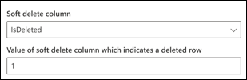
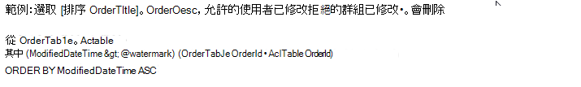

<!---Previous ms.author: vivg --->

# Azure SQL 和 Microsoft SQL Server Graph 連接器

Microsoft SQL Server 或 Azure SQL Graph 連接器可讓您的組織探索內部部署 SQL Server 資料庫中的資料，並為雲端中的 Azure SQL 實例所主控的資料庫進行索引。
Graph 連接器會將指定的內容索引放入 Microsoft 搜尋中。 若要讓索引保持在最新的來來源資料中，它支援定期完整和累加編目。 透過這些 SQL 連接器，您也可以限制特定使用者對搜尋結果的存取。

> [!NOTE]
> 請閱讀 [**設定 Graph 連接器**](configure-connector.md)文章，以瞭解一般 Graph 連接器設定指示。

本文適用于任何設定、執行及監視 Azure SQL 和 Microsoft SQL server Graph connector 的使用者。 它會補充一般設定程式，並顯示只適用于 Azure SQL 和 Microsoft SQL server Graph 連接器的指示。 本文也包含 Microsoft SQL server 和 Azure SQL 連接器[限制](#limitations)的相關資訊。

## 開始之前

### 僅限內部部署 Microsoft SQL Server 連接器 (安裝 Graph 連接器代理程式) 

為了存取您的內部部署協力廠商資料，您必須安裝及設定 Graph 連接器代理程式。 請參閱[Install the Graph connector agent](graph-connector-agent.md)以深入瞭解。

>[!NOTE]
>若您在設定 Microsoft SQL Server Graph 連接器時使用 Windows 驗證，您嘗試登入的使用者，必須對安裝 Graph 連接器代理程式的機器具有互動式登入許可權。 請參閱 [登錄原則管理](/windows/security/threat-protection/security-policy-settings/allow-log-on-locally#policy-management) 的檔，以檢查登入許可權。

## 步驟1：在 Microsoft 365 系統管理中心中新增 Graph 連接器

遵循一般 [設定指示](./configure-connector.md)。
<!---If the above phrase does not apply, delete it and insert specific details for your data source that are different from general setup 
instructions.-->

## 步驟2：命名連線

遵循一般 [設定指示](./configure-connector.md)。
<!---If the above phrase does not apply, delete it and insert specific details for your data source that are different from general setup 
instructions.-->

## 步驟3：設定連接設定

### 僅針對 Azure SQL 連接器註冊應用程式 () 

針對 Azure SQL connector，您必須在 Azure Active Directory 中註冊應用程式，以允許 Microsoft 搜尋應用程式存取索引的資料。 若要深入瞭解如何註冊應用程式，請參閱 Microsoft Graph 檔，以瞭解如何[註冊應用程式](/graph/auth-register-app-v2)。

完成應用程式註冊並記下應用程式名稱、應用程式 (用戶端) 識別碼與租使用者識別碼後，您需要 [產生新的用戶端密碼](/azure/healthcare-apis/register-confidential-azure-ad-client-app#application-secret)。 用戶端密碼只會顯示一次。 請記住 & 會安全地儲存用戶端密碼。 設定 Microsoft 搜尋中的新連接時，請使用用戶端識別碼和用戶端密碼。

若要將註冊的應用程式新增至您的 Azure SQL Database，您必須：

- 登入您的 Azure SQL DB
- 開啟新的查詢視窗
- 從外部提供者執行命令「建立使用者 [app 名稱]，以建立新使用者
- 執行命令 ' exec sp_addrolemember ' db_datareader '、[app name] 或 ' ALTER ROLE db_datareader ADD MEMBER [app name] '，將使用者新增至角色

>[!NOTE]
>若要撤銷對 Azure Active Directory 中登錄的任何應用程式的存取權，請參閱 Azure 檔中關於[移除已註冊的應用程式](/azure/active-directory/develop/quickstart-remove-app)。

### 連接設定

若要將 Microsoft SQL Server 連接器連線至資料來源，您必須設定要編目的資料庫伺服器和部署代理程式。 然後，您就可以使用必要的驗證方法來連接至資料庫。

> [!NOTE] 
> 您的資料庫必須執行 SQL Server 版本2008或更新版本，Microsoft SQL Server 連接器才能連線。

針對 Azure SQL 連接器，您只需要指定您要連線的伺服器名稱或 IP 位址。 Azure SQL 連接器只支援 Azure Active Directory 開啟識別碼 connect (OIDC) 驗證，以連線至資料庫。

為了增加安全性，您可以為您的 Azure SQL Server 或資料庫設定 IP 防火牆規則。 若要深入瞭解設定 IP 防火牆規則，請參閱 [IP 防火牆規則](/azure/azure-sql/database/firewall-configure)的檔。 在 [防火牆設定] 中新增下列用戶端 IP 範圍。

| 區域 | IP 範圍 |
| ------------ | ------------ |
| NAM | 52.250.92.252/30、52.224.250.216/30 |
| EUR | 20.54.41.208/30、51.105.159.88/30 |
| APC | 52.139.188.212/30、20.43.146.44/30 |

若要搜尋資料庫內容，您必須在設定連接器時指定 SQL 查詢。 這些 SQL 查詢必須針對所有要編制索引的資料庫資料行命名 (也就是 [來源屬性]) ，包括要取得所有欄所需執行的任何 SQL 聯接。 若要限制存取搜尋結果，您必須在設定連接器時，指定 (ACLs) SQL 查詢中的存取控制清單。

## 步驟3a：必要的完整編目 () 

在這個步驟中，您會設定執行資料庫完整編目的 SQL 查詢。 完整編目會選取所有欄或屬性，以選取 [ **查詢**]、[ **搜尋**] 或 [ **取得**] 選項。 您也可以指定 ACL 欄，以限制搜尋結果對特定使用者或群組的存取。

> [!Tip]
> 若要取得所需的所有欄，您可以加入多個表格。

###  (必要) 和 ACL 欄 (選用) 選取資料欄位

這個範例會示範五個數據列的選取範圍，其中包含搜尋的資料： [訂單 Id]、[OrderTitle]、[OrderDesc]、[CreatedDateTime] 及 [IsDeleted]。 若要設定每個資料列的查看許可權，您可以選擇性地選取下列 ACL 欄： AllowedUsers、AllowedGroups、DeniedUsers 及 DeniedGroups。 所有的資料欄位也都有 **查詢**、 **搜尋** 或 **檢索** 的選項。

選取下列範例查詢所示的資料行： `SELECT OrderId, OrderTitle, OrderDesc, AllowedUsers, AllowedGroups, DeniedUsers, DeniedGroups, CreatedDateTime, IsDeleted`

若要管理搜尋結果的存取權，您可以在查詢中指定一或多個 ACL 欄。 SQL 連接器可讓您控制每個記錄層級的存取。 您可以選擇對資料表中的所有記錄使用相同的存取控制。 如果 ACL 資訊儲存在不同的資料表中，您可能必須在查詢中使用這些資料表進行聯接。

在上述查詢中使用每個 ACL 欄的描述如下。 下列清單說明四種 **存取控制機制**。

- **AllowedUsers**：此欄會指定可以存取搜尋結果的使用者 IDs 清單。 在下列範例中，使用者清單為： john@contoso.com、keith@contoso.com 和 lisa@contoso.com 只有具有「訂單 Id」的記錄存取權 = 12。
- **AllowedGroups**：此欄會指定可以存取搜尋結果的使用者群組。 在下列範例中，group sales-team@contoso.com 只會具有「訂單 Id = 12」的記錄存取權。
- **DeniedUsers**：此欄會 **指定沒有搜尋** 結果存取權的使用者清單。 在下列範例中，使用者 john@contoso.com 及 keith@contoso.com 無法存取具有「訂單 Id」的記錄，而其他所有人都可以存取這筆記錄。
- **DeniedGroups**：此欄 **指定沒有搜尋** 結果存取權的使用者群組。 在下列範例中，群組 engg-team@contoso.com 及 pm-team@contoso.com 沒有具有「訂單 Id」的記錄存取權，而其他所有人都可以存取這筆記錄。  

### 支援的資料類型

下表摘要說明 MS SQL 和 Azure SQL 連接器支援的 SQL 資料類型。 該表也會摘要列出支援的 SQL 資料類型的索引資料類型。 若要深入瞭解 Microsoft Graph 連接器支援的索引資料類型，請參閱[屬性資源類型](/graph/api/resources/property?preserve-view=true&view=graph-rest-beta#properties)的檔。

| 類別 | 來源資料類型 | 索引資料類型 |
| ------------ | ------------ | ------------ |
| 日期和時間 | date   datetime   datetime2   Smalldatetime | datetime |
| 完全數值 | Bigint   int   Smallint   Tinyint | int64 |
| 完全數值 | 位 | 布林值 |
| 近似數值 | float   真正 | double |
| 字元字串 | 字元   Varchar   文字 | string |
| Unicode 字元字串 | Nchar   Nvarchar   Ntext | 字串 |
| 其他資料類型 | 唯一 | 字串 |

對於目前不是直接支援的任何其他資料類型，此資料行必須明確地轉換成支援的資料類型。

### 浮水印 (必要) 

若要防止資料庫超載，連接器會批次並繼續完整編目的查詢。 使用 [浮水印] 資料行的值，每個後續的批次都會取得，而查詢會從最後一個檢查點繼續。 實質上，這種機制會控制完整編目的資料重新整理。

建立浮水印的查詢程式碼片段，如下列範例所示：

- `WHERE (CreatedDateTime > @watermark)`. 使用保留的關鍵字來引用浮水印欄名稱 `@watermark` 。 如果浮水印欄的排序次序是遞增的，請使用 `>` ，否則請使用 `<` 。
- `ORDER BY CreatedDateTime ASC`. 在 [浮水印] 欄上以遞增或遞減順序排序。

在下一個影像所示的設定中， `CreatedDateTime` 是選取的 [浮水印] 欄。 若要取得第一批列，請指定 [浮水印] 資料行的資料類型。 在此情況下，資料類型為 `DateTime` 。

第 **一個查詢** 會使用： "CreatedDateTime > 1753 年1月1日，00:00:00" (最小值 DateTime 的資料類型) 。 提取第一個批次之後， `CreatedDateTime` 如果資料列是以遞增順序排序，則會將批次中傳回的最高值儲存為檢查點。 範例是 03:00:00 2019 年3月1日。 然後，在查詢中使用「CreatedDateTime > 三月份1，2019 03:00:00」提取下一批 **N** 列。

### 跳過虛刪除的列 (選用) 

若要排除資料庫中虛刪除的列的索引，請指定虛刪除的列名稱和值，以指出刪除列的資料行。

### 完整編目：管理搜尋許可權

選取 [ **管理許可權** ]，以選擇用來指定存取控制機制 (ACL) 欄的各種存取控制。 選取您在 [完整編目 SQL] 查詢中指定的欄名。

每個 ACL 欄都應該是多重值欄。 您可以使用分隔符號（如分號 (; ) 、逗號 (、) 等等）來分隔這些多個 ID 值。 您必須在 [ **值分隔符號** ] 欄位中指定此分隔符號。

下列識別碼類型可供使用 ACLs：

- **使用者主體名稱 (upn)**：使用者主要名稱 (upn) 是以電子郵件地址格式的系統使用者名稱。 UPN (例如： john.doe@domain.com) 會包含 (登入名稱) 、分隔符號 (@ 符號) 和功能變數名稱 (UPN 尾碼) 的使用者名稱。
- **Azure Active Directory (AAD) 識別碼**：在 Azure AD 中，每個使用者或群組都有一個類似 ' e0d3ad3d-0000-1111-2222-3c5f5c52ab9b ' 的物件識別碼。
- **Active Directory (AD) 安全性** 識別碼：在內部部署 AD 安裝程式中，每個使用者和群組都有一個無法變化的唯一安全性識別碼，看起來像是-1-5-21-3878594291-2115959936-132693609-65242。 '

## 步驟3b：增量編目 (選用) 

在此選用的步驟中，提供 SQL 查詢，以執行資料庫的累加編目。 在此查詢中，SQL 連接器會決定自上次累加編目以來對資料所做的任何變更。 在完整編目中，選取 [所有欄]，以選取 [ **查詢**]、[ **搜尋**] 或 [ **取得**] 選項。 指定您在完整編目查詢中指定的相同 ACL 欄集。

下列映射中的元件類似于完整編目元件，但有一個例外。 在此情況下，"ModifiedDateTime" 是選取的浮水印欄。 查看 [完整編目步驟](#step-3a-full-crawl-required) ，以瞭解如何撰寫累加編目查詢，並以範例顯示下列影像。

## 步驟4：指派屬性標籤

遵循一般 [設定指示](./configure-connector.md)。

<!---If the above phrase does not apply, delete it and insert specific details for your data source that are different from general setup 
instructions.-->

## 步驟5：管理架構

遵循一般 [設定指示](./configure-connector.md)。
<!---If the above phrase does not apply, delete it and insert specific details for your data source that are different from general setup 
instructions.-->

## 步驟6：管理搜尋許可權

您可以選擇使用完整編目 [畫面中所指定的 ACLs](#full-crawl-manage-search-permissions) ，也可以覆寫它們，讓每個人都能看到您的內容。

## 步驟7：選擇重新整理設定

遵循一般 [設定指示](./configure-connector.md)。
<!---If the above phrase does not apply, delete it and insert specific details for your data source that are different from general setup 
instructions.-->

## 步驟8：檢查連線

遵循一般 [設定指示](./configure-connector.md)。
<!---If the above phrase does not apply, delete it and insert specific details for your data source that are different from general setup 
instructions.-->

<!---## Next steps: Customize the search results page

Create your own verticals and result types, so end users can view search results from new connections. Without this step, data from your connection won't show up on the search results page.

To learn more about how to create your verticals and MRTs, see [Search results page customization](customize-search-page.md).-->

## 疑難排解

以下是設定連接器時所觀察到的常見錯誤及其可能的原因。

| 設定步驟 | 錯誤訊息 | 可能的原因 (s)  |
| ------------ | ------------ | ------------ |
| 完整編目 | `Error from database server: A transport level error has occurred when receiving results from the server.` | 由於網路問題，導致此錯誤。 建議您使用 [microsoft 網路監視器](https://www.microsoft.com/download/details.aspx?id=4865) 檢查網路記錄，並與 microsoft 客戶支援部門聯繫。 |

## 限制

SQL 連接器在預覽版本中有這些限制：

- Microsoft SQL Server 連接器：內部部署資料庫必須執行 SQL Server 版本2008或更新版本。
- 主控 azure SQL 資料庫) 的 Microsoft 365 訂閱和 Azure 訂閱 (必須位於相同的 Azure Active Directory 內。
- 只有使用使用者主要名稱 (UPN) 、Azure Active Directory (Azure AD) 或 Active Directory 安全性才能支援 ACLs。
- 不支援在資料庫欄中編制豐富內容的索引。 這類內容的範例為 HTML、JSON、XML、blob 及檔 parsings，以資料庫資料欄中的連結形式存在。
