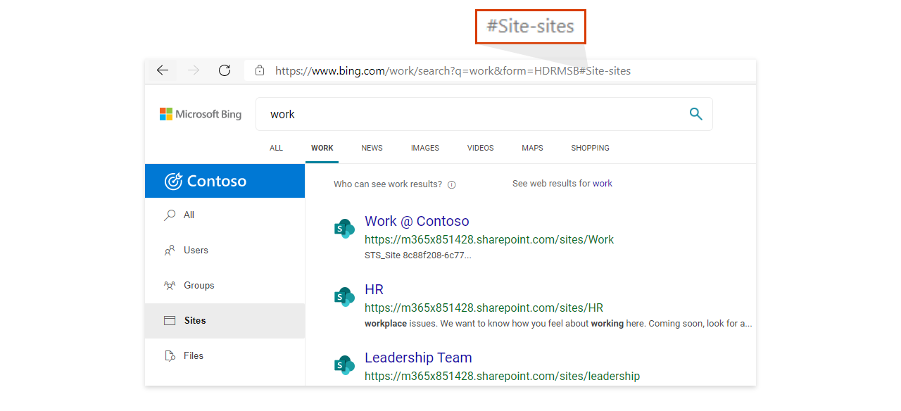
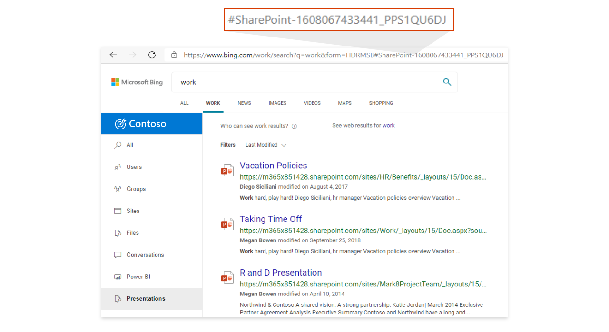

# <a name="add-a-search-box-to-your-intranet-site"></a><span data-ttu-id="b8bd1-103">將搜尋方塊新增至您的內部網路網站</span><span class="sxs-lookup"><span data-stu-id="b8bd1-103">Add a search box to your intranet site</span></span>

<span data-ttu-id="b8bd1-104">若要讓您的使用者能夠輕鬆存取組織的結果，請在任何內部網路網站或頁面 Bing 搜尋方塊中新增 Microsoft 搜尋。</span><span class="sxs-lookup"><span data-stu-id="b8bd1-104">To provide your users with easy access to results from your organization, add a Microsoft Search in Bing search box to any intranet site or page.</span></span> <span data-ttu-id="b8bd1-105">以下是一些優點：</span><span class="sxs-lookup"><span data-stu-id="b8bd1-105">These are some of the benefits:</span></span>

- <span data-ttu-id="b8bd1-106">SharePoint 或內部網路入口網站上的搜尋方塊，提供開始搜尋的熟悉、信任的進入點。</span><span class="sxs-lookup"><span data-stu-id="b8bd1-106">A search box on your SharePoint or intranet portal provides a familiar, trusted entry point to start searching</span></span>
- <span data-ttu-id="b8bd1-107">支援所有主要網頁瀏覽器，包括 Google Chrome 和 Microsoft Edge</span><span class="sxs-lookup"><span data-stu-id="b8bd1-107">Supports all major web browsers, including Google Chrome and Microsoft Edge</span></span>
- <span data-ttu-id="b8bd1-108">只會顯示您組織的搜尋建議，永遠不會包含 web 建議</span><span class="sxs-lookup"><span data-stu-id="b8bd1-108">Only search suggestions from your organization appear, web suggestions are never included</span></span>
- <span data-ttu-id="b8bd1-109">在 Bing 工作成果] 頁面中，使用使用者來進行 Microsoft 搜尋，但不包括廣告和 web 結果</span><span class="sxs-lookup"><span data-stu-id="b8bd1-109">Takes users to a Microsoft Search in Bing work results page, which excludes ads and web results</span></span>
- <span data-ttu-id="b8bd1-110">您可以控制搜尋方塊的外觀和行為，包括讓使用者在預設垂直或自訂垂直上進行土地的功能。</span><span class="sxs-lookup"><span data-stu-id="b8bd1-110">You control the appearance and behavior of the search box, including the ability to land users on a default vertical or a custom vertical you've created</span></span>
  
## <a name="add-a-search-box-to-an-intranet-page"></a><span data-ttu-id="b8bd1-111">將搜尋方塊新增至內部網路頁面</span><span class="sxs-lookup"><span data-stu-id="b8bd1-111">Add a search box to an intranet page</span></span>

<span data-ttu-id="b8bd1-112">您需要將兩個元件新增至頁面：搜尋方塊的容器和啟動該搜尋方塊的指令碼。</span><span class="sxs-lookup"><span data-stu-id="b8bd1-112">You need to add two elements to the page: a container for the search box and the script that powers it.</span></span>
  
```html
<div id="bfb_searchbox"></div>
<script>
    var bfbSearchBoxConfig = {
        containerSelector: "bfb_searchbox"
    };
</script>
<script async src="https://www.bing.com/business/s?k=sb"></script>
```

<span data-ttu-id="b8bd1-113">在 SharePoint 傳統網站上，新增指令碼編輯器網頁組件並將指令碼放置在其中。</span><span class="sxs-lookup"><span data-stu-id="b8bd1-113">On a SharePoint classic site, add a Script Editor Web Part and drop the script in it.</span></span>
  
## <a name="enable-the-search-box-for-mobile"></a><span data-ttu-id="b8bd1-114">針對行動裝置啟用搜尋方塊</span><span class="sxs-lookup"><span data-stu-id="b8bd1-114">Enable the search box for mobile</span></span>

<span data-ttu-id="b8bd1-115">若要將內部網路網站或頁面提供給行動裝置使用者，請將 isMobile: true 新增至設定物件：</span><span class="sxs-lookup"><span data-stu-id="b8bd1-115">For intranet sites or pages available to mobile users, add isMobile: true to the settings object:</span></span>
  
```html
<div id="bfb_searchbox"></div>
<script>
    var bfbSearchBoxConfig = {
        containerSelector: "bfb_searchbox", 
        isMobile: true
    };
</script>
<script async src="https://www.bing.com/business/s?k=sb"></script>
```

## <a name="put-focus-on-the-search-box-by-default"></a><span data-ttu-id="b8bd1-116">根據預設，焦點會放置在搜尋方塊中</span><span class="sxs-lookup"><span data-stu-id="b8bd1-116">Put focus on the search box by default</span></span>

<span data-ttu-id="b8bd1-117">若要協助使用者加快搜尋速度，載入頁面或網站時，請將 focus: true 新增至設定物件來將游標放置在搜尋方塊中：</span><span class="sxs-lookup"><span data-stu-id="b8bd1-117">To help users search faster, when the page or site loads place the cursor in the search box by adding focus: true to the settings object:</span></span>
  
```html
<div id="bfb_searchbox"></div>
<script>
    var bfbSearchBoxConfig = {
        containerSelector: "bfb_searchbox",
        focus: true
    };
</script>
<script async src="https://www.bing.com/business/s?k=sb"></script>
```

## <a name="customize-the-appearance-of-the-search-box"></a><span data-ttu-id="b8bd1-118">自訂搜尋方塊的外觀</span><span class="sxs-lookup"><span data-stu-id="b8bd1-118">Customize the appearance of the search box</span></span> 

<span data-ttu-id="b8bd1-119">為了協助讓搜尋方塊更符合您的內部網路的樣式，您可以使用各種不同的組態選項。</span><span class="sxs-lookup"><span data-stu-id="b8bd1-119">To help the search box better fit with the style of your intranet, there are a variety of configuration options you can use.</span></span> <span data-ttu-id="b8bd1-120">您可以混搭選項來符合您的需求。</span><span class="sxs-lookup"><span data-stu-id="b8bd1-120">Mix and match options to suit your needs.</span></span>

```html
<div id="bfb_searchbox"></div>
<script>
    var bfbSearchBoxConfig = {
        containerSelector: "bfb_searchbox",
        width: 560,                             // default: 560, min: 360, max: 650
        height: 40,                             // default: 40, min: 40, max: 72
        cornerRadius: 6,                        // default: 6, min: 0, max: 25                                   
        strokeOutline: true,                    // default: true
        dropShadow: true,                       // default: false
        iconColor: "#067FA6",                   // default: #067FA6
        title: "Search box",                    // default: "Search box"
        vertical: "Person-people",              // default: not specified, search box directs to the All vertical on the WORK results page
        companyNameInGhostText: "Contoso"       // default: not specified
                                                // when absent, ghost text will be "Search work"
                                                // when specified, text will be "Search <companyNameInGhostText>"
    };
</script>
<script async src="https://www.bing.com/business/s?k=sb"></script>
```

## <a name="direct-users-to-a-default-or-custom-vertical"></a><span data-ttu-id="b8bd1-121">將使用者定向至預設或自訂的垂直</span><span class="sxs-lookup"><span data-stu-id="b8bd1-121">Direct users to a default or custom vertical</span></span>

<span data-ttu-id="b8bd1-122">若要在企業營運人員或內部網路網站與您的工作結果之間提供簡便的整合，您也可以自訂搜尋方塊，方法是指定使用者在按下搜尋建議時所應居住在該位置的預設或自訂垂直。</span><span class="sxs-lookup"><span data-stu-id="b8bd1-122">To provide easy integration between your line-of-business apps or intranet sites and your work results, you can also customize the search box by specifying a default or custom vertical that users should land on when they click a search suggestion.</span></span>

<span data-ttu-id="b8bd1-123">使用 bfbSearchBoxConfig 中的 [垂直] 選項來定義您想要的垂直方向。</span><span class="sxs-lookup"><span data-stu-id="b8bd1-123">Use the vertical option in bfbSearchBoxConfig to define the vertical you want.</span></span> <span data-ttu-id="b8bd1-124">例如，如果您想要讓使用者永遠在網站上水準土地，其中一個預設的縱向，請使用「網站網站」值。</span><span class="sxs-lookup"><span data-stu-id="b8bd1-124">For example, if you want users to always land on the Sites vertical, one of the default verticals, use the value "Site-sites".</span></span>



<span data-ttu-id="b8bd1-126">若為自訂的縱向，請在 URL 的結尾使用雜湊。</span><span class="sxs-lookup"><span data-stu-id="b8bd1-126">For custom verticals, use the hash at the end of the URL.</span></span> <span data-ttu-id="b8bd1-127">您可以從 Bing 中的 [工作] 頁面進行搜尋，按一下垂直標籤，然後在數位 sign ( # ) 之後複製值，以找到這些值。</span><span class="sxs-lookup"><span data-stu-id="b8bd1-127">You can find these values by searching from the work page on Bing, clicking a vertical label, and copying the value after the number sign (#).</span></span>



## <a name="use-an-iframe-to-embed-a-search-box"></a><span data-ttu-id="b8bd1-129">使用 iFrame 來內嵌搜尋方塊</span><span class="sxs-lookup"><span data-stu-id="b8bd1-129">Use an iFrame to embed a search box</span></span>

<span data-ttu-id="b8bd1-130">如果該網站沒有內嵌指令碼的選項，請使用 iFrame 來新增搜尋方塊。</span><span class="sxs-lookup"><span data-stu-id="b8bd1-130">If embedding a script isn't an option for the site, use an iFrame to add the search box.</span></span> <span data-ttu-id="b8bd1-131">您將無法自訂搜尋方塊。</span><span class="sxs-lookup"><span data-stu-id="b8bd1-131">You won't be able to customize the search box.</span></span>
  
```html
<iframe width="564" height="400" src="https://www.bing.com/business/searchbox"></iframe>
```

## <a name="inprivate-mode-and-conditional-access"></a><span data-ttu-id="b8bd1-132">InPrivate 模式和條件式存取</span><span class="sxs-lookup"><span data-stu-id="b8bd1-132">InPrivate mode and Conditional Access</span></span>

<span data-ttu-id="b8bd1-133">如果在 InPrivate 視窗中開啟頁面或網站，就會停用內嵌搜尋方塊。</span><span class="sxs-lookup"><span data-stu-id="b8bd1-133">An embedded search box will be disabled if the page or site is opened in an InPrivate window.</span></span> <span data-ttu-id="b8bd1-134">此外，在 Microsoft Edge 中使用 Azure AD 條件式存取支援，Bing 在使用 InPrivate 模式時不支援 AAD 登入。</span><span class="sxs-lookup"><span data-stu-id="b8bd1-134">Also, with Azure AD Conditional Access support in Microsoft Edge, Bing.com doesn't support AAD sign in when using InPrivate mode.</span></span> <span data-ttu-id="b8bd1-135">如需 Edge 中的條件式存取的詳細資訊，請參閱[Microsoft Edge 和條件式存取](https://docs.microsoft.com/deployedge/ms-edge-security-conditional-access#accessing-conditional-access-protected-resources-in-microsoft-edge)。</span><span class="sxs-lookup"><span data-stu-id="b8bd1-135">For more information about Conditional Access in Edge, see [Microsoft Edge and Conditional Access](https://docs.microsoft.com/deployedge/ms-edge-security-conditional-access#accessing-conditional-access-protected-resources-in-microsoft-edge).</span></span> 