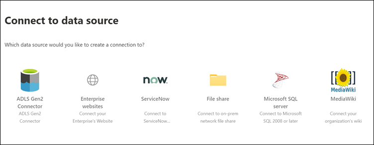

<!-- markdownlint-disable no-trailing-punctuation -->

# 設定 microsoft 內建的連接器以進行 Microsoft 搜尋Set up your Microsoft-built connector for Microsoft Search

本文將引導您逐步完成設定 Microsoft 內建連接器的步驟。This article guides you through the steps of configuring a Microsoft-built connector. 它概述在 Microsoft 365 系統[管理中心](https://admin.microsoft.com)中設定連線的流程。It outlines the flow of setting up a connection in the Microsoft 365 [admin center](https://admin.microsoft.com). 如需如何設定特定 Microsoft 內置連接器的詳細資訊，請參閱下列文章：For more details on how to set up specific Microsoft-built connectors, see these articles:

* [Azure Data Lake Storage Gen2Azure Data Lake Storage Gen2](azure-data-lake-connector.md)
* [Azure DevOpsAzure DevOps](azure-devops-connector.md)
* [Azure SQLAzure SQL](MSSQL-connector.md)
* [企業網站Enterprise websites](enterprise-web-connector.md)
* [檔案共用File share](file-share-connector.md)
* [MediaWikiMediaWiki](mediawiki-connector.md)
* [Microsoft SQL serverMicrosoft SQL server](MSSQL-connector.md)
* [ServiceNowServiceNow](servicenow-connector.md)

## 設定Set up

完成下列步驟以設定任何 Microsoft 建立的連接器。Complete the following steps to configure any of the Microsoft-built connectors.

1. 移至[Microsoft 365 系統管理中心](https://admin.microsoft.com)中的 [[連接器]](https://admin.microsoft.com/Adminportal/Home#/MicrosoftSearch/Connectors)索引標籤。Go to the [Connectors tab](https://admin.microsoft.com/Adminportal/Home#/MicrosoftSearch/Connectors) in the [Microsoft 365 admin center](https://admin.microsoft.com).
2. 使用[Microsoft 365](https://www.microsoft.com/microsoft-365)租使用者的認證登入您的帳戶。Sign in to your account with the credentials for your [Microsoft 365](https://www.microsoft.com/microsoft-365) tenant.
3. 選取 [**新增連接器**]。Select **Add a connector**.
4. 從可用的連接器清單中，選取您選擇的連接器。From the list of available connectors, select the connector of your choice.

### 命名連接器Name the connector

若要建立連接，請先指定下列屬性：To create a connection, first specify these attributes:

1. 連接的名稱Name of the connection
2. 連接識別碼Connection ID
3. 描述（選用）Description (optional)

連接識別碼會建立連接器的隱含屬性。The connection ID creates implicit properties for your connector. 它必須只包含字母數位字元，最多可以有32個字元。It must contain only alphanumeric characters and be a maximum of 32 characters.

### 連接到資料來源Connect to a data source

資料連線過程會根據連接器類型而有所不同。The data connection process varies based on the type of connector. 若要深入瞭解如何連線至您的內部部署資料來源，請參閱[安裝內部部署資料閘道](https://aka.ms/configuregateway)。To learn more about connecting to your on-premises data source, see [Install an on-premises data gateway](https://aka.ms/configuregateway).

### 選取來源屬性Select source properties

協力廠商資料來源所設定的資料欄位會在 Microsoft 搜尋中編入來源屬性。The data fields set by your third-party data source as source properties are indexed into Microsoft Search. 若要修改這些屬性，請選取 [**連接器**] 頁面右邊的側欄中的 [**編輯屬性**]。To modify these properties, select **Edit properties** in the side bar on the right of the **Connectors** page. 您**最多可以選擇64來源屬性**。You can select **up to 64 source properties**.

### 管理搜尋結構描述Manage the search schema

系統管理員可以設定搜尋架構屬性，以控制每個來源屬性的搜尋功能。Admins can set the search schema attributes to control search functionality of each source property. 搜尋架構可協助決定搜尋結果頁面上顯示的結果，以及使用者可以查看和存取哪些資訊。A search schema helps determine what results display on the search results page and what information end users can view and access.

搜尋架構屬性包括可搜尋、可**查詢**及可**供\*\*\*\*檢索**的屬性。Search schema attributes include **searchable**, **queryable**, and **retrievable**. 下表列出 Microsoft Graph 連接器所支援的每個屬性，並說明其功能。The following table lists each of the attributes that Microsoft Graph connectors support and explains their functions.

搜尋架構屬性Search schema attribute | 函數Function | 範例Example
--- | --- | ---
搜索SEARCHABLE | 使屬性的文字內容可供搜尋。Makes the text content of a property searchable. 屬性內容會包含在全文檢索索引中。Property contents are included in the full-text index. | 若屬性為**title**，**企業**查詢會傳回包含 word Enterprise 的任何文字或標題中的 word **enterprise**的查詢。If the property is **title**, a query for **Enterprise** returns answers that contain the word **Enterprise** in any text or title.
可QUERYABLE | 依查詢搜尋特定屬性的相符。Searches by query for a match for a particular property. 您可以在查詢中以程式設計方式或逐字方式指定屬性名稱。The property name can then be specified in the query either programmatically or verbatim. |  若**Title**屬性是可查詢的，則支援查詢**標題： Enterprise** 。If the **Title** property is queryable, then the query **Title: Enterprise** is supported.
檢索RETRIEVABLE | 在結果類型中只能使用可檢索的屬性，並顯示在搜尋結果中。Only retrievable properties can be used in the result type and display in the search result. |

針對除檔案共用連接器以外的所有連接器，必須手動設定自訂類型。For all connectors except the file share connector, custom types must be set manually. 若要啟動每個欄位的搜尋功能，您需要對應至屬性清單的搜尋架構。To activate search capabilities for each field, you need a search schema mapped to a list of properties. 連接嚮導會根據您所選擇的來源屬性集，自動選取搜尋架構。The connection wizard automatically selects a search schema based on the set of source properties you choose. 您可以在 [搜尋架構] 頁面中選取每個屬性和屬性的核取方塊，以修改此架構。You can modify this schema by selecting the check boxes for each property and attribute in the search schema page.

這些限制和建議適用于搜尋架構設定：These restrictions and recommendations apply to search schema settings:

* 針對索引自訂類型的連接器，建議您不要**標示包含**主要內容可**檢索**的欄位。For connectors that index custom types, we recommend that you **do not** mark the field that contains the main content **retrievable**. 使用該搜尋屬性呈現搜尋結果時，會發生重大效能問題。Significant performance issues occur when search results render with that search attribute. 範例是[ServiceNow](https://www.servicenow.com)知識文庫文章的 [**文字**內容] 欄位。An example is the **Text** content field for a [ServiceNow](https://www.servicenow.com) knowledge-base article.
* 在搜尋結果中，只會標示為可檢索的屬性，並可用來建立新式的結果類型（MRTs）。Only properties marked as retrievable render in the search results and can be used to create modern result types (MRTs).
* 只能將字串屬性標示為可搜尋。Only string properties can be marked searchable.

> [!Note]
> 建立連線之後，就**無法**修改架構。After you create a connection, you **can't** modify the schema. 若要這麼做，您必須刪除您的連線，並建立新的連線。To do that, you need to delete your connection and create a new one.

### 管理搜尋許可權Manage search permissions

存取控制清單（ACLs）決定組織中的哪些使用者可以存取每個資料項目目。Access Control Lists (ACLs) determine which users in your organization can access each item of data. 檔案共用連接器只支援可對應至[Azure Active Directory （AZURE AD）](https://docs.microsoft.com/azure/active-directory/)的 ACLs。The file share connector supports only ACLs that can be mapped to [Azure Active Directory (Azure AD)](https://docs.microsoft.com/azure/active-directory/). 所有其他連接器都支援所有使用者均可看到的搜尋許可權。All the other connectors support search permissions that are visible to all users.

### 設定重新整理排程Set the refresh schedule

重新整理排程會決定您的資料與 Microsoft Graph 和 Microsoft 搜尋中的索引同步處理的頻率。The refresh schedule determines how often your data is synced with the index in Microsoft Graph and Microsoft Search. 您可以透過兩種方式排程重新整理：完整編目或累加編目。You can schedule the refresh in two ways: full crawl or incremental crawl.

使用**完整**編目時，搜尋引擎會處理及索引內容來源中的每個專案，而不論先前的編目。With a **full crawl**, the search engine processes and indexes every item in the content source, regardless of previous crawls. 在下列情況下，完整編目的運作方式最為好：Full crawl works best in these situations:

* 您必須偵測資料刪除。You need to detect deletions of data.
* 增量式編目無法編目錯誤的內容。The incremental crawl failed to crawl content for errors.
* Microsoft 搜尋的軟體更新是必要的。A software update for Microsoft Search is required. 更新會修改搜尋架構。Updates modify the search schema.
* 已修改 ACLs。ACLs were modified.
* 已修改編目規則。Crawl rules were modified.

使用累加編目**時，搜尋**引擎只可以處理和編制自上次成功編目之後所建立或修改的專案。With an **incremental crawl**, the search engine can process and index only the items that were created or modified since the last successful crawl. 因此，不會重新索引內容來源中的所有資料。Therefore, not all the data in the content source is re-indexed. 增量式編目最適合偵測內容、中繼資料、許可權及其他更新。Incremental crawls works best to detect content, metadata, permission, and other updates.

因為未處理未變更的專案，所以增量編目的速度會比完全編目快許多。Incremental crawls are much faster than full crawls because unchanged items aren’t processed. 若要維護內容來源與搜尋索引之間的準確資料同步處理，您必須定期執行這兩個編目。To maintain an accurate data sync between the content source and the search index, you need to run both crawls periodically.

每個連接器都會有一組不同的最佳重新整理排程，取決於修改資料的頻率及修改的類型。Each connector will have a different optimal set of refresh schedules based on how often data is modified and the type of modifications.

### 檢查連接器設定Review connector settings

設定連接器之後，系統[管理中心](https://admin.microsoft.com)會帶您前往可供您複查設定的頁面。After you configure your connector, the [admin center](https://admin.microsoft.com) takes you to a page where you can review your settings. 您可以回到設定程式來編輯任何設定，再確認連接。You can go back through the configuration process to edit any setting before you confirm the connection. 若要深入瞭解，請參閱[管理您的連接器](manage-connector.md)。To learn more, see [Manage your connector](manage-connector.md).

## 後續步驟：自訂搜尋結果頁面Next steps: Customize the search results page

透過 Microsoft Search 使用者介面（UI），您的使用者可以從您的[microsoft 365](https://www.microsoft.com/microsoft-365)生產力應用程式和更廣泛的 microsoft 體系中搜尋內容。With the Microsoft Search user interface (UI), your end users can search content from your [Microsoft 365](https://www.microsoft.com/microsoft-365) productivity apps and the broader Microsoft ecosystem. 搜尋類別是指使用者在[SharePoint](https://sharepoint.com/)、 [Microsoft Office](https://Office.com)及[Bing](https://Bing.com)中的 microsoft 搜尋中查看其搜尋結果時所顯示的索引標籤。A search vertical refers to the tabs that are shown when a user views their search results in [SharePoint](https://sharepoint.com/), [Microsoft Office](https://Office.com), and Microsoft Search in [Bing](https://Bing.com). 您可以自訂搜尋範圍來縮小結果，如此只會顯示特定類型的搜尋結果。You can customize search verticals to narrow down results, so that only a certain type of search results is displayed. 這些縱向顯示為搜尋結果頁面頂端的 tab 鍵。These verticals appear as a tab on the top of the search results page. 現代結果類型（MRT.LOG）是指定結果呈現方式的 UI。A modern result type (MRT) is the UI that designates how results are presented.

您必須建立自己的行業和結果類型，讓使用者可以從新的連線中查看搜尋結果。You must create your own verticals and result types, so end users can view search results from new connections. 在此步驟中，您的連線中的資料不會顯示在搜尋結果頁面上。Without this step, data from your connection won’t show up on the search results page.

若要深入瞭解如何建立您的行業和 MRTs，請參閱[搜尋結果頁面自訂](customize-search-page.md)。To learn more about how to create your verticals and MRTs, see [Search results page customization](customize-search-page.md).

## 如何知道這是否正常運作？How do I know this worked?

在系統[管理中心](https://admin.microsoft.com)的 [**連接器**] 索引標籤下，移至您發佈的連線清單。Go to the list of your published connections under the **Connectors** tab in the [admin center](https://admin.microsoft.com). 若要瞭解如何進行更新和刪除，請參閱[管理您的連接器](manage-connector.md)。To learn how to make updates and deletions, see [Manage your connector](manage-connector.md).
