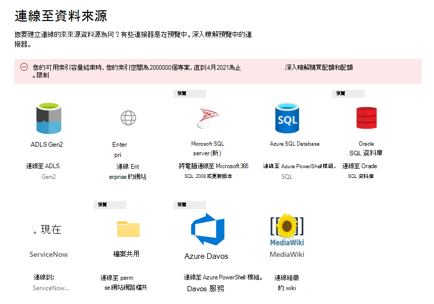

<!-- Previous ms.author: monaray -->

<!-- markdownlint-disable no-trailing-punctuation -->

# Microsoft 的圖形連接器安裝程式概述 

本文說明 microsoft [365 系統管理中心](https://admin.microsoft.com)設定 **microsoft** 的圖形連接器所需的基本程式。 基本套裝程式含下列步驟：  
<!---Add links to each section in the doc--->

1. [在 Microsoft 365 系統管理中心新增圖表連接器](#step-1-add-a-graph-connector-in-the-microsoft-365-admin-center)
2. [命名連接](#step-2-name-the-connection)
3. [設定連接設定](#step-3-configure-the-connection-settings)
4. [管理搜尋許可權](#step-4-manage-search-permissions)
5. [指派屬性標籤](#step-5-assign-property-labels)
6. [管理架構](#step-6-manage-schema)
7. [重新整理設定](#step-7-refresh-settings)
8. [檢查連線](#step-8-review-connection)

本文也包含疑難排解、限制及後續步驟的相關資訊：

* [疑難排解](#troubleshooting)
* [限制](#limitations)
* [後續步驟](#next-steps)

> [!NOTE]
> Microsoft 所有圖形連接器的設定程式都類似，但不完全相同。 **除了閱讀本文之外，請務必閱讀資料來源的連接器特定資訊。**  

<!---## Before you get started-->

<!---Insert "Before you get started" recommendations for this data source-->

## 步驟1：在 Microsoft 365 系統管理中心新增圖表連接器

完成下列步驟以設定任何 Microsoft 建的圖形連接器：

1. 在 [Microsoft 365 系統管理中心](https://admin.microsoft.com)內登入您的系統管理員帳戶。

2. 在功能窗格中，選取 [ **設定**]，然後選取 [ **搜尋 & 情報**]。 選取 [ [連接器]](https://admin.microsoft.com/Adminportal/Home#/MicrosoftSearch/Connectors)索引標籤。

3. 選取 [ **+ 新增**]，然後從可用選項的功能表中選取您選擇的資料來源。

   > [!div class="mx-imgBorder"]
   > 

> [!NOTE]
> 每個租使用者最多可以新增10個圖形連線。

## 步驟2：命名連線

指定下列屬性：

*  (必要的名稱) 
* 需要 (連線識別碼) 
* Description (optional) 

連接識別碼會建立連接器的隱含屬性。 它必須只包含字母數位字元，最多可以有32個字元。

## 步驟3：設定連接設定

設定連線設定的程式會根據資料來源的類型而有所不同。 請參閱您想要新增至租使用者的資料來源類型的連接器特定資訊，以在安裝程式中完成此步驟。  

若要深入瞭解連線至內部部署資料來源的詳細資訊，請參閱 [安裝內部部署資料閘道](/data-integration/gateway/service-gateway-install)。

## 步驟4：管理搜尋許可權

 (ACLs 的存取控制清單) 決定組織中的哪些使用者可以存取每個資料項目目。  

有些連接器（例如 [MICROSOFT SQL](MSSQL-connector.md) 和 [Azure Data Lake Storage Gen2](azure-data-lake-connector.md) ）在本機上支援 [AZURE Active Directory (azure AD) ](/azure/active-directory/) ACLs。

其他連接器（如 [ServiceNow](servicenow-connector.md)、 [Azure DevOps](azure-devops-connector.md)和 [SALESFORCE](salesforce-connector.md) ）支援非 Azure AD 使用者和群組的同步處理。  

## 步驟5：指派屬性標籤

您可以在 [指派屬性標籤] 頁面上，將語義標籤指派給來源屬性。 標籤是由 Microsoft 提供的已知標記，可提供語義意義。 其允許 Microsoft 將您的連接器資料整合到 Microsoft 365 體驗，例如增強型搜尋、人員卡片、智慧探索等等。  

下表列出目前支援的標籤及其描述。  

標籤 | 描述
--- | ---  
**title** | 您想要顯示在搜尋和其他體驗中的專案標題
**url** | 來源系統中專案的目標 url
**createdBy** | 建立專案的人員名稱
**lastModifiedBy** | 最近編輯專案的人員名稱
**作者** | 參與或合作專案的人員名稱
**createdDateTime** | 專案的建立時間
**lastModifiedDateTime** | 專案最近編輯的時間
**檔案名** | 檔專案的名稱
**fileExtension** | 檔專案的類型（例如 .pdf 或單字）

此頁面上的屬性會根據您的資料來源預先選取，但是如果有其他屬性更適合特定標籤，您可以變更此選取範圍。  

標籤 **標題** 是最重要的標籤。 **強烈建議** 您將屬性指派給此標籤，以便讓連線參與 [結果叢集體驗](result-cluster.md)。

不正確地對應標籤會導致 deteriorated 搜尋體驗。 有些標籤不會有指派屬性。  

## 步驟6：管理架構

### Content 屬性

建議您從選項的下拉式功能表中選取 **內容屬性** ，或保留預設值（如果有的話）。 此屬性用於內容、搜尋結果頁面片段產生、 [結果](result-cluster.md) 叢集加入、語言偵測、HTML/文字支援、排名與相關性及查詢表述的全文檢索索引。

如果您選取內容屬性，當您 [建立結果類型](customize-results-layout.md)時，可以選擇使用系統所產生的屬性 **ResultSnippet** 。 此屬性用作在查詢時從 content 屬性產生之動態程式碼片段的預留位置。 如果您在結果類型中使用此屬性，則會在搜尋結果中產生程式碼片段。

### 建立來源屬性的別名

您可以在「管理架構」頁面的 [別名] 欄下，新增別名至您的屬性。 別名是屬性的易記名稱，也可用於查詢和建立篩選。 它們也用來從多個連接中標準化來源屬性，使其具有相同名稱。 這樣一來，您就可以建立單一篩選，使其具有多個連線。 如需詳細資訊，請參閱 [自訂搜尋結果頁面](customize-search-page.md)。  

### 搜尋架構屬性

您可以設定搜尋架構屬性，以控制每個來源屬性的搜尋功能。 搜尋架構可協助決定搜尋結果頁面上顯示的結果，以及使用者可以查看和存取哪些資訊。

搜尋架構屬性包含 **查詢**、 **搜尋**、 **檢索** 及 **精煉** 的選項。 下表列出 Microsoft Graph 連接器所支援的每個屬性，並說明其功能。

搜尋架構屬性 | 函數 | 範例
--- | --- | ---
搜索 | 使屬性的文字內容可供搜尋。 屬性內容會包含在全文檢索索引中。 | 若屬性為 **title**， **企業** 查詢會傳回包含 word Enterprise 的任何文字或標題中的 word **enterprise** 的查詢。
查詢 | 依查詢搜尋特定屬性的相符。 您可以在查詢中以程式設計方式或逐字方式指定屬性名稱。 |  如果可以查詢 **title** 屬性，則會支援查詢 **標題： Enterprise** 。
檢索 | 在結果類型中只能使用可檢索的屬性，並顯示在搜尋結果中。 |
完善 | [調整] 選項可以像在 Microsoft 搜尋結果頁面中那樣使用。 | 您組織中的使用者可以在 [搜尋結果] 頁面中以 **URL** [篩選](custom-filters.md)，如果在連線設定期間標示了精煉屬性

針對除檔案共用連接器以外的所有連接器，必須手動設定自訂類型。 若要啟動每個欄位的搜尋功能，您需要對應至屬性清單的搜尋架構。 連接嚮導會根據您所選擇的來源屬性集，自動選取搜尋架構。 您可以在 [搜尋架構] 頁面中選取每個屬性和屬性的核取方塊，以修改此架構。

> [!div class="mx-imgBorder"]
> 

### 搜尋架構設定的限制與建議

* **Content** 屬性僅可供搜尋。 在下拉式清單中選取此屬性後，就無法使用 options **取回** 或 **查詢**。

* 使用 **content** 屬性來呈現搜尋結果時，會發生重大效能問題。 範例是 [ServiceNow](https://www.servicenow.com)知識文庫文章的 [**文字** 內容] 欄位。

* 在搜尋結果中，只有標示為可檢索的屬性，而且可以用來 (MRTs) 建立新式結果類型。

* 只能將字串屬性標示為可搜尋。

> [!NOTE]
> 建立連線之後，就 **無法** 修改架構。 若要這麼做，您必須刪除您的連線，並建立新的連線。

## 步驟7：重新整理設定

[重新整理間隔] 會決定資料來源與 Microsoft 搜尋之間的同步處理頻率。 每個資料來源類型都有一組不同的最佳重新整理排程，取決於修改資料的頻率及修改的類型。

有兩種重新整理間隔類型，也就是 **完整** 重新 **整理和累加** 重新整理，但是部分資料來源無法使用增量更新。

使用完整重新整理時，搜尋引擎會處理及索引內容來源中的每個專案，而不論先前的編目。 完整重新整理最適合下列情況：

* 偵測資料刪除。
* 增量式重新整理找到錯誤，但失敗。
* 已修改 ACLs。
* 已修改編目規則。
* 連線的架構尚未更新 (尚未支援架構更新) 。

使用 **增量** 重新整理，搜尋引擎只可以處理和編制自上次成功編目之後所建立或修改的專案。 因此，並非內容來源中的所有資料都是重新編制索引。 增量式重新整理最適合偵測內容、中繼資料、許可權及其他更新的工作。

重新整理的速度會比完整重新整理快許多，因為未處理未變更的專案。 不過，如果您選擇執行累加重新整理，您仍然需要定期執行完整重新整理，以維護內容來源與搜尋索引之間的正確資料同步處理。

> [!div class="mx-imgBorder"]
> 

<!---Change screenshot for one that shows both options in new UI (try ServiceNow)--->

## 步驟8：檢查連線

您可以視需要複查整個設定及編輯設定，然後再完成連線。 **若尚未閱讀資料來源的連接器特有資訊，請務必先將其讀取。** 當您準備好完成連線時，請選取 **[完成更新]** 。

### 確認連接設定是否運作正常

在系統 [管理中心](https://admin.microsoft.com)的 [**連接器**] 索引標籤下，移至您發佈的連線清單。 若要瞭解如何進行更新和刪除，請參閱 [管理您的連接器](manage-connector.md)。

## 疑難排解
<!---Insert troubleshooting recommendations for this data source-->
閱讀資料來源的連接器特定資訊。 

> [!NOTE]
> 並非所有連接器特有的文章都包含疑難排解建議。

## 限制
<!---Insert limitations for this data source-->
若要瞭解適用于所有資料來源的限制，請參閱 [Microsoft Graph 連接器](connectors-overview.md) 文章的概述。

請參閱資料來源連接器特有的資訊，以找出其他限制是否適用于該特定圖表連接器。

## 後續步驟

在發佈連線後，您必須自訂搜尋結果頁面。 若要瞭解如何自訂搜尋結果，請參閱 [自訂搜尋結果頁面](customize-search-page.md)。