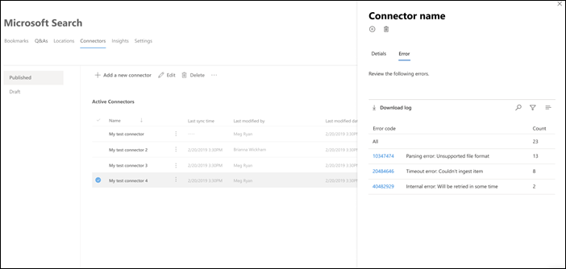
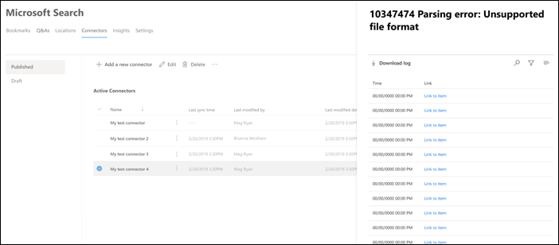

<!-- markdownlint-disable no-inline-html -->

# 檢視連線詳細資料與錯誤View connection details and errors

若要存取和管理您的連接器，您必須指定為您租使用者的「搜尋管理員」。To access and manage your connectors, you must be designated as a search administrator for your tenant. 請與您的租使用者管理員聯繫，為您提供搜尋系統管理員角色。Contact your tenant administrator to provision you for the search administrator role.

流覽至[Microsoft 365 admin center](https://admin.microsoft.com)中的 [[連接器]](https://admin.microsoft.com/Adminportal/Home#/MicrosoftSearch/Connectors)索引標籤。Navigate to the [Connectors tab](https://admin.microsoft.com/Adminportal/Home#/MicrosoftSearch/Connectors) in the [Microsoft 365 admin center](https://admin.microsoft.com).

當您按一下 [ [連接器]](https://admin.microsoft.com/Adminportal/Home#/MicrosoftSearch/Connectors)索引標籤上的連線時，您可以查看連線詳細資料和錯誤。You can view connection details and errors when you click on the connection on the [Connectors tab](https://admin.microsoft.com/Adminportal/Home#/MicrosoftSearch/Connectors).  

## 查看您的最後編目資訊View your last crawl info

在第一次的累加或完全編目成功完成後，最後一個編目資料值會顯示在詳細資料窗格中的最後一個編目標頭底下。After the first initial incremental or full crawl completes successfully, the last crawl data values are displayed under the last crawl header in the detail pane. 如果沒有執行的最後一個編目，您就不會看到最後一個編目標頭底下的任何資訊。If there was no last crawl that ran, you will not see any information under the last crawl header. 關於最後一次編目的資訊可協助您深入瞭解編目的執行方式及必要時採取的必要步驟。This information about last crawl will help you gain insights into how the crawl performed and take necessary steps wherever required.

下列的最後一個編目值將可供每個連線使用：The following last crawl values will be available for each connection:

值Value | 描述Description
--- | ---
**完成于****Completed at** | 上次編目完成的日期和時間Date and time the last crawl got completed
**Type****Type** | 增量或完整編目Incremental or full crawl
**Duration****Duration** | 最後編目完成的時間（多少）how much time did the last crawl take to complete
**成功****Successes** | 上次編目中已成功 ingested 的專案數Number of items that have been successfully ingested in the last crawl
錯誤**Errors** | 最後一個編目中因為的專案數Number of items that errored in the last crawl

## 監視錯誤Monitor errors

針對 [**連接器**] 索引標籤上的每個作用中 **連接器**，所有的現有編目錯誤都會顯示在 [**錯誤**] 索引卷索引標籤會列出錯誤碼、每個記錄檔的計數，以及錯誤記錄下載選項。For each **Active Connector** on the **Connectors** tab, any existing crawl errors show under the **Error** tab. The tab lists error codes, the count of each, and error log download options. 請參閱下列影像中的範例。See the example in the following image. 選取 **錯誤碼** 以查看錯誤的詳細資料。Select an **error code** to view the error's details.

若要查看錯誤的特定詳細資料，請選取其錯誤碼。To view an error's specific details, select its error code. 螢幕會顯示錯誤詳細資料和連結。A screen appears with error details and a link. 最近的錯誤會出現在頂端。The most recent errors appear at the top. 請參閱下表中的範例。See the example in the following table.

以下是針對任何連線可能會出現的不同錯誤清單。Below is the list of different errors that can appear against any connection.

錯誤碼Error code | 錯誤訊息Error message | 解決方案Solution
--- | --- | ---
10001000 | 無法使用資料來源。The data source isn't available. 請檢查您的網際網路連線，或確定該連接器仍可存取資料來源。Check your internet connection or make sure the data source is still accessible by the connector. | 當資料來源由於網路問題或資料來源本身被刪除、移動或重新命名時，便會發生此錯誤。This error occurs when the data source is not reachable due to a network issue or when the data source itself is deleted, moved, or renamed. 檢查提供的資料來源詳細資料是否仍然有效。Check if the data source details provided are still valid.
10011001 | 無法更新資料，因為資料來源正在節流連接器。Can't update the data, because the data source is throttling the connector. | 若要 unthrottle 資料來源，請檢查其縮放比例是否可增加，或等到一天中的流量很低的時間。To unthrottle the data source, check if its scale limits can be increased or wait until a less traffic-heavy time of the day.
10021002 | 無法使用資料來源進行驗證。Can't authenticate with the data source. 請確認與此資料來源相關聯的認證正確無誤。Verify that the credentials associated with this data source are correct. | 按一下 [ **編輯** ] 以更新驗證認證。Click **Edit** to update the authentication credentials.
10031003 | 與連接器關聯的帳戶沒有存取該專案的許可權。The account associated with the connector doesn't have permission to access the item. |  確定適當的帳戶有權存取您要編制索引的專案。Ensure the proper account has access to the item you want indexed.
10041004 | 無法到達內部部署資料閘道。Unable to reach the on-premises data gateway. 請確定閘道服務正在執行，且連線設定中已更新閘道詳細資料。Make sure the gateway service is running and the gateway details are updated in the connection configuration. | 使用閘道檢查電腦，開啟 Power BI 閘道應用程式，並確定閘道正在執行。Check the computer with the gateway, open the Power BI Gateway application and make sure the gateway is running. 確認閘道使用的是與 Microsoft 搜尋相同的系統管理員帳戶，然後確定連線設定中所有的閘道詳細資料都已更新。Verify that the gateway is using the same admin account as Microsoft Search, then make sure all the gateway details are all updated in the connection configuration.
10051005 | 與此資料來源相關聯的認證已過期。Credentials associated with this data source have expired. 更新認證並更新連線。Renew the credentials and update the connection. | 按一下 [ **編輯** ] 以更新驗證認證。Click **Edit** to update the authentication credentials.
10061006 | 您的閘道版本已過期，且不再支援此連接器。Your gateway version is out of date and doesn’t support this connector anymore. 您將需要更新閘道。You will need to update the gateway. | 請造訪 [安裝內部部署資料閘道](/data-integration/gateway/service-gateway-install) ，以在包含閘道的機器上下載並安裝最新版本的 Power BI 閘道。Please visit [Install an on-premises data gateway](/data-integration/gateway/service-gateway-install) to download  and install the latest version of the Power BI gateway on the machine containing the gateway.
10071007 | 未偵測到有效的 Power BI 授權。No valid Power BI license detected. 您需要有效的 Power BI 授權，才能執行這種編目。You need a valid Power BI license to perform this crawl. | 您需要有效的 Power BI 授權，才能執行這種編目。You need a valid Power BI license to perform this crawl. 檢查您的組織是否具備有效的授權。Check that your organization has a valid license. 如果是的話，請再試一次。If it does, try again. 如果不是，請取得授權，然後再試一次。If it doesn’t, obtain a license and then try again.
10081008 | 租使用者的配額利用率已達到其限制。The total quota utilization of your tenant has reached its limit. | 嘗試刪除連線以釋放部分配額，或調整您的攝取篩選器以引入較少的資料。Try deleting a connection to free up some of your quota or adjusting your ingestion filters to bring in less data. 若未解決問題，請與 Microsoft 支援人員聯繫。If these don't solve the issue, contact Microsoft support.
10091009 | 您的連線總配額使用量已達到其限制。The total quota utilization for your connection has reached its limit. | 請嘗試調整您的攝取篩選，以引入較少的資料。Try adjusting your ingestion filters to bring in less data. 如果這無法解決問題，請與 Microsoft 支援人員聯繫。If this doesn't solve the issue, contact Microsoft support.
10101010 | 用於索引非 Azure AD 群組的總配額利用率已達到100K 的上限。The total quota utilization for indexing non-Azure AD groups has reached its limit of 100K. | 嘗試刪除連線以釋放部分配額，或調整您的攝取篩選器以引入較少的資料。Try deleting a connection to free up some of your quota or adjusting your ingestion filters to bring in less data. 若未解決問題，請與 Microsoft 支援人員聯繫。If these don't solve the issue, contact Microsoft support.
10111011 | 無法存取或離線的圖形連接器 [代理程式](on-prem-agent.md) 。The Graph connector [agent](on-prem-agent.md) is not reachable or offline. | 
10121012 | 因為不支援的驗證模式，所以連線驗證失敗。Authentication to your connection failed due to an unsupported authentication mode. | 編輯連線以更新連接的驗證設定。Edit the connection to update the authentication settings for your connection.
20012001 | 因為佇列中的更新數目很多，所以會限制索引。Indexing is throttled because of a large number of updates in the queue. 根據佇列的不同，可能需要一些時間才能完成更新。Depending on the queue, it can take some time for the updates to complete. | 請稍候，直到佇列清除為止。Please wait until the queue gets cleared.
20022002 | 由於不支援的專案格式設定，索引失敗。Indexing failed due to unsupported item formatting. | 如需詳細資訊，請參閱連接器特有的檔。See connector-specific documentation for more information.
20032003 | 由於不支援的專案內容，索引失敗。Indexing failed due to unsupported item content. | 如需詳細資訊，請參閱連接器特有的檔。See connector-specific documentation for more information.
20042004 | 由於不支援的專案或檔案大小，所以索引失敗。Indexing failed due to unsupported item or file size. | 如需詳細資訊，請參閱連接器特有的檔。See connector-specific documentation for more information.
20052005 | 索引失敗，因為 URI 的長度太長。Indexing failed because the URI is too long. | 如需詳細資訊，請參閱連接器特有的檔。See connector-specific documentation for more information.
20062006 | 由於對應的映射公式或沒有此屬性的 Azure AD 使用者，所以使用者對應失敗。User mapping failed due to an invalid mapping formula or no Azure AD user with this property. | 請嘗試使用不同的對應公式刪除及重新建立連線。Try deleting and recreating the connection with a different mapping formula. 
20072007 | 此專案不會顯示在 Microsoft 搜尋中，因為某些使用者或群組沒有查看此專案的許可權，所以無法進行索引。This item will not be displayed in Microsoft Search because some users or groups without permission to view this item could not be indexed. | 
20082008 | 連接不能有超過50000個成員的非 Azure AD 群組。Connections can't have non-Azure AD groups with more than 50,000 members. | 請嘗試從群組中移除使用者，或嘗試移除 ACLed 與該群組的專案，以避免攝取，並重新建立連線。Try removing users from a group or try removing items ACLed with that group from ingestion and recreate the connection.
20092009 | 因為有大量要求，所以非 Azure AD 群組索引已暫停。Non-Azure AD group indexing is temporarily paused due to a large number of requests. 當系統完成這些要求的處理時，索引將會繼續。Indexing will resume when the system finishes processing these requests. 請稍後再回來查看。Please check back later. | 
20102010 | 因為 Microsoft 所進行的更新，所以此連線已不再有效。This connection is no longer valid because of an update made by Microsoft. 請刪除連線，然後建立新的連線。Please delete the connection and create a new one. | 請刪除連線，然後建立新的連線。Please delete the connection and create a new one.
50005000 | 發生錯誤。Something went wrong. 若繼續，請與支援人員聯繫。If this continues, contact support. |