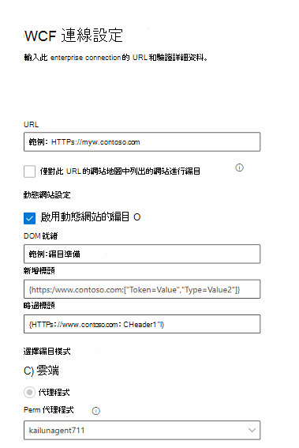

<!---Previous ms.author: monaray --->

<!-- markdownlint-disable no-inline-html -->

# Enterprise 網站 Graph 連接器Enterprise websites Graph connector

Enterprise 網站 Graph 連接器可讓您的組織編制 **來自內部網站** 的文章和內容。The Enterprise websites Graph connector allows your organization to index articles and **content from its internal-facing websites**. 從網站設定連接器及同步內容之後，使用者可以從任何 Microsoft 搜尋用戶端搜尋該內容。After you configure the connector and sync content from the website, end users can search for that content from any Microsoft Search client.

> [!NOTE]
> 請閱讀 [**設定 Graph 連接器**](configure-connector.md)文章，以瞭解一般 Graph 連接器設定指示。Read the [**Setup your Graph connector**](configure-connector.md) article to understand the general Graph connectors setup instructions.

本文適用于任何設定、執行及監視 Enterprise 網站連接器的人員。This article is for anyone who configures, runs, and monitors an Enterprise websites connector. 它會補充一般設定程式，並顯示只適用于 Enterprise 網站連接器的指示。It supplements the general setup process, and shows instructions that apply only for the Enterprise websites connector. 本文也包含 [疑難排解](#troubleshooting)的相關資訊。This article also includes information about [Troubleshooting](#troubleshooting).

<!---## Before you get started-->

<!---Insert "Before you get started" recommendations for this data source-->

## 步驟1：在 Microsoft 365 系統管理中心中新增 Graph 連接器Step 1: Add a Graph connector in the Microsoft 365 admin center

遵循一般 [設定指示](./configure-connector.md)。Follow the general [setup instructions](./configure-connector.md).
<!---If the above phrase does not apply, delete it and insert specific details for your data source that are different from general setup instructions.-->

## 步驟2：命名連線Step 2: Name the connection

遵循一般 [設定指示](./configure-connector.md)。Follow the general [setup instructions](./configure-connector.md).
<!---If the above phrase does not apply, delete it and insert specific details for your data source that are different from general setup instructions.-->

## 步驟3：設定連接設定Step 3: Configure the connection settings

若要連線至您的資料來源，請填入網站的根 URL、選擇編目來源，以及您想要使用的驗證類型： [無]、[基本驗證]，或 OAuth 2.0 搭配[Azure Active Directory (Azure AD) ](/azure/active-directory/)。To connect to your data source, fill in the root URL of the website, select a crawl source, and the type of authentication you'd like to use: None, Basic Authentication, or OAuth 2.0 with [Azure Active Directory (Azure AD)](/azure/active-directory/). 在您完成此資訊之後，請選取 [測試連線] 以驗證您的設定。After you complete this information, select Test Connection to verify your settings.

### URLURL

使用 [URL] 欄位可指定您要編目之網站的根目錄。Use the URL field to specify the root of the website that you'd like to crawl. 企業網站連接器會使用此 URL 做為開始點，並遵循此 URL 的所有連結進行編目。The enterprise websites connector will use this URL as the starting point and follow all the links from this URL for its crawl.

### 編目網站地圖中所列的網站Crawl websites listed in the sitemap

選取此選項時，連接器只會編目網站地圖中所列的 URLs。When selected the connector will only crawl the URLs listed in the sitemap. 若未選取或未找到任何網站圖形，連接器將會對該網站的根 URL 所找到的所有連結進行深入編目。If not selected or no site map is found, the connector will do a deep crawl of all the links found on the root URL of the site.

### 動態網站設定Dynamic site configuration

例如，如果您的網站包含動態內容，例如 Confluence 或 Unily 等內容管理系統中的網頁，您可以啟用動態編目程式。If your website contains dynamic content, for example, webpages that live in content management systems like Confluence or Unily, you can enable a dynamic crawler. 若要將其開啟，請選取 [ **啟用動態網站的** 編目]。To turn it on, select **Enable crawl for dynamic sites**. 編目程式會在開始編目之前，等待動態內容進行轉譯。The crawler will wait for dynamic content to render before it begins crawling.

> [!div class="mx-imgBorder"]
> 

除了核取方塊之外，還有三個可供選用的欄位：In addition to the check box, there are three optional fields available:

1. **Dom 就緒**：輸入 dom 專案，編目程式應使用它做為內容完全呈現及編目應該開始的信號。**DOM Ready**: Enter the DOM element the crawler should use as the signal that the content is fully rendered and the crawl should begin.
1. **要新增的標頭**：指定編目程式在傳送該特定 web URL 時應包含的 HTTP 標頭。**Headers to Add**: Specify which HTTP headers the crawler should include when sending that specific web URL. 您可以為不同的網站設定多個標頭。You can set multiple headers for different websites. 建議包括 auth token 值。We suggest including auth token values.
1. **略過標頭**：指定應從動態編目要求排除的任何不必要標頭。**Headers to Skip**: Specify any unnecessary headers that should be excluded from dynamic crawling requests.

> [!NOTE]
> 只有代理程式編目模式支援動態編目。Dynamic crawling is only supported for Agent crawl mode.

### 編目模式：雲端或內部部署Crawl mode: Cloud or On-premises

編目模式會決定您要建立索引的網站類型（雲端或內部部署）。The crawl mode determines the type of websites you want to index, either cloud or on-premises. 針對您的雲端網站，選取 **雲端** 做為編目模式。For your cloud websites, select **Cloud** as the crawl mode.

此外，連接器現在也支援對內部部署網站進行編目。Also, the connector now supports crawling of on-premises websites. 若要存取您的內部部署資料，您必須先安裝及設定 Graph 連接器代理程式。To access your on-premises data, you must first install and configure the Graph connector agent. 若要深入瞭解，請參閱[Graph connector agent](./on-prem-agent.md)。To learn more, see [Graph connector agent](./on-prem-agent.md).

若為您的內部部署網站，請選取 [**代理程式**] 做為編目模式，並在 [部署中的 **代理程式**] 欄位中，選擇您先前安裝及設定的 Graph 連接器代理程式。For your on-premises websites, select **Agent** as the crawl mode and in the **On-prem Agent** field, choose the Graph connector agent that you installed and configured earlier.  

### 驗證Authentication

基本驗證需要使用者名稱和密碼。Basic Authentication requires a username and password. 使用[Microsoft 365 系統管理中心](https://admin.microsoft.com)建立此 bot 帳戶。Create this bot account by using the [Microsoft 365 admin center](https://admin.microsoft.com).

使用 [AZURE AD](/azure/active-directory/) OAuth 2.0 需要資源識別碼、用戶端識別碼和用戶端密碼。OAuth 2.0 with [Azure AD](/azure/active-directory/) requires a resource ID, Client ID, and Client Secret. OAuth 2.0 僅適用于雲端模式。OAuth 2.0 only works with Cloud mode.

如需詳細資訊，請參閱[使用 OAuth 2.0 代碼授與流程授權存取 Azure Active Directory web 應用程式](/azure/active-directory/develop/v1-protocols-oauth-code)。For more information, see [Authorize access to Azure Active Directory web applications using OAuth 2.0 code grant flow](/azure/active-directory/develop/v1-protocols-oauth-code). 使用下列值進行註冊：Register with the following values:

**名稱：** Microsoft 搜尋**Name:** Microsoft Search  
**Redirect_URI：**`https://gcs.office.com/v1.0/admin/oauth/callback`**Redirect_URI:** `https://gcs.office.com/v1.0/admin/oauth/callback`

若要取得資源、client_id 及 client_secret 的值，請移至 **使用授權碼以要求** 重新導向 URL 網頁上的存取權杖。To get the values for the resource, client_id, and client_secret, go to **Use the authorization code to request an access token** on the redirect URL webpage.

如需詳細資訊，請參閱[快速入門：使用 Microsoft 身分識別平臺註冊應用程式](/azure/active-directory/develop/quickstart-register-app)。For even more information, see [Quickstart: Register an application with the Microsoft identity platform](/azure/active-directory/develop/quickstart-register-app).

## 步驟3a：新增 URLs 以排除 (選擇性編目限制) Step 3a: Add URLs to exclude (Optional crawl restrictions)

有兩種方式可以避免網頁進行編目：在 robots.txt 檔案中禁止這些頁面，或將其新增至排除清單。There are two ways to prevent pages from being crawled: disallow them in your robots.txt file or add them to the Exclusion list.

### robots.txt 的支援Support for robots.txt

連接器會檢查您的根網站是否有 robots.txt 檔案，如果有的話，則會依照該檔案中所發現的指示來查看。The connector checks to see if there is a robots.txt file for your root site and, if one exists, it will follow and respect the directions found within that file. 如果您不想讓連接器編目網站上的某些頁面或目錄，您可以在 robots.txt 檔案中的「禁止」宣告中呼叫這些頁面或目錄。If you do not want the connector to crawl certain pages or directories on your site, you can call out those pages or directories in the "Disallow" declarations in your robots.txt file.

### 新增要排除的 URLsAdd URLs to exclude

您可以選擇性地建立 **排除清單** ，以排除部分 URLs 若該內容機密或不值得編目的情況，則無法取得編目。You can optionally create an **Exclusion list** to exclude some URLs from getting crawled if that content is sensitive or not worth crawling. 若要建立排除清單，請流覽根 URL。To create an exclusion list, browse through the root URL. 您可以在設定過程中將排除的 URLs 新增至清單。You can add the excluded URLs to the list during the configuration process.

## 步驟4：指派屬性標籤Step 4: Assign property labels

您可以從選項的功能表中選擇，將 source 屬性指派給每個標籤。You can assign a source property to each label by choosing from a menu of options. 雖然這個步驟不是必要的，但具有一些屬性標籤會提升搜尋相關性，並確保使用者可以更精確的搜尋結果。While this step isn't mandatory, having some property labels will improve the search relevance and ensure more accurate search results for end users.

## 步驟5：管理架構Step 5: Manage schema

在 [ **管理架構** ] 畫面上，您可以變更架構屬性 (選項包括「 **查詢**」、「 **搜尋**」、「 **檢索**」及「 **精煉** 」與屬性相關聯的) 、新增選用的別名，然後選擇 **Content** 屬性。On the **Manage Schema** screen, you can change the schema attributes (the options are **Query**, **Search**, **Retrieve**, and **Refine**) associated with the properties, add optional aliases, and choose the **Content** property.

## 步驟6：管理搜尋許可權Step 6: Manage search permissions

Enterprise 網站連接器只支援 **所有人都** 能看見的搜尋許可權。The Enterprise websites connector only supports search permissions visible to **Everyone**. 已編制索引的資料會顯示在搜尋結果中，並對組織中的所有使用者顯示。Indexed data appears in the search results and is visible to all users in the organization.

## 步驟7：設定重新整理排程Step 7: Set the refresh schedule

Enterprise 網站連接器只支援完整重新整理。The Enterprise websites connector only supports a full refresh. 這表示連接器會在每次重新整理時重新編目網站的所有內容。This means that the connector will recrawl all the website's content during every refresh. 若要確定連接器有足夠的時間來編目內容，建議您設定大型重新整理排程間隔。To make sure the connector gets enough time to crawl the content, we recommend that you set a large refresh schedule interval. 建議您在一到兩周之間進行排程重新整理。We recommend a scheduled refresh between one and two weeks.

## 步驟8：檢查連線Step 8: Review connection

遵循一般 [設定指示](./configure-connector.md)。Follow the general [setup instructions](./configure-connector.md).
<!---If the above phrase does not apply, delete it and insert specific details for your data source that are different from general setup instructions.-->

## 疑難排解Troubleshooting

當閱讀網站內容時，編目可能會遇到一些來源錯誤，這些錯誤是由下列詳細的錯誤碼所代表。When reading the website's content, the crawl may encounter some source errors, which are represented by the detailed error codes below. 若要取得錯誤類型的詳細資訊，請在選取連接後，移至 [ **錯誤詳細資料** ] 頁面。To get more information on the types of errors, go to the **error details** page after selecting the connection. 選取 **錯誤碼** 以查看更詳細的錯誤。Select the **error code** to see more detailed errors. 此外，請參閱 [管理您的連接器](./manage-connector.md) 以深入瞭解。Also refer to [Manage your connector](./manage-connector.md) to learn more.

 詳細錯誤代碼Detailed Error code | 錯誤訊息Error message
 --- | ---
 60016001 | 無法連線正在嘗試編制索引的網站The site that is being tried to index is not reachable
 60056005 | 根據 robots.txt 設定，已封鎖嘗試編制索引的來源頁面。The source page that is being tried to index has been blocked by as per robots.txt configuration.
 60086008 | 無法解析 DNSUnable to resolve the DNS
 60096009 | 針對所有用戶端錯誤 (除 HTTP 404、408) 以外，請參閱 HTTP 4xx 錯誤碼以取得詳細資訊。For all client-side errors (Except HTTP 404, 408), refer to HTTP 4xx error codes for details.
 60136013 | 找不到嘗試編制索引的來源頁面。The source page that is being tried to index could not be found.  (HTTP 404 錯誤) (HTTP 404 error)
 60186018 | 來源頁面沒有回應，且要求超時。 (HTTP 408 錯誤) The source page is not responding, and the request has timed out. (HTTP 408 error)
 60216021 | 嘗試編制索引的來源頁面沒有頁面上的文字內容。The source page that is being tried to index has no textual content on the page.
 60236023 | 嘗試編制索引的來源頁面不受支援 (不是 HTML 頁面) The source page that is being tried to index is unsupported (not an HTML page)
 60246024 | 嘗試編制索引的來源頁面具有不支援的內容。The source page that is being tried to index has unsupported content.

* 當資料來源由於網路問題或資料來源本身被刪除、移動或重新命名時，就會發生錯誤6001-6013。Errors 6001-6013 occur when the data source is not reachable due to a network issue or when the data source itself is deleted, moved, or renamed. 檢查提供的資料來源詳細資料是否仍然有效。Check if the data source details provided are still valid.
* 當資料來源包含頁面上的非文字內容或頁面不是 HTML 時，就會發生錯誤6021-6024。Errors 6021-6024 occur when the data source contains non-textual content on the page or when the page is not an HTML. 請檢查資料來源，並將此頁面加入排除清單，或略過錯誤。Check the data source and add this page in exclusion list or ignore the error.
