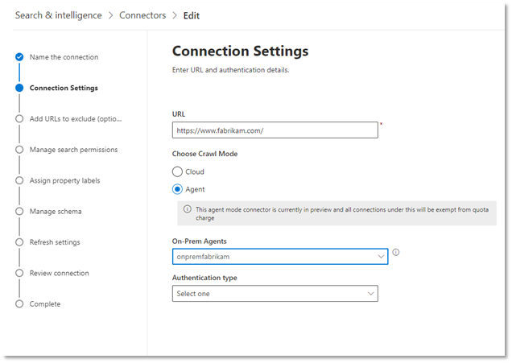

<!---Previous ms.author: monaray --->

<!-- markdownlint-disable no-inline-html -->

# 企業網站圖表連接器

企業網站圖表連接器可讓您的組織對 **來自內部網站** 的文章和內容編制索引。 在您設定網站的連接器及同步內容之後，使用者可以從任何 Microsoft 搜尋用戶端搜尋該內容。

> [!NOTE]
> 請閱讀 [**您的圖形連接器文章設定**](configure-connector.md) ，以瞭解一般圖表連接器設定程式。

本文適用于任何設定、執行及監視企業網站連接器的人員。 它會補充一般設定程式，並顯示只適用于企業網站連接器的指示。 本文也包含 [疑難排解](#troubleshooting) 及 [限制](#limitations)的相關資訊。

<!---## Before you get started-->

<!---Insert "Before you get started" recommendations for this data source-->

## 步驟1：在 Microsoft 365 系統管理中心新增圖表連接器

遵循一般 [設定指示](https://docs.microsoft.com/microsoftsearch/configure-connector)。
<!---If the above phrase does not apply, delete it and insert specific details for your data source that are different from general setup instructions.-->

## 步驟2：命名連線

遵循一般 [設定指示](https://docs.microsoft.com/microsoftsearch/configure-connector)。
<!---If the above phrase does not apply, delete it and insert specific details for your data source that are different from general setup instructions.-->

## 步驟3：設定連接設定

若要連線至您的資料來源，您必須填寫網站的根 URL、選擇編目來源，以及您想要使用的驗證類型： [無]、[基本驗證]，或 OAuth 2.0 搭配 [Azure Active Directory (AZURE AD) ](https://docs.microsoft.com/azure/active-directory/)。 在您完成此資訊之後，請選取 [測試連線] 以驗證您的設定。

### URL

使用 [URL] 欄位可指定您要編目之網站的根目錄。 企業網站連接器會使用此 URL 做為開始點，並遵循此 URL 的所有連結進行編目。

### 編目模式：雲端或內部部署 (預覽) 

編目模式會決定您要建立索引的網站類型（雲端或內部部署）。 針對您的雲端網站，選取 **雲端** 做為編目模式。

此外，連接器現在也支援對內部部署網站進行編目。 此模式為預覽模式。 若要存取您的內部部署資料，您必須先安裝及設定圖形連接器代理程式。 若要深入瞭解，請參閱 [Graph connector agent](https://docs.microsoft.com/microsoftsearch/on-prem-agent)。

若為您的內部部署網站，請選取 [ **代理程式** ] 做為編目模式，並在 [部署中的 **代理程式** ] 欄位中，選擇您先前安裝及設定的圖形連接器代理程式。  

> [!div class="mx-imgBorder"]
> 

### 驗證

基本驗證需要使用者名稱和密碼。 使用 [Microsoft 365 系統管理中心](https://admin.microsoft.com)建立此 bot 帳戶。

使用 [AZURE AD](https://docs.microsoft.com/azure/active-directory/) OAuth 2.0 需要資源識別碼、用戶端識別碼和用戶端密碼。 OAuth 2.0 僅適用于雲端模式。

如需詳細資訊，請參閱 [使用 OAuth 2.0 程式碼授與流程授權存取 Azure Active Directory web 應用程式](https://docs.microsoft.com/azure/active-directory/develop/v1-protocols-oauth-code)。 使用下列值進行註冊：

**名稱：** Microsoft 搜尋  
**Redirect_URI：**`https://gcs.office.com/v1.0/admin/oauth/callback`

若要取得資源、client_id 及 client_secret 的值，請移至 **使用授權碼以要求** 重新導向 URL 網頁上的存取權杖。

如需詳細資訊，請參閱 [快速入門：使用 Microsoft identity Platform 註冊應用程式](https://docs.microsoft.com/azure/active-directory/develop/quickstart-register-app)。

## 步驟3a：新增 URLs 以排除 (選擇性編目限制) 

有兩種方式可以避免網頁進行編目：在 robots.txt 檔案中禁止這些頁面，或將其新增至排除清單。

### robots.txt 的支援

連接器會檢查您的根網站是否有 robots.txt 檔案，如果有的話，則會依照該檔案中所發現的指示來查看。 如果您不想讓連接器編目網站上的某些頁面或目錄，您可以在 robots.txt 檔案中的「禁止」宣告中呼叫這些頁面或目錄。

### 新增要排除的 URLs

您可以選擇性地建立 **排除清單** ，以排除部分 URLs 若該內容機密或不值得編目的情況，則無法取得編目。 若要建立排除清單，請流覽根 URL。 您可以在設定過程中將排除的 URLs 新增至清單。

## 步驟4：指派屬性標籤

您可以從選項的功能表中選擇，將 source 屬性指派給每個標籤。 雖然這個步驟不是必要的，但具有一些屬性標籤會提升搜尋相關性，並可確保使用者更準確的搜尋結果。

## 步驟5：管理架構

在 [ **管理架構** ] 畫面上，您可以變更架構屬性 (選項包括「 **查詢**」、「 **搜尋**」、「 **檢索**」及「 **精煉** 」與屬性相關聯的) 、新增選用的別名，然後選擇 **Content** 屬性。

## 步驟6：管理搜尋許可權

企業網站連接器只支援 **所有人都** 能看見的搜尋許可權。 已編制索引的資料會顯示在搜尋結果中，並對組織中的所有使用者顯示。

## 步驟7：設定重新整理排程

企業網站連接器只支援完整重新整理。 這表示連接器會在每次重新整理時重新編目網站的所有內容。 若要確定連接器有足夠的時間來編目內容，建議您設定大型重新整理排程間隔。 建議您在一到兩周之間進行排程重新整理。

## 步驟8：檢查連線

遵循一般 [設定指示](https://docs.microsoft.com/microsoftsearch/configure-connector)。
<!---If the above phrase does not apply, delete it and insert specific details for your data source that are different from general setup instructions.-->

## 疑難排解

當閱讀網站內容時，編目可能會遇到一些來源錯誤，這些錯誤是由下列詳細的錯誤碼所代表。 若要取得錯誤類型的詳細資訊，請在選取連接後，移至 [ **錯誤詳細資料** ] 頁面。 選取 **錯誤碼** 以查看更詳細的錯誤。 此外，請參閱 [管理您的連接器](https://docs.microsoft.com/microsoftsearch/manage-connector) 以深入瞭解。

 詳細錯誤代碼 | 錯誤訊息
 --- | ---
 6001 | 無法連線正在嘗試編制索引的網站
 6005 | 根據 robots.txt 設定，已封鎖嘗試編制索引的來源頁面。
 6008 | 無法解析 DNS
 6009 | 針對所有用戶端錯誤 (除 HTTP 404、408) 以外，請參閱 HTTP 4xx 錯誤碼以取得詳細資訊。
 6013 | 找不到嘗試編制索引的來源頁面。  (HTTP 404 錯誤) 
 6018 | 來源頁面沒有回應，且要求超時。 (HTTP 408 錯誤) 
 6021 | 嘗試編制索引的來源頁面沒有頁面上的文字內容。
 6023 | 嘗試編制索引的來源頁面不受支援 (不是 HTML 頁面) 
 6024 | 嘗試編制索引的來源頁面具有不支援的內容。

* 當資料來源由於網路問題或資料來源本身被刪除、移動或重新命名時，就會發生錯誤6001-6013。 檢查提供的資料來源詳細資料是否仍然有效。
* 當資料來源包含頁面上的非文字內容或頁面不是 HTML 時，就會發生錯誤6021-6024。 請檢查資料來源，並將此頁面加入排除清單，或略過錯誤。

## 限制

企業網站連接器不支援搜尋 **動態網頁** 上的資料。 [Confluence](https://www.atlassian.com/software/confluence)與[Unily](https://www.unily.com/)等內容管理系統中的這些網頁範例，或儲存網站內容的資料庫。