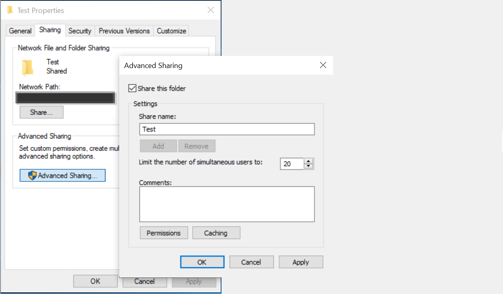

<!---Previous ms.author: rusamai --->

# 檔案共用圖形連接器

檔案共用圖表連接器可讓組織中的使用者搜尋內部部署 Windows 檔案共用。

> [!NOTE]
> 請閱讀 [**您的圖形連接器文章設定**](configure-connector.md) ，以瞭解一般圖表連接器設定程式。

## 開始之前

### 安裝圖形連接器代理程式

若要編制 Windows 檔案共用的索引，您必須安裝並註冊 Graph 連接器代理程式。 請參閱 [安裝 Graph connector agent](on-prem-agent.md) 以深入瞭解。  

### 內容需求

### 檔案類型

下列格式的內容可以編制索引及搜尋： DOC，.DOCM，.DOCX，點，DOTX，.EML，GIF，HTML，JPEG，.MHT，MHTML，MSG，NWS，OBD，OBT，ODP，ODS，ODT，ONE，PDF，.POT，PPS，PPTM，XLB，XLS，.XLSX，.XLT，.xlc，XML，XPS，和 ZIP。 只會為這些格式的文字內容編制索引。 會忽略所有多媒體內容。 針對任何不屬於此格式的檔案，會以單獨的中繼資料來編制索引。

### 檔案大小限制

支援的檔案大小上限為 100 MB。 超過 100 MB 的檔案不會編制索引。 後處理的最大大小限制為 4 MB。 當檔案大小達到 4 MB 時，處理便會停止。 因此，檔案中所提供的某些片語可能無法用於搜尋。

## 步驟1：在 Microsoft 365 系統管理中心新增圖表連接器

遵循一般 [設定指示](./configure-connector.md)。
<!---If the above phrase does not apply, delete it and insert specific details for your data source that are different from general setup instructions.-->

## 步驟2：命名連線

遵循一般 [設定指示](./configure-connector.md)。
<!---If the above phrase does not apply, delete it and insert specific details for your data source that are different from general setup instructions.-->

## 步驟3：設定連接設定

在 [連線 **至資料來源]** 頁面上，選取 [檔案 **共用** ]，並提供名稱、連線識別碼及描述。 在下一個頁面上，提供檔案共用的路徑，然後選取您先前安裝的圖形連接器代理程式。 輸入 [Microsoft Windows](https://microsoft.com/windows) 使用者帳戶的認證，該帳戶具有檔案共用中所有檔案的讀取權限。

### 保留上次存取時間

當連接器嘗試編目檔案時，會更新其中繼資料中的「最後存取時間」欄位。 如果您依賴該欄位進行任何封存與備份解決方案，而且不想要在連接器存取時加以更新，您可以在 [ **高級設定** ] 頁面中設定此選項。

## 步驟4：管理搜尋許可權

您可以在 [ **管理搜尋許可權** ] 頁面中選取所需的選項，以限制可搜尋以共用存取控制清單或新技術檔案系統為基礎的任何檔案的許可權 (NTFS) 存取控制清單。 這些存取控制清單中所提供的使用者帳戶和群組必須由 Active Directory (AD) 管理。 如果您使用其他任何系統進行使用者帳戶管理，可以選取「everyone」選項，讓使用者可以搜尋所有檔案，而不需要任何訪問限制。 不過，當使用者嘗試開啟檔案時，會套用來源的 access 控制項設定。

請注意，根據預設，windows 會在網路上共用資料夾時，提供「所有人」在「共用」 ACLs 中的「讀取」許可權。 根據分機，如果您在 [ **管理搜尋許可權**] 中選擇 [共用] ACLs，使用者就能夠搜尋所有檔案。 如果您想要限制存取，請移除檔案共用中「Everyone」的「讀取」存取權，並只對所需的使用者和群組提供存取權。 然後，連接器會讀取這些訪問限制，並將它們套用至搜尋。

只有在您所提供的共用路徑遵循 UNC 路徑格式時，才可以選擇 [共用] ACLs。 您可以移至 [共用] 選項底下的「高級共用」，以 UNC 格式建立路徑。

## 步驟5：指派屬性標籤

遵循一般 [設定指示](./configure-connector.md)。
<!---If the above phrase does not apply, delete it and insert specific details for your data source that are different from general setup instructions.-->

## 步驟6：管理架構

遵循一般 [設定指示](./configure-connector.md)。
<!---If the above phrase does not apply, delete it and insert specific details for your data source that are different from general setup instructions.-->

## 步驟7：選擇重新整理設定

遵循一般 [設定指示](./configure-connector.md)。
<!---If the above phrase does not apply, delete it and insert specific details for your data source that are different from general setup instructions.-->

## 步驟8：檢查連線

遵循一般 [設定指示](./configure-connector.md)。
<!---If the above phrase does not apply, delete it and insert specific details for your data source that are different from general setup 
instructions.-->

<!---## Troubleshooting-->
<!---Insert troubleshooting recommendations for this data source-->

<!---## Limitations-->
<!---Insert limitations for this data source-->