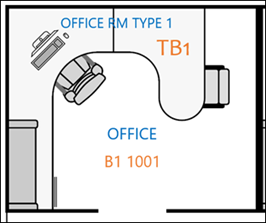

<!-- markdownlint-disable no-inline-html -->
# Microsoft 搜尋基底計畫的最佳作法Best practices for Microsoft Search floor plans

若要成功地執行 Microsoft 搜尋基底計畫，您必須協調三個數據片段：To successfully implement Microsoft Search floor plans, you need to coordinate three pieces of data:

- **建立位置資料**：何種格式及新增方式？**Building location data**: What format and how to add?
- **DWG 格式中的 Floor 平面圖地圖**：如何查看是否有最大成功的資料？**Floor plan map in DWG format**: How to view and what data should it contain for maximum success?
- **在[Azure Active Directory （azure AD）](https://azure.microsoft.com/services/active-directory/)中的員工辦公位置**：要使用的格式及新增方式？**Employee office location in [Azure Active Directory (Azure AD)](https://azure.microsoft.com/services/active-directory/)**: What format to use and how to add?  

在下列各節中也說明部署 Microsoft 搜尋基底計畫的最佳作法。The best practices for deploying Microsoft Search floor plans are also described in the following sections.

## 建立位置資料Building location data

在您新增 floor 計畫之前，您必須將大樓新增至 Microsoft 搜尋位置。Before you add floor plans, you need to add your buildings to Microsoft Search locations. 提供下列必要的建立資料：Provide the following required building data:

|必要的建立資料Required building data  |範例Example  |
|---------|---------|
|名稱Name     |    組建1，紐約州的城市Building 1, New York City     |
|街道地址Street address     |     123任何途徑，紐約州紐約市，紐約州10118123 Any Avenue, New York, NY 10118  |
|緯度-經度（選用）Latitude-longitude  (optional)   |    40.760539，-73.97534140.760539, -73.975341      |
|關鍵字Keywords     |    紐約辦事處，組建1，總公司，總公司，總部New York Office, Building 1, main office, headquarters     |

您可以使用 [**位置**] 索引標籤中的 [匯**入**] 功能（而不是一次加入一個位置），一次新增許多建築物。You can add many buildings at a time by using the **Import** feature in the **Locations** tab instead of adding locations one at a time. 使用 [匯**入**] 功能，您可以指定緯度-經度。With the **Import** feature, you can specify the latitude-longitude. 如需詳細資訊，請參閱[管理位置](manage-locations.md)。For more information, see [Manage locations](manage-locations.md).

## DWG 格式的 Floor 平面圖地圖Floor plan map in DWG format

若要在 Microsoft 搜尋中建立地圖，您需要以特定資訊上傳 DWG 格式的 floor 方案。To build maps in Microsoft Search, you need to upload floor plans in DWG format with specific information. 若要瞭解如何建立及流覽 DWG 格式的檔案，請參閱[Dwg viewer](https://www.autodesk.in/products/dwg)。To learn how to create and view DWG-formatted files, see [DWG Viewers](https://www.autodesk.in/products/dwg).

Floor 平面圖地圖顯示四個元素：Floor plan maps display four elements:

1. **會議室號碼**：在下列範例中，會議室編號會定義為**B1 1001**和**b1 1002**。**Room numbers**: In the following example, room numbers are defined as **B1 1001** and **B1 1002**. **B1**是組建碼， **1001**包含第**1**層和辦公室號碼**001**。**B1** is the building code, and **1001** contains the floor number **1** and the office number **001**.
1. **會議室佈局。**：若要協助澄清多個使用者共用 office，您可以定義椅子和書桌等版面配置。**Room layouts.**: To help clarify details when multiple users share an office, you can define layouts like chairs and desk.
1. **會議室類型**：有些範例包括 office、corridor、open 區域和抽水馬桶。**Room types**: Some examples include office, corridor, open area, and toilet.
1. **資產資訊**：如果使用者位於開啟的空間中，您可以指定其所在的桌面。**Asset info**: If users are in an open space, you can denote which desk they sit at. 在此範例中，辦公桌是由**TB1**和**TB2**表示。In this example, the desks are denoted by **TB1** and **TB2**.

在此圖中，房間號碼是最重要的專案。In this diagram, room numbers are the most important item. 它們會對應至使用者帳戶上的辦公室位置，如下圖所示。They're mapped to a person’s office location on their user account as shown in the following image.

![人員搜尋結果卡片的 [一覽表] 索引標籤顯示使用者的詳細資料，包括辦公室位置](media/floorplans-peoplecard.png)

此資訊儲存在[AZURE AD](https://azure.microsoft.com/services/active-directory/)的**PhysicalDeliveryOfficeName**屬性中。This information is stored in [Azure AD](https://azure.microsoft.com/services/active-directory/) in the **PhysicalDeliveryOfficeName** property. 在 Microsoft 365 系統[管理中心](https://admin.microsoft.com)，它稱為**Office**屬性，可在作用中**使用者**新增。In the Microsoft 365 [admin center](https://admin.microsoft.com), it’s called the **Office** property and can be added in **Active users**.

### DWG 檔案DWG files

Microsoft Search 需要 DWG 中的 floor 計畫檔案，這是[AutoCAD](https://www.autodesk.com/autocad)的繪圖格式。Microsoft Search requires floor plan files in DWG, which is an [AutoCAD](https://www.autodesk.com/autocad) drawing format. 檔案必須包含**版面**配置及**標籤**資料。The files must contain **layout** and **label** data. **會議室編號**是地面方案最重要的標籤。**Room numbers** are the most important labels for floor plans.

建議您使用下表所示的完全相符方法，來建立您的 office 編號系統。We recommend that you create your office numbering system with the exact-match method shown in the following table. 不過，您並不局限于該標籤。But you aren't limited to that labeling. 例如，如果使用者在[AZURE AD](https://azure.microsoft.com/services/active-directory/)中的 office 位置是**B1 1001**，您可以使用下列任一選項，在 DWG 檔案中貼上房間號碼。For example, if the user's office location in [Azure AD](https://azure.microsoft.com/services/active-directory/) is **B1 1001**, you can label the room number in the DWG file with any of the options that follow.

|MatchMatch  |版面配置Layout  |
|---------|---------|
|完全符合 office 位置（建議）Exact match to office location (Recommended)   **B1 1001****B1 1001**   建立程式碼： B1Building code: B1 地板：1Floor: 1  會議室編號：001Room number: 001    |         |
|符合底價和房間號碼Match floor and room number   **1001****1001** 地板：1Floor: 1  會議室編號：001Room number: 001    |      |
|只符合會議室號碼Match room number only   **1****1** 會議室編號：1Room number: 1        |         |

## 使用者帳戶辦公室位置User account office location

若要對應員工的位置，DWG 檔案中的房間號碼會對應至[AZURE AD](https://azure.microsoft.com/services/active-directory/)中使用者帳戶的 office 位置。To map an employee’s location, the room numbers in DWG files are mapped to office locations in the user’s account in [Azure AD](https://azure.microsoft.com/services/active-directory/). **Office location**屬性必須符合 DWG 檔案中的 Office 位置資訊。The **Office location** property needs to match the office location information in the DWG file.

下表說明對應位置資料的最佳作法：The following table explains best practices for mapping location data:

|最佳作法Best practice  |說明Explanation |
|---------|---------|
|包括建築物代碼、基底及房間編號。Include building code, floor, and room number.     |   這項資料可讓您取得完全符合的可能性。This data gives you the best chance to make exact matches.     |
|在建立代碼和地面後包含分隔符號。Include a separator after building codes and floors.     |  以分隔符號或空間分隔基底和房間號碼的大樓代碼，如下列範例所示：Separate building codes from floor and room numbers with a separator or a space, as in these examples:  B1 1001B1 1001  B1/1001B1/1001   B1-1001。B1-1001.   |
|會議室編號永遠遵循建立程式碼、翼和地面資訊。Room number always follows building code, wing, and floor information.     |  如果會議室號碼是**1001**，請將辦公室位置設定為**b1 1001**、 **b1/1001**或**b1-1001**。If the room number is **1001**, then set the office location to **B1 1001**, **B1/1001**, or **B1-1001**.   如果會議室號碼是**F1-001**，請將辦公位置設定為**b1 F1-001**或**b1/F1-001**。If the room number is **F1-001**, then set the office location to **B1 F1-001** or **B1/F1-001**.   如果會議室編號為**1**，則將[Azure AD](https://azure.microsoft.com/services/active-directory/)位置設定為**b1 1001**、 **B1/1001**或**b1-F1-001**。If the room number is **1**, then set the [Azure AD](https://azure.microsoft.com/services/active-directory/) location to **B1 1001**, **B1/1001**, or **B1-F1-001**.       |
|

## 後續步驟Next steps

[管理位置Manage locations](manage-locations.md) 
[管理基底計畫Manage floor plans](manage-floorplans.md)
