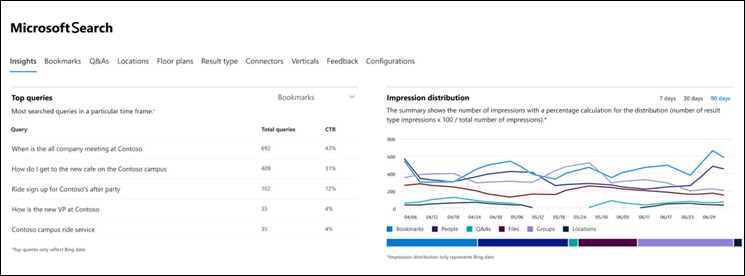
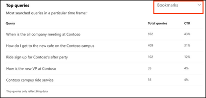
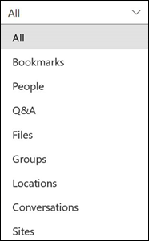
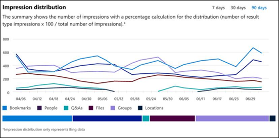

# Microsoft 搜尋深入資訊儀表板報告

您可以使用 Microsoft Search Insights 儀表板來管理您已發佈的答案的 [Bing](https://Bing.com) 資料。 這只是讓您的使用者 [輕鬆尋找內容](make-content-easy-to-find.md) 所需的其中一個步驟。

當您第一次前往 [microsoft 365 系統管理中心](https://admin.microsoft.com)的 microsoft 搜尋時，您會在 [洞察力] 儀表板上輸入。

下列報告可在 Insights 儀表板上使用。

> [!NOTE]
> 報告中的資料只代表 [Bing](https://Bing.com) 資料。

## 查詢排行榜

這份報告提供使用者所執行之 top 2000 [Bing](https://Bing.com) 搜尋查詢的詳細資料。 若要讓查詢顯示在 **Top 查詢**中，查詢至少必須有三次按一下。

點擊率下限 (CTR) 表示使用者找不到所需的內容。

您可以透過篩選答案類型來選擇報表的不同視圖。 例如，如果您只想要查看書簽的上方查詢，請選取報表右上角的下拉式清單，然後選取 [ **書簽**]。 預設會顯示 **所有** 的答案類型。

## 印記散發

這份報告顯示在 [Bing](https://Bing.com) 一段時間內針對各種答案所散佈的印象。 範例包括書簽、人員、Q&A、files、位置、檔案網站、群組和交談。

「印記」發佈可協助系統管理員瞭解使用者在指定期間內的外觀。
