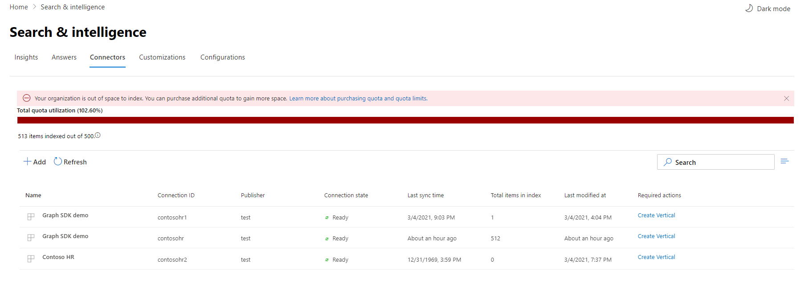

<!-- markdownlint-disable no-inline-html -->

# 監控您的連線

若要存取和管理您的連接器，您必須指定為您租使用者的「搜尋管理員」。 請與您的租使用者管理員聯繫，為您提供搜尋系統管理員角色。

## 連接作業

流覽至[Microsoft 365 系統管理中心](https://admin.microsoft.com)的 [[連接器]](https://admin.microsoft.com/Adminportal/Home#/MicrosoftSearch/Connectors)索引標籤。

針對每個連接器類型， [Microsoft 365 系統管理中心](https://admin.microsoft.com)都支援下表所示的作業：

作業 | Microsoft Graph 連接器 | 夥伴或 Graph 連接器
--- | --- | ---
新增連線 | ： heavy_check_mark： (請參閱 [安裝程式概述](configure-connector.md))  | ： x： (參照您的合作夥伴或自訂的連接器 admin UX) 
刪除連線 | ： heavy_check_mark： | ： heavy_check_mark：
編輯已發佈的連線 | ： heavy_check_mark： Name 及 Description   ： heavy_check_mark：連線設定   ： heavy_check_mark：屬性標籤   ： heavy_check_mark：架構   ： heavy_check_mark：重新整理排程   | ： heavy_check_mark： Name   ： heavy_check_mark： Description
編輯拔模連接 | ： heavy_check_mark： | 軸

## 監視您的線上狀態

在您建立連線後，已處理的專案數目會顯示在 [ **Microsoft 搜尋**] 頁面上的 [**連接器**] 索引標籤上。 在初次完整編目成功完成之後，會顯示定期增加編目的進度。 此頁面提供連接器之日常作業的相關資訊，以及記錄檔及錯誤歷程記錄的概覽。

每個連線的 [ **狀態** ] 欄中會顯示五種狀態：

* **同步** 處理。 連接器會編目來源中的資料，以編制現有專案的索引並進行任何更新。

* **Ready**：連線已就緒，而且沒有對其執行任何作用中的編目。 **上次同步處理時間** 表示上次成功編目的時間。 連線為最新的同步處理時間。

* 已 **暫停**。 管理員會透過 pause 選項暫停編目。 下一個編目只會在手動恢復時執行。 不過，來自此連線的資料仍可供搜尋。

* **失敗**。 連接發生嚴重失敗。 此錯誤需要手動干預。 管理員需要根據所顯示的錯誤訊息採取適當的動作。 在發生錯誤之前，已編制索引的資料可供搜尋。

* **Delete 失敗**。 刪除連接失敗。 根據失敗原因，資料可能仍然會編制索引，專案配額可能仍然會消耗，而且編目仍會執行連線。 建議您在此狀態再次嘗試刪除連線。

## 監視索引配額利用率

可用的索引配額和使用量會顯示在 [連接器] 的 [登陸] 頁面上。

 
>[!NOTE]
>在預覽期間內，每個嘗試 Graph 連接器的組織，都提供所有連線中高達2000000專案的免費固定配額。 使用目前可用的 Graph 連接器，在預覽中使用 Graph 連接器的組織中，可用配額會在2021年4月1日到期。
>以「[預覽](./connectors-overview.md)」標示的 Microsoft 內建 Graph 連接器不會包含在您組織的總電量索引配額內。 不過，它會計算您可以為您的組織設定的最大連線數目上限，以及您的組織可在連線上編制索引的最大7000000專案數目;每個連線都是限制700000個專案。 

[配額使用狀況] 列會根據您的組織的配額使用量，指出不同的狀態：

狀態 | 配額使用量層級
--- | --- 
一般 | 0-79%
高 | 80-89%
嚴重 | 90%-99%
Full | 100%

<!-- 

-->

已編制索引的專案數也會顯示每個連線。 每個連線編制索引的專案數會占組織可用的總配額。

當您的組織超過索引配額時，所有作用中的連線將會受到影響，而且這些連線將會以 **超出限制** 的狀態運作。 在此狀態下，您的使用中連接  

* 無法新增專案。

* 將能夠更新或刪除現有專案。

若要修正此問題，您可以執行下列其中一項操作：

* 瞭解如何在 [授權需求和價格](licensing.md)購買組織的索引配額。

* 找出 ingested 過多內容的連線，並更新這些連線以編制索引較少的專案，以騰出空間做為配額。 若要更新連線，您必須使用新的攝取篩選來刪除及建立新的連線，而這會帶來較少的專案。

* 永久刪除一或多個連線