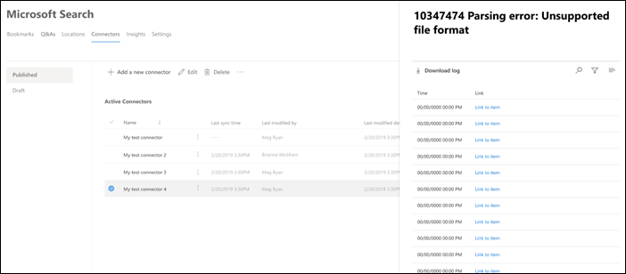

<!-- markdownlint-disable no-inline-html -->

# 管理 Microsoft 搜尋的連線

若要存取和管理您的連接器，您必須指定為您租使用者的「搜尋管理員」。 請與您的租使用者管理員聯繫，為您提供搜尋系統管理員角色。

## 開始使用

流覽至[Microsoft 365 admin center](https://admin.microsoft.com)中的 [[連接器]](https://admin.microsoft.com/Adminportal/Home#/MicrosoftSearch/Connectors)索引標籤。

針對每個連接器類型， [Microsoft 365 系統管理中心](https://admin.microsoft.com) 支援下表所示的作業：

作業 | Microsoft 建立的連接器 | 夥伴或自訂建立的連接器
--- | --- | ---
新增連線 | ： heavy_check_mark： (請參閱 [設定您的 Microsoft 建連接器](configure-connector.md))  | ： x： (參照您的合作夥伴或自訂的連接器 admin UX) 
刪除連線 | ： heavy_check_mark： | ： heavy_check_mark：
編輯已發佈的連線 | ： heavy_check_mark： Name   ： heavy_check_mark： Description   ： heavy_check_mark：外部資料源的驗證認證   ： heavy_check_mark：內部部署資料來源的閘道認證   ： heavy_check_mark：重新整理排程   | ： heavy_check_mark： Name   ： heavy_check_mark： Description
編輯拔模連接 | ： heavy_check_mark： | 軸

## 監視您的線上狀態

在您建立連線後，已處理的專案數目會顯示在 [ **Microsoft 搜尋**] 頁面上的 [**連接器**] 索引標籤上。 在初次完整編目成功完成之後，會顯示定期增加編目的進度。 此頁面提供連接器之日常作業的相關資訊，以及記錄檔及錯誤歷程記錄的概覽。

每個連線會在 [ **狀態** ] 欄中顯示四個狀態：

* **同步** 處理。 連接器會編目來源中的資料，以編制現有專案的索引並進行任何更新。

* **已啟用**：連線已啟用，且沒有對其執行的作用中編目。 **上次同步處理時間** 表示上次成功編目的時間。 連線為最新的同步處理時間。

* 已 **暫停**。 管理員會透過 pause 選項暫停編目。 下一個編目只會在手動恢復時執行。 不過，來自此連線的資料仍可供搜尋。

* **失敗**。 連接發生嚴重失敗。 此錯誤需要手動干預。 管理員需要根據所顯示的錯誤訊息採取適當的動作。 在發生錯誤之前，已編制索引的資料可供搜尋。

### 查看您的最後編目資訊

在第一次的累加或完全編目成功完成後，最後一個編目資料值會顯示在詳細資料窗格中的最後一個編目標頭底下。 如果沒有執行的最後一個編目，您就不會看到最後一個編目標頭底下的任何資訊。 關於最後一次編目的資訊可協助您深入瞭解編目的執行方式及必要時採取的必要步驟。

下列的最後一個編目值將可供每個連線使用：

值 | 描述
--- | ---
完成于 | 上次編目完成的日期和時間
類型 | 增量或完整編目
持續時間 | 最後編目完成的時間（多少）
成功 | 上次編目中已成功 ingested 的專案數
錯誤 | 最後一個編目中因為的專案數

### 監視錯誤

針對 [**連接器**] 索引標籤上的每個作用中 **連接器**，所有的現有編目錯誤都會顯示在 [**錯誤**] 索引卷索引標籤會列出錯誤碼、每個記錄檔的計數，以及錯誤記錄下載選項。 請參閱下列影像中的範例。 選取 **錯誤碼** 以查看錯誤的詳細資料。

若要查看錯誤的特定詳細資料，請選取其錯誤碼。 螢幕會顯示錯誤詳細資料和連結。 最近的錯誤會出現在頂端。 請參閱下表中的範例。

以下是針對任何連線可能會出現的不同錯誤清單。 如果這些解決方案無法運作，請聯繫支援人員或傳送我們的 [意見](connectors-feedback.md)反應。

錯誤碼 | 錯誤訊息 | 解決方案
--- | --- | ---
1000 | 無法使用資料來源。 請檢查您的網際網路連線，或確定該連接器仍可存取資料來源。 | 當資料來源由於網路問題或資料來源本身被刪除、移動或重新命名時，便會發生此錯誤。 檢查提供的資料來源詳細資料是否仍然有效。
1001 | 無法更新資料，因為資料來源正在節流連接器。 | 若要 unthrottle 資料來源，請檢查其縮放比例是否可增加，或等到一天中的流量很低的時間。
1002 | 無法使用資料來源進行驗證。 請確認與此資料來源相關聯的認證正確無誤。 | 按一下 [ **編輯** ] 以更新驗證認證。
1003 | 與連接器關聯的帳戶沒有存取該專案的許可權。 |  確定適當的帳戶有權存取您要編制索引的專案。
1004 | 無法到達內部部署資料閘道。 請確定閘道服務正在執行，且連線設定中已更新閘道詳細資料。 | 使用閘道檢查電腦，開啟 Power BI 閘道應用程式，並確定閘道正在執行。 確認閘道使用的是與 Microsoft 搜尋相同的系統管理員帳戶，然後確定連線設定中所有的閘道詳細資料都已更新。
1005 | 與此資料來源相關聯的認證已過期。 更新認證並更新連線。 | 按一下 [ **編輯** ] 以更新驗證認證。
1006 | 您的閘道版本已過期，且不再支援此連接器。 您將需要更新閘道。 | 請造訪 [安裝內部部署資料閘道](https://docs.microsoft.com/data-integration/gateway/service-gateway-install) ，以在包含閘道的機器上下載並安裝最新版本的 Power BI 閘道。
1007 | 未偵測到有效的 Power BI 授權。 您需要有效的 Power BI 授權，才能執行這種編目。 | 您需要有效的 Power BI 授權，才能執行這種編目。 檢查您的組織是否具備有效的授權。 如果是的話，請再試一次。 如果不是，請取得授權，然後再試一次。
1008 | 租使用者的配額利用率已達到其限制。 嘗試刪除連線以釋放部分配額，或調整您的攝取篩選器以引入較少的資料。 | 嘗試刪除連線以釋放部分配額，或調整您的攝取篩選器以引入較少的資料。 若未解決問題，請與 Microsoft 支援人員聯繫。
2001 | 因為佇列中的更新數目很多，所以會限制索引。 根據佇列的不同，可能需要一些時間才能完成更新。 | 請稍候，直到佇列清除為止。
2002 | 由於不支援的專案格式設定，索引失敗。 | 如需詳細資訊，請參閱連接器特有的檔。
2003 | 由於不支援的專案內容，索引失敗。 | 如需詳細資訊，請參閱連接器特有的檔。
5000 | 發生錯誤。 若繼續，請與支援人員聯繫。 |

## 監視索引配額利用率

可用的索引配額和使用量會顯示在 [連接器] 的 [登陸] 頁面上。

>[!NOTE]
>在預覽期間內，每個嘗試繪製圖形連接器的組織，都已在所有連線中提供高達2000000專案的免費固定配額。 透過圖形連接器一般可用，在預覽中使用圖形連接器的組織，可用配額會在2月1日（2021）到期。
>以「 [預覽](connectors-preview.md) 」標示的 Microsoft 建立圖形連接器，將不會包含在您組織的總電量索引配額內。 不過，它會計算您可以為您的組織設定的最大連線數目上限，以及您的組織可在連線中為其編制索引的7000000個專案數目上限。

[配額使用狀況] 列會根據您的組織的配額使用量，指出不同的狀態：

狀態 | 配額使用量
--- | ---
一般 | 1-69%
高 | 70-89%
重要 | 90%-99%
Full | 100%

已編制索引的專案數也會顯示每個連線。 每個連線編制索引的專案數會占組織可用的總配額。

當您的組織超過索引配額時，所有作用中的連線將會受到影響，而且這些連線將會以 **超出限制** 的狀態運作。 在此狀態下，您的使用中連接  

* 無法新增專案。

* 將能夠更新或刪除現有專案。

若要修正此問題，您可以執行下列其中一項操作：

* 瞭解如何在 [授權需求和價格](licensing.md)購買組織的索引配額。

* 找出 ingested 過多內容的連線，並更新這些連線以編制索引較少的專案，以騰出空間做為配額。 若要更新連線，您必須使用新的攝取篩選來刪除及建立新的連線，而這會帶來較少的專案。

* 永久刪除一或多個連線

## 限制

* 當您 **發佈** Microsoft 建立的連接器時，可能需要幾分鐘的時間來建立連線。 在此期間內，連接會顯示其狀態為 [擱置中]。

* 在發佈連接後， [Microsoft 365 系統管理中心](https://admin.microsoft.com) 不支援編輯 **搜尋架構** 。 若要編輯搜尋架構，請刪除連接，然後建立新的連線。

* 接收輸送量會限制每秒大約四個專案。

* 不支援架構更新。 建立連線設定後，就無法更新架構。 您只可刪除並重新建立連線。

* 連接限制。 每個租使用者最多可以建立10個連接。

* 無法使用 [編輯連線支援]。 建立連線後，就無法編輯或變更它。 如果您需要變更任何詳細資料，您必須刪除並重新建立連線。
