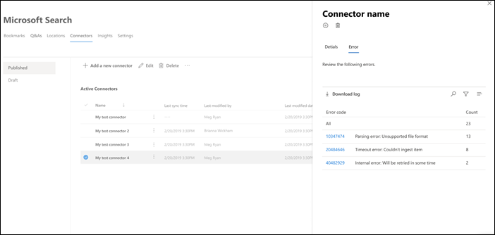

# 管理您的 Microsoft 搜尋連接器Manage your connector for Microsoft Search

若要存取和管理您的連接器，您必須指定為您租使用者的「搜尋管理員」。To access and manage your connectors, you must be designated as a search administrator for your tenant. 請與您的租使用者管理員聯繫，為您提供搜尋系統管理員角色。Contact your tenant administrator to provision you for the search administrator role.

## 開始使用Get started

1. 登入 [Microsoft 365 系統管理中心](https://admin.microsoft.com)。Sign in to the [Microsoft 365 admin center](https://admin.microsoft.com).
2. 移至 [**設定**  >  **Microsoft 搜尋**  >  **連接器**]。Go to **Settings** > **Microsoft Search** > **Connectors**.

針對每個連接器類型， [Microsoft 365 系統管理中心](https://admin.microsoft.com)支援下表所示的作業：For each connector type, the [Microsoft 365 admin center](https://admin.microsoft.com) supports the operations shown in the following table:

**作業****Operation** | **Microsoft 建立的連接器****Microsoft-built connector** | **夥伴或自訂建立的連接器****Partner or custom-built connector**
--- | --- | ---
新增連線Add a connection | ： heavy_check_mark：（請參閱[設定您的 Microsoft 建連接器](configure-connector.md)）:heavy_check_mark: (See [Configure your Microsoft-built connector](configure-connector.md)) | ： x：（請參閱合作夥伴或自訂的連接器系統管理員 UX）:x: (Refer to your partner or custom-built connector admin UX)
刪除連線Delete a connection | ： heavy_check_mark：:heavy_check_mark: | ： heavy_check_mark：:heavy_check_mark:
編輯已發佈的連線Edit a published connection | ： heavy_check_mark： Name:heavy_check_mark: Name   ： heavy_check_mark： Description:heavy_check_mark: Description   ： heavy_check_mark：外部資料源的驗證認證:heavy_check_mark: Authentication credentials for your external data source   ： heavy_check_mark：內部部署資料來源的閘道認證:heavy_check_mark: Gateway credentials for your on-premises data source   ： heavy_check_mark：重新整理排程:heavy_check_mark: Refresh schedule   | ： heavy_check_mark： Name:heavy_check_mark: Name   ： heavy_check_mark： Description:heavy_check_mark: Description
編輯拔模連接Edit a draft connection | ： heavy_check_mark：:heavy_check_mark: | 軸:x:

## 監視您的線上狀態Monitor your connection status
在您建立連線後，已處理的專案數目會顯示在 [ **Microsoft 搜尋**] 頁面上的 [**連接器**] 索引標籤上。After you create a connection, the number of processed items shows on the **Connectors** tab on the **Microsoft Search** page. 在初次完整編目成功完成之後，會顯示定期增加編目的進度。After the initial full crawl completes successfully, the progress for periodic incremental crawls displays. 此頁面提供連接器之日常作業的相關資訊，以及記錄檔及錯誤歷程記錄的概覽。This page provides information about the connector's day-to-day operations and an overview of the logs and error history.

每個連線會在 [**狀態**] 欄中顯示四個狀態：Four states show up in the **Status** column against each connection:
* **同步**處理。**Syncing**. 連接器會編目來源中的資料，以編制現有專案的索引並進行任何更新。The connector is crawling the data from the source to index the existing items and make any updates.
* **已啟用**：連線已啟用，且沒有對其執行的作用中編目。**Enabled**: The connection is enabled, and there's no active crawl running against it. **上次同步處理時間**表示上次成功編目的時間。**Last sync time** indicates when the last successful crawl happened. 連線為最新的同步處理時間。The connection is as fresh as the last sync time.
* 已**暫停**。**Paused**. 管理員會透過 pause 選項暫停編目。The crawls are paused by the admins through the pause option. 下一個編目只會在手動恢復時執行。The next crawl runs only when it's manually resumed. 不過，來自此連線的資料仍可供搜尋。However, the data from this connection continues to be searchable.
* **失敗**。**Failed**. 連接發生嚴重失敗。The connection had a critical failure. 此錯誤需要手動干預。This error requires manual intervention. 管理員需要根據所顯示的錯誤訊息採取適當的動作。The admin needs to take appropriate action based on the error message shown. 在發生錯誤之前，已編制索引的資料可供搜尋。Data that was indexed until the error occurred is searchable.

### 監視錯誤Monitor errors
針對 [**連接器**] 索引標籤上的每個作用中**連接器**，所有的現有編目錯誤都會顯示在 [**錯誤**] 索引卷索引標籤會列出錯誤碼、每個記錄檔的計數，以及錯誤記錄下載選項。For each **Active Connector** on the **Connectors** tab, any existing crawl errors show under the **Error** tab. The tab lists error codes, the count of each, and error log download options. 請參閱下列影像中的範例。See the example in the following image. 選取**錯誤碼**以查看錯誤的詳細資料。Select an **error code** to view the error's details.

若要查看錯誤的特定詳細資料，請選取其錯誤碼。To view an error's specific details, select its error code. 螢幕會顯示錯誤詳細資料和連結。A screen appears with error details and a link. 最近的錯誤會出現在頂端。The most recent errors appear at the top. 請參閱下表中的範例。See the example in the following table.

以下是針對任何連線可能會出現的不同錯誤清單。Below is the list of different errors that can appear against any connection. 如果這些解決方案無法運作，請聯繫我們支援人員或傳送我們（意見反應） [連接器-feedback.md]。If these solutions don’t work, contact support or send us (feedback)[connectors-feedback.md]. 

**錯誤碼****Error code** | **錯誤訊息****Error message** | **解決方案****Solution**
--- | --- | ---
10001000 | 無法使用資料來源。The data source isn't available. 請檢查您的網際網路連線，或確定該連接器仍可存取資料來源。Check your internet connection or make sure the data source is still accessible by the connector. | 當資料來源由於網路問題或資料來源本身被刪除、移動或重新命名時，便會發生此錯誤。This error occurs when the data source is not reachable due to a network issue or when the data source itself is deleted, moved, or renamed. 檢查提供的資料來源詳細資料是否仍然有效。Check if the data source details provided are still valid.
10011001 | 無法更新資料，因為資料來源正在節流連接器。Can't update the data, because the data source is throttling the connector. | 若要 unthrottle 資料來源，請檢查其縮放比例是否可增加，或等到一天中的流量很低的時間。To unthrottle the data source, check if its scale limits can be increased or wait until a less traffic-heavy time of the day.
10021002 | 無法使用資料來源進行驗證。Can't authenticate with the data source. 請確認與此資料來源相關聯的認證正確無誤。Verify that the credentials associated with this data source are correct. | 按一下 [**編輯**] 以更新驗證認證。Click **Edit** to update the authentication credentials.
10031003 | 與連接器關聯的帳戶沒有存取該專案的許可權。The account associated with the connector doesn't have permission to access the item. |  確定適當的帳戶有權存取您要編制索引的專案。Ensure the proper account has access to the item you want indexed.
10041004 | 無法到達內部部署資料閘道。Unable to reach the on-premises data gateway. 請確定閘道服務正在執行，且連線設定中已更新閘道詳細資料。Make sure the gateway service is running and the gateway details are updated in the connection configuration. | 使用閘道檢查電腦，開啟 Power BI 閘道應用程式，並確定閘道正在執行。Check the computer with the gateway, open the Power BI Gateway application and make sure the gateway is running. 確認閘道使用的是與 Microsoft 搜尋相同的系統管理員帳戶，然後確定連線設定中所有的閘道詳細資料都已更新。Verify that the gateway is using the same admin account as Microsoft Search, then make sure all the gateway details are all updated in the connection configuration. 
10051005 | 與此資料來源相關聯的認證已過期。Credentials associated with this data source have expired. 更新認證並更新連線。Renew the credentials and update the connection. | 按一下 [**編輯**] 以更新驗證認證。Click **Edit** to update the authentication credentials. 
10061006 | 您的閘道版本已過期，且不再支援此連接器。Your gateway version is out of date and doesn’t support this connector anymore. 您將需要更新閘道。You will need to update the gateway. | 請造訪[安裝內部部署資料閘道](https://docs.microsoft.com/data-integration/gateway/service-gateway-install)，以在包含閘道的機器上下載並安裝最新版本的 Power BI 閘道。Please visit [Install an on-premises data gateway](https://docs.microsoft.com/data-integration/gateway/service-gateway-install) to download  and install the latest version of the Power BI gateway on the machine containing the gateway.
10071007 | 未偵測到有效的 Power BI 授權。No valid Power BI license detected. 您需要有效的 Power BI 授權，才能執行這種編目。You need a valid Power BI license to perform this crawl. | 您需要有效的 Power BI 授權，才能執行這種編目。You need a valid Power BI license to perform this crawl. 檢查您的組織是否具備有效的授權。Check that your organization has a valid license. 如果是的話，請再試一次。If it does, try again. 如果不是，請取得授權，然後再試一次。If it doesn’t, obtain a license and then try again.
10081008 | 租使用者的配額利用率已達到其限制。The total quota utilization of your tenant has reached its limit. 嘗試刪除連線以釋放部分配額，或調整您的攝取篩選器以引入較少的資料。Try deleting a connection to free up some of your quota or adjusting your ingestion filters to bring in less data. | 嘗試刪除連線以釋放部分配額，或調整您的攝取篩選器以引入較少的資料。Try deleting a connection to free up some of your quota or adjusting your ingestion filters to bring in less data. 若未解決問題，請與 Microsoft 支援人員聯繫。If these don't solve the issue, contact Microsoft support.
20012001 | 因為佇列中的更新數目很多，所以會限制索引。Indexing is throttled because of a large number of updates in the queue. 根據佇列的不同，可能需要一些時間才能完成更新。Depending on the queue, it can take some time for the updates to complete. | 請稍候，直到佇列清除為止。Please wait until the queue gets cleared.
20022002 | 由於不支援的專案格式設定，索引失敗。Indexing failed due to unsupported item formatting. | 如需詳細資訊，請參閱連接器特有的檔。See connector-specific documentation for more information.
20032003 | 由於不支援的專案內容，索引失敗。Indexing failed due to unsupported item content. | 如需詳細資訊，請參閱連接器特有的檔。See connector-specific documentation for more information. 
20042004 | 檔案[大小](https://docs.microsoft.com/microsoftsearch/file-share-connector#content-requirements)太大，無法編制索引。The [file size](https://docs.microsoft.com/microsoftsearch/file-share-connector#content-requirements) is too large to be indexed. 在處理前，其必須為 100 MB 或以下，且不大於 4 MB。It must be 100 MB or less before processing and no larger than 4 MB after processing. 在此情況下，檔案會部分編制索引。The file gets indexed partially in this case. 檔案中的一些片語可能不會傳回搜尋結果。Few phrases present in the file might not return a search result. | 如需詳細資訊，請參閱檔案[共用特定檔](https://docs.microsoft.com/MicrosoftSearch/file-share-connector#content-requirements)。See [file share specific documentation](https://docs.microsoft.com/MicrosoftSearch/file-share-connector#content-requirements) for more information.
50005000 | 發生錯誤。Something went wrong. 若繼續，請與支援人員聯繫。If this continues, contact support. | 

## 預覽限制Preview limitations
* 當您**發佈**Microsoft 建立的連接器時，可能需要幾分鐘的時間來建立連線。When you **publish** a Microsoft-built connector, it might take a few minutes for the connection to be created. 在這段時間內，該連線會顯示其狀態為 [擱置中]。During that time, the connection shows its status as pending. 此外，也不會自動重新整理，所以您需要手動重新整理。Also, there's no auto-refresh, so you need to refresh manually.
* [Microsoft 365 系統管理中心](https://admin.microsoft.com)不支援在發佈連接後，查看及編輯**搜尋架構**。The [Microsoft 365 admin center](https://admin.microsoft.com) doesn't support viewing and editing the **search schema** after a connection is published. 若要編輯搜尋架構，請刪除連接，然後建立新的連線。To edit the search schema, delete your connection and then create a new one.
* 當您管理連線的重新整理**排程**時，會顯示在每個會話期間同步處理的專案數。When you manage your connection's **refresh schedule**, the number of items that sync during each session are displayed. 不過，無法使用同步處理歷程記錄。However, the sync history isn't available.
