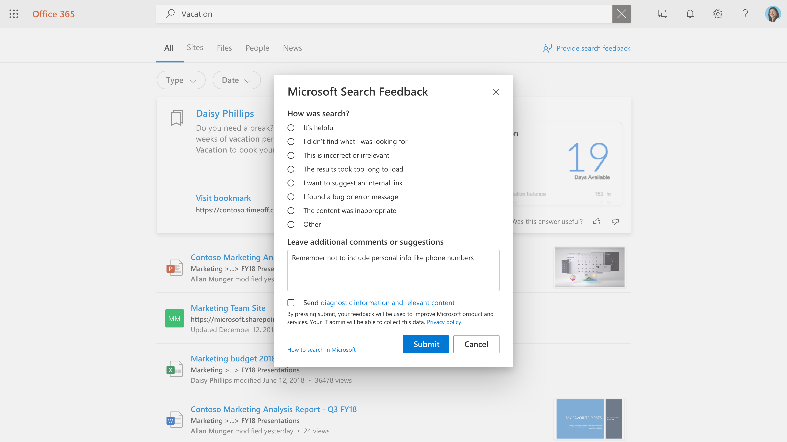

# 管理使用者意見反應

為您的使用者建立極佳的搜尋經驗是 Microsoft 與搜尋管理員之間的合作關係。 您的使用者意見允許我們不斷地評估產品並加以調整，以取得最佳的體驗。 不過，有些意見反應最適合您。

我們現在提供工具，可讓您複查及管理使用者在搜尋體驗上所提供的意見反應。

## 使用者如何提交意見反應

當您組織中的人員使用 Microsoft 搜尋時，他們可能會獲得經驗的意見反應。 當他們按一下 [結果] 頁面上的 [回饋] 連結時，他們可以將其意見分類，並包含其他批註。

使用者也可以選擇將其查詢及其他診斷資訊以及類別和批註傳送給 Microsoft。 [深入瞭解](https://privacy.microsoft.com/en-US/privacystatement) 隱私權及如何保護此資料。 診斷資料包含 Microsoft 在產品改進中使用意見反應專案所需的最重要資訊。

大部分的意見反應都會出現在 Microsoft 搜尋系統管理中心的 [ [意見](https://admin.microsoft.com/Adminportal/Home#/MicrosoftSearch/feedback) 反應] 區段中。 使用 **我想要建議的內部連結** 類別的回饋會在 [ [書簽](https://admin-ignite.microsoft.com/Adminportal/Home#/MicrosoftSearch/bookmarks) ] 區段中顯示為建議的書簽，並可透過篩選 **建議** 的狀態加以看到。

## 審閱意見反應

在 [ [意見](https://admin.microsoft.com/Adminportal/Home#/MicrosoftSearch/feedback) 反應] 頁面上，您可以查看和匯出組織中的人員在過去30天內所傳送的意見反應。 一旦使用者送出意見反應，它就會出現在此清單中20分鐘內。 您可以使用 [重新整理] 按鈕，以確保您查看的是最新的資料。

透過使用篩選，您可以查看特定答案類型的意見反應。 您也可以依據來源和日期範圍進行篩選。

您可以使用意見反應清單上方的搜尋方塊，來搜尋特定查詢的意見反應。

在 [意見反應] 清單中，逐字欄會指出使用者的意見反應也包含批註或建議。 若要閱讀它，請按一下 [查詢] 以開啟 [ **詳細資料** ] 面板。

## 更新意見反應狀態

當您的意見反應進入時，它會處於 *新* 的狀態，而且會在您將其變更為 *已解決* 或 *重複* 之前保留在那裡。

若要變更此狀態：

1. 在查詢旁，選取 [ **更多選項** (三個豎直點) 。
1. 在功能表上，選取 [ **標示為已解析** ] 或 [ **標示為重複]。**
1. 清單將重新整理並顯示更新的狀態。

您也可以更新多個專案的狀態，只要加以選取，然後選取 [更多選項]，再選取一個專案。

## 匯出意見反應

如果您想要與其他人共用搜尋意見反應或保留超過30天，請按一下 [ **匯出]。** 會自動下載名為 Feedbacks 的 .csv 檔案，該檔案的日期為 "Feedbacks_10_31_2020.csv" （如 ""）。

## 將使用者回饋傳送給 Microsoft

根據預設，所有的使用者意見反應都會傳送給 Microsoft，此外還會傳送給您。 若要停止傳送對 Microsoft 的意見反應，請按一下 [ **管理設定** ]，然後清除 [ **自動傳送使用者對 Microsoft 的意見** 反應] 核取方塊。 最多可能需要24小時的時間，此變更才會生效。

如果您已決定不自動傳送意見反應給 Microsoft，您仍然可以將個別的意見反應傳送給 Microsoft。

1. 選取您要共用的意見反應。
1. 在動作列中，選取 [更多 (三個點) ]，然後按一下 [ **傳送對 Microsoft 的意見** 反應]。

1. [收件者] 欄中的狀態會變更為 [擱置]。 在傳送意見反應時，它會變更為 [是]。

如果您自動或手動共用反應，它永遠不會針對選擇未包含此資訊的使用者，包含查詢及其他診斷資訊。

## 如何使用意見反應的建議

作為搜尋管理員，您應該瞭解組織中的主要角色，以及這些人員一般會與其互動及搜尋的內容類型。 透過這種瞭解，您可以使用意見反應，針對使用者的搜尋體驗進行目標改進。

1. 「我未找到我要尋找的專案」，且有類似的意見反應可用於識別使用者所需的內容，但目前並未包含在搜尋索引中。 判斷這種情況通常是根據瞭解使用者的調查和推斷。 找到後，決定包含該內容的方法是最適合的：
    1. 書簽可用於具有高品質登錄頁面和有限的搜尋字詞的內容來源，讓使用者群組從書簽取得高品質的結果，然後可有效地尋找所要尋找的專案。
    1. Q&A 對個別的回應非常常見，但不會變更。
    1. 連接器可用於具有各種內容和各種各樣的搜尋字詞的內容來源。
1. 「結果花太長的時間來載入「& ' 我發現問題」可能是更大問題的指示器。 每天若要顯示此意見反應可能會有説明，如果有多個案例出現，您可以驗證自己的搜尋經驗，並在需要時開啟 Microsoft 支援案例。 這種類型的意見反應對 Microsoft 也很重要，這是將所有意見反應傳遞給我們的極佳原因。
1. 「我想要建議一個內部連結」可以評估為書簽或已連接內容的新增。 您的第一個想法應該是書簽;如果書簽獲得高使用量，您可以考慮透過連接器引入內容，以啟用更豐富的搜尋體驗。
