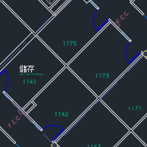
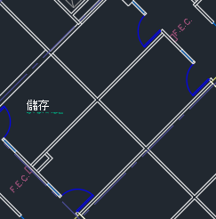
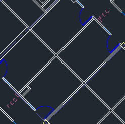
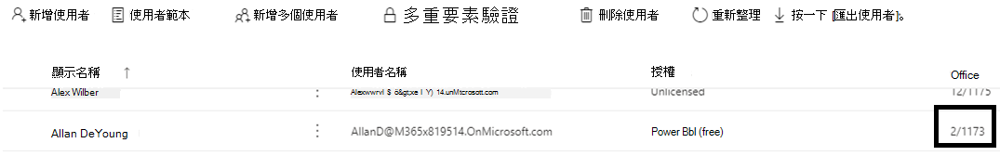
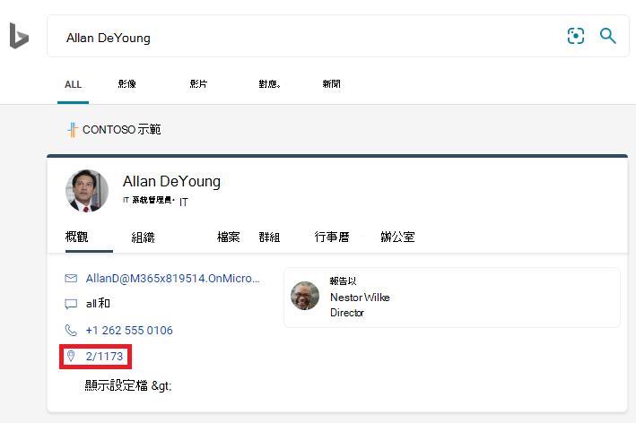
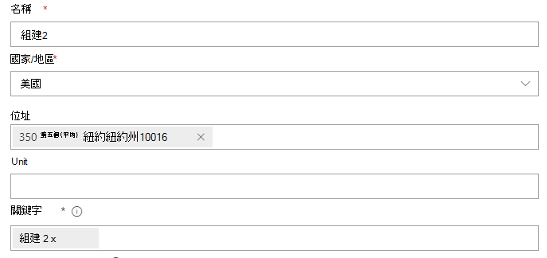
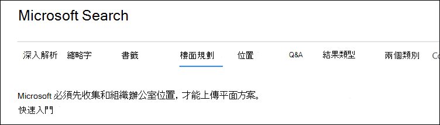
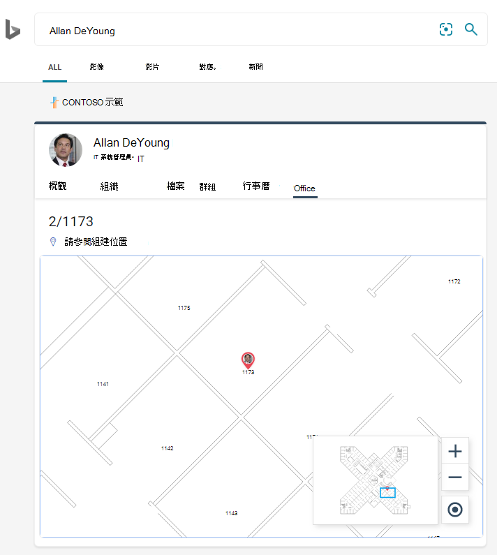
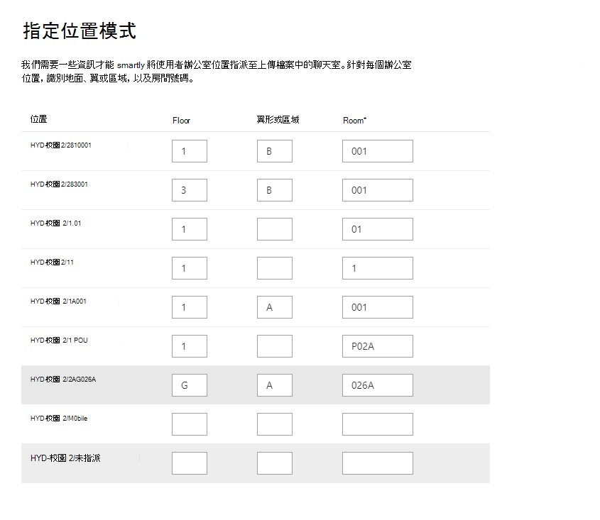
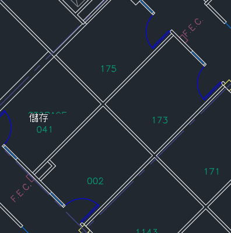

# 管理基底計畫Manage floor plans

**Microsoft 搜尋**中的平面圖可協助使用者在大樓內找到人員和會議室。Floor plans in **Microsoft Search** help users find people and meeting rooms within a building. 平面圖的回答下列問題：Floor plans answer the following questions:

- Allan Deyoung 的 office 位於何處？Where is Allan Deyoung's office?
- 組建2第2地面Building 2 floor 3
- 尋找2/11173Find 2/11173

## 新增平面計畫Add floor plans

請遵循下列步驟，在**Microsoft 搜尋**中設定 floor 方案答案。Follow these steps to setup floor plans answers in **Microsoft Search**.

### 步驟1：判斷您的大樓代碼Step 1: Determine your building codes

建立碼是用來做為使用者辦公室位置的一部分。Building codes are used as part of a user's office location. 更新使用者設定檔時，您會使用這些代碼。You'll use these codes when updating user profiles. 假設您的組織有在此位置的大樓：*組建2、350 5 號、紐約城、紐約州 10016*Let's say your organization has a building at this location: *Building 2, 350 5th Avenue, New York City, NY 10016*

以下是此組建程式碼的一些很好的範例：2、B2、Building2、組建2或 NYCB2。Here are some good examples for this building's code: 2, B2, Building2, Building 2, or NYCB2. 每個組建都必須有唯一的程式碼。Each building must have a unique code.

### 步驟2：查看您的地面計畫Step 2: Review your floor plans

Floor 計畫檔案必須採用 DWG 格式;DWG 檔案可包含文字標籤。Floor plans files must be in DWG format; DWG files can contain text labels. 當文字標籤標示房間時，它稱為會議室標籤。When a text label marks a room, it is called a room label. DWG 檔案必須有**至少10個**以標籤標示的房間。The DWG file must have **at least 10 rooms** marked with labels. 以下是具有不同標籤類型的 DWG 檔案範例：Here are some examples of DWG files with different label types:

|**包含會議室標籤的文字標籤****Text labels including room labels**|**文字標籤，但沒有會議室標籤****Text labels but no room labels**|**無文字標籤****No text labels**|
|:-----:|:-----:|:-----:|
||||

如需查看和更新 DWG 檔案的詳細資訊，請參閱[FAQ](#frequently-asked-questions)一節。See the [FAQ](#frequently-asked-questions) section for information on viewing and updating DWG files.

### 步驟3：更新使用者設定檔上的 office 位置Step 3: Update office locations on user profiles

使用者的辦公室位置是組建程式碼和會議室標籤的組合。A user's office location is a combination of a building code and a room label. 例如，如果組建程式碼是*2* ，而會議室標籤是*1173*，則辦公室位置會是*2/1173*。For example, if the building code is *2* and the room label is *1173*, the office location would be *2/1173*.

為您組織中的每位使用者新增或更新辦公地點。Add or update office locations for each user in your organization. 您可以在 Microsoft 365 系統[管理中心](https://admin.microsoft.com)的使用者設定檔上變更 office 位置，也可以在內部部署 Active directory 中變更，以同步處理至 Azure Active directory。You can change office location on the user profile in the Microsoft 365 [admin center](https://admin.microsoft.com) or you can change in your on-premises Active Directory to sync into Azure Active Directory. *PhysicalDeliveryOfficeName*是用於 office 位置的欄位。*PhysicalDeliveryOfficeName* is the field that is used for office location. 如果您的會議室標籤不含底價編號，請參閱秘訣的常見問題。If your room labels do not include floor numbers, see the FAQ for tips.

在此範例中，Allan 的 office 位於組建2第1座第1座的房間1173。In this example, Allan's office is in room 1173 on floor 1 of building 2.

> [!NOTE]
> 若要在搜尋地面計畫時查看更新的 office 位置，您必須在每個地面更新**至少10個人**的 office 位置。To see updated office locations when searching for floor plans, you must update office locations for **at least 10 people** on each floor.

### 步驟4：確認辦公室位置Step 4: Verify office location

使用**Microsoft 搜尋**來尋找使用者，並確認其辦公室位置是否正確顯示。Use **Microsoft Search** to find a user and verify that their office location is appearing correctly. 如果您只有更新的位置，您可能需要等候**72 小時**，更新才會出現在搜尋結果中。If you have just updated locations, you may need to wait up to **72 hours** for the updates to appear in the search results.

### 步驟5：新增大樓位置Step 5: Add building locations

地面計畫使用[位置](manage-locations.md)來定義您的辦公樓。Floor plans uses [Locations](manage-locations.md) to define your buildings. 在 Microsoft 365 系統[管理中心](https://admin.microsoft.com)中，移至 [**設定**  >  **Microsoft 搜尋**  >  **答案**  >  [**位置**](https://admin.microsoft.com/Adminportal/Home#/MicrosoftSearch/locations)]，然後選取 [**新增**]。In the Microsoft 365 [admin center](https://admin.microsoft.com), go to **Settings** > **Microsoft Search** > **Answers** > [**Locations**](https://admin.microsoft.com/Adminportal/Home#/MicrosoftSearch/locations), and then select **Add**. 輸入組建的名稱、位址及關鍵字。Enter the name, address, and keywords for the building. 新增所需數目的辦公樓。Add as many buildings as you need.

如需位置的詳細資訊，請參閱[管理位置](manage-locations.md)For more details about locations, see [Manage Locations](manage-locations.md)

### 步驟6：收集和組織辦公室位置Step 6: Gather and organize office locations

在您可以使用基底計畫之前，必須建立 office 位置的索引。Before you can use floor plans, office locations must be indexed. 這是一次性作業，可能需要長達48小時才能完成。This is a one-time operation that can take up to 48 hours to complete. 總時間將取決於您的組織的大小。The total time will depend on the size of your organization.

在系統[管理中心](https://admin.microsoft.com)中，移**Settings**至 [  >  **Microsoft Search**  >  **解答**  >  [**地面方案**](https://admin.microsoft.com/Adminportal/Home#/MicrosoftSearch/floorplans) \*\* \*\*] 中的 [設定]，然後選取 [開始]。In [admin center](https://admin.microsoft.com), go to **Settings** > **Microsoft Search** > **Answers** > [**Floor plans**](https://admin.microsoft.com/Adminportal/Home#/MicrosoftSearch/floorplans), and then select **Get started**. 如果您未看到此通知，表示您的組織已完成此步驟。If you don't see this notice, this step has already been completed for your organization

### 步驟7：上傳基底計畫Step 7: Upload floor plans

1. 在系統[管理中心](https://admin.microsoft.com)中，移至 [**設定**  >  **Microsoft 搜尋**  >  **答案**  >  [**基底方案**](https://admin.microsoft.com/Adminportal/Home#/MicrosoftSearch/floorplans)]。In the [admin center](https://admin.microsoft.com), go to **Settings** > **Microsoft Search** > **Answers** > [**Floor plans**](https://admin.microsoft.com/Adminportal/Home#/MicrosoftSearch/floorplans).
2. 選取下拉式清單中的大樓，然後選取 **[下一步]**。Select a building in the drop-down list and select **Next**. 如果大樓未列出，請後退並[新增大樓位置](#step-5-add-building-locations)。If the building isn't listed, go back and [add building locations](#step-5-add-building-locations).
3. 選取 [**上傳**檔案]，然後選擇您要上傳的地面計畫。Select **Upload files**, and then choose the floor plan you are uploading.
4. 上傳完成後，您必須輸入在 floor 計畫檔案中所代表的 floor 編號。When the upload is complete, you must enter floor number that is represented in the floor plan file. 然後選取 [下一步]\*\*\*\*。Then select **Next**.
5. 選如果您的地面有 wings 或區域，請輸入該詳細資料。(Optional) If your floor has wings or zones, enter that detail.
6. 您將會看到一個 [回顧] 畫面，列出對應至地面方案的 office 位置數目。You will see a review screen listing how many office locations were mapped to the floor plans. 選取 [**詳細資料**]，以確保對應正確。Select **Details** to ensure the mapping is correct.
    - 如果沒有對應的使用者，或您不滿意對應，請選取 [**繼續對應**]。If no users are mapped or you're not satisfied with the mapping, select **Continue mapping**. 若要發佈，請選取 [**略過併發布**]。To publish, select **Skip and publish**.
7. 輸入此地面計畫的建立程式碼。Enter the building code for this floor plan. 您可以在使用者的 office location 屬性找到建立程式碼。The building code can be found on users' office location property. 例如，如果使用者的辦公室位置是**2/1173**，則建立程式碼為**2**。For example, if a user's office location is **2/1173**, then the building code is **2**.
8. 在 [複查] 畫面上重複步驟6，以確保對應正確。On the review screen, repeat step 6 to ensure the mapping is correct.
9. 選檢查及識別所有上傳的地面計畫的位置模式，然後選取 **[下一步]**。(Optional) Review and identify the location patterns for all uploaded floor plans and then select **Next**.
10. 在 [複查] 畫面上重複步驟6，以確保對應正確。On the review screen, repeat step 6 to ensure the mapping is correct.
11. 當您準備好時，請選取 [**發佈**]，以在**Microsoft 搜尋**中提供地面方案。When you're ready, select **Publish** to make the floor plan available in **Microsoft Search**.

> [!NOTE]
> **發佈平面方案需要48小時的時間。****It takes 48 hours for the floor plans to be published.** 之後，當使用者搜尋共同工作者的辦公室時，會看到與下列類似的地面計畫結果。After that your users will see a floor plan results similar to the one below when they search for a co-worker's office.

### 步驟8：（選用）指定位置模式Step 8: (Optional) Specify location patterns

上傳平面圖後，文字標籤會與使用者設定檔中的辦公室位置進行比較。After uploading a floor plan, the text labels will be compared to the office locations in your users' profiles. 如果相符的專案少於10個，則會出現 [**指定位置模式**] 畫面。If there are fewer than 10 matches, the **Specify location patterns** screen appears. 位置模式是用來從辦公室位置提取底價、翼和會議室資訊。Location patterns are used to extract floor, wing, and room information from office locations.

只需要會議室、floor 和翼是選用的，您可以視需要略過位置。Only room is required, floor and wing are optional, and you can skip locations as needed.

## 編輯基底計畫Edit floor plans

若要更新現有的平面圖，請選取您要變更的地面計畫，然後選取 [**編輯**]。To update an existing floor plan, select the floor plan you want to change, and then select **Edit**. 進行變更並儲存。Make your changes and save them.

## 疑難排解Troubleshooting

|**步驟****Step**|**錯誤訊息****Error message**|**類型****Type**|**Action****Action**|
|:-----|:-----|:-----|:-----|
|上傳基底計畫Upload floor plans|無法讀取 CC_1 dwg。Unable to read CC_1.dwg. 請重新上傳或刪除地面計畫。Please re-upload or delete the floor plan.|錯誤Error|請嘗試重新上傳檔案。Try uploading the file again. 如果無法運作，請刪除檔案，然後再試一次。If that doesn't work delete the file and try again.|
|上傳基底計畫Upload floor plans|有兩個檔案名為 CC_1 dwg。There are two files named CC_1.dwg. 請刪除其中一個名稱，或使用另一個名稱重新上傳。Please delete one of them or re-upload with another name.|錯誤Error|如果檔案名不正確，請新增 floor 或翼形資訊，然後重新上傳檔案，使檔案名成為唯一的。If the file name is incorrect make the file name unique by adding floor or wing information and then upload the file again. 如果您不小心新增相同的檔案兩次，請將它刪除。If you accidentally added the same file twice just delete it.|
|上傳基底計畫Upload floor plans|找不到資料。No data found.|錯誤Error|請檢查您的檔案，確定其是否正確，然後重新上傳或刪除。Check your file to make sure it's the correct one and then upload it again or delete it.|
|上傳基底計畫Upload floor plans|此檔案中缺少外部參照。External references are missing in this file. 上傳 CC_1_furniture。 dwg 或刪除此檔案。Either upload CC_1_furniture.dwg or delete this file.|警告Warning|上傳外部參考檔案或刪除。Upload external reference files or delete.|
|上傳基底計畫Upload floor plans|無法讀取 DWG 檔案中的會議室編號或標記。Could not read room numbers or tags in the DWG file. 請刪除此檔案。Please delete this file.|警告Warning|請檢查 DWG 檔案，確定已包含資料，然後刪除該檔案，然後再試一次。Check your DWG file to make sure the data is included and then delete the file and try again.|
|連結辦公室位置Link office locations|在 Azure Active Directory 中找不到任何 office 位置。No office locations found in Azure Active Directory. 在設定地面計畫之前，將位置資料新增至 Azure Active Directory。Add location data to Azure Active Directory before setting up floor plans.|錯誤Error|[更新使用者設定檔上的 office 位置Update office locations on user profiles](#step-3-update-office-locations-on-user-profiles) |

## 常見問題集Frequently asked questions

**問：** 如何查看及編輯 DWG 檔案？**Q:** How do I view and edit DWG files?

**A：** 使用下列任一選項可查看 DWG 檔案：**A:** Use any of these options to view DWG files:

- 將檔案上傳至 SharePoint 並加以開啟。Upload the file to SharePoint and open it.
- 在[Microsoft Visio](https://support.office.com/article/Open-insert-convert-and-save-DWG-and-DXF-AutoCAD-drawings-60cab691-0f4c-4fc9-b775-583273c8dac5)或[Autodesk DWG TrueView](https://www.autodesk.com/products/dwg)中開啟檔案。Open the file in [Microsoft Visio](https://support.office.com/article/Open-insert-convert-and-save-DWG-and-DXF-AutoCAD-drawings-60cab691-0f4c-4fc9-b775-583273c8dac5) or [Autodesk DWG TrueView](https://www.autodesk.com/products/dwg).
- 將檔案上傳至[Autodesk 的線上檢視器](https://viewer.autodesk.com/)。Upload the file to [Autodesk's Online Viewer](https://viewer.autodesk.com/).

**問：** 如何將文字標籤新增至未標記的聊天室？**Q:** How do I add text labels to unmarked rooms?

**A：** 在編輯器中開啟 DWG 檔案，並[新增會議室標籤](https://knowledge.autodesk.com/support/autocad-map-3d/learn-explore/caas/CloudHelp/cloudhelp/2019/ENU/MAP3D-Learn/files/GUID-4854F184-6279-4E0C-9487-34A4759017F6-htm.html)。**A:** Open the DWG file in an editor  and [add room labels](https://knowledge.autodesk.com/support/autocad-map-3d/learn-explore/caas/CloudHelp/cloudhelp/2019/ENU/MAP3D-Learn/files/GUID-4854F184-6279-4E0C-9487-34A4759017F6-htm.html).

**問：** 如何建立或編輯 DWG 檔案以供測試之用？**Q:** How do I create or edit DWG files for testing purposes?

**A：** 在 Microsoft Visio、Autodesk AutoCAD 或任何其他 DWG 編輯器中建立 DWG 檔案。**A:** Create a DWG file in Microsoft Visio, Autodesk AutoCAD, or any other DWG editor. 請確定檔案中已標示10個或多個會議室。Make sure 10 or more rooms are labeled in the file.

**問：** DWG 檔案中的文字標籤的最佳格式是什麼？**Q:** What's the best format for text labels in DWG files?

**A：** 為了獲得最佳結果，文字標籤應包含底價編號和房間號碼。**A:** For the best results, text labels should contain floor numbers and room numbers. 下列範例會使用2或 SC 做為建立程式碼。The examples below use 2 or SC for the building code.
<!-- markdownlint-disable no-inline-html -->
|會議室標籤類型Room label types|FloorFloor|房間Room|範例文本標籤Sample text label|辦公室位置（建立程式碼/文字標籤）Office location (building code/text label)|
|:-----|:-----|:-----|:-----|:-----|
|具有底價和房間號碼Has floor and room number|1 1|173173|11731173|2/11732/1173|
|| 2121|4545|2104521045|2/210452/21045|
||至23|萬美元100K|23-10 萬美元23-100K|2/23-100K2/23-100K|
||1 1|G06-07G06-07|1G06-071G06-07|2/1G06-072/1G06-07|
||2 2|1024A1024A|02.1024 a02.1024A|2/02.1024 a2/02.1024A|
||2 2|1024A1024A|02.1024 a02.1024A|2/02.1024 a2/02.1024A|
||2 2|105.01105.01|2105.012105.01|2/2105.012/2105.01|
|有建立程式碼、基底及房間號碼Has building code, floor, and room number|00|X-11-M-12X-11-M-12|2-0-X-11-M-122-0-X-11-M-12|2/2-0-X-11-M-122/2-0-X-11-M-12 2-0-X-11-M-122-0-X-11-M-12|
||2 2|128A128A|22128A22128A|2/22128A2/22128A 22128A22128A|
||1 1|B2-11B2-11|21-B2-1121-B2-11|2/21-B2-112/21-B2-11 21-B2-1121-B2-11|
||2 2|4545|SC2045SC2045|SC/SC2045SC/SC2045 SC2045SC2045|

**問：** 我可以使用不含底價編號的 DWG 檔案嗎？**Q:** Can I use a DWG file that doesn't include floor numbers?

**A：** 是的，您可以。**A:** Yes, you can. 當您在使用者的 Azure Active Directory 設定檔中更新 office 位置時，請將底價號碼包含在會議室號碼的一部分中，即使它在 DWG 檔案中遺失也是一樣。When you update office locations in the user's Azure Active Directory profile, include the floor number as part of the room number, even if it's missing from the DWG file. 上傳檔案之後，會出現 [指定位置模式] 畫面，您可以同時指出這兩個值。After you upload the file, the Specify location patterns screen will appear and you can indicate both values.

例如，包含房間號碼，但沒有底價編號的 DWG 檔案，看起來可能類似如下：For example, a DWG file that includes room numbers, but no floor numbers, may look similar to this:

使用者設定檔中的 office 位置應該是2/1175，其中 ' 2 ' 是組建碼，' 1 ' 是底價號碼，而 ' 175 ' 是房間號碼。The office location in the user's profile should be 2/1175 where '2' is the building code, '1' is the floor number, and '175' is the room number.
