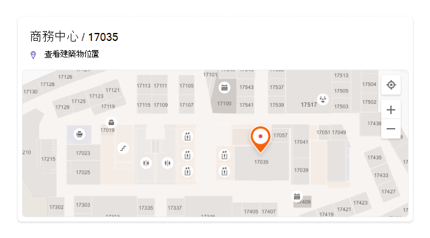
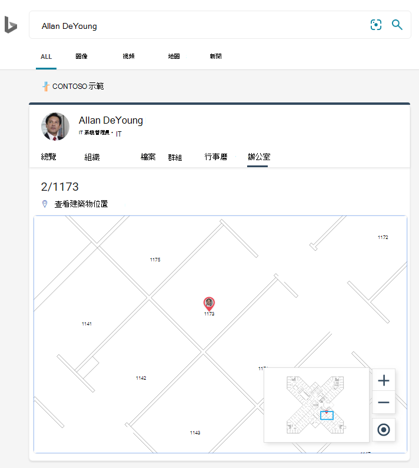
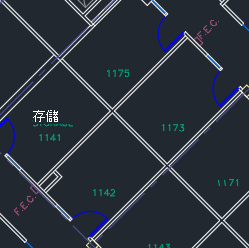
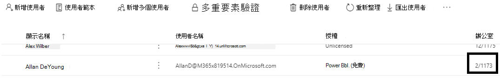
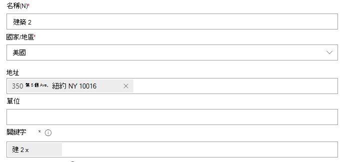
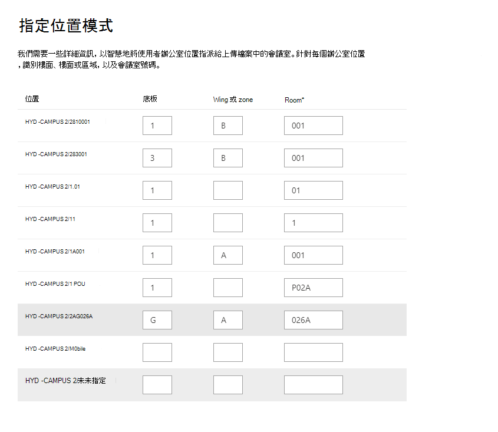

# 管理基底計畫

Microsoft 搜尋中的地面計畫，可協助使用者在大樓內找到人員、會議室及共用空間。 包含人員全名、名字、會議室名稱或會議室位置的查詢模式，如這些範例所示，將會傳回平面計畫：

- Allan Deyoung 的 office 位於何處？
- 雛菊的 office 位於何處？
- 組建2第2地面
- Workspace-1
- B1/1.20

## 使用者經驗

使用者可以在[Bing](https://bing.com)、 [SharePoint](http://sharepoint.com/)及[Office 365](https://office.com)上看到平面規劃的答案。 也支援其他會傳回 Bing 結果的進入點，包括 Windows 搜尋和 Microsoft Edge 位址列。 當使用者搜尋會議室名稱或位置時，他們會看到在底價計畫應答上標示的興趣點。

> [!div class="mx-imgBorder"]
> 

當他們搜尋人員的辦公室時，他們會看到類似的答案，也就是標記上的人員的設定檔影像。

> [!div class="mx-imgBorder"]
> 

## 新增平面計畫

請遵循下列步驟，設定 Microsoft 搜尋中的底價方案回答。

### 步驟1：判斷您的大樓代碼

建立碼是用來做為使用者辦公室位置的一部分。 更新使用者設定檔時，您會使用這些代碼。 假設您的組織有在此位址的大樓： *組建2、350 5 號、紐約市、紐約州 10016*

以下是建立程式碼的一些很好的範例：2、B2、Building2、組建2或 NYCB2。 每個組建都必須有唯一的程式碼。

### 步驟2：查看您的地面計畫

Floor 計畫檔案必須採用 DWG 格式，以支援文字標籤。 當文字標籤標示房間時，它稱為會議室標籤。 以下是一些範例 DWG 檔案，具有不同的標籤類型：

| 包含會議室標籤的文字標籤 | 文字標籤，但沒有會議室標籤 | 無文字標籤 |
|:-----:|:-----:|:-----:|
||||

最佳作法是，DWG 文字標籤應包含底價編號、翼號 (如相關) 和房間號碼，依序排列。 如需更多的文字標籤格式範例，請參閱 [FAQs](#frequently-asked-questions) ，以及查看和更新 DWG 檔案的相關資訊。

### 步驟3：更新使用者設定檔上的 office 位置

使用者的辦公室位置是組建程式碼和會議室標籤的組合。 例如，如果組建程式碼是 *2* ，而會議室標籤是 *1173*，則辦公室位置會是 *2/1173*。

新增或更新具有指派工作地點之使用者的辦公室位置。 您可以從[Microsoft 365](https://admin.microsoft.com)或[Azure Active Directory](https://portal.azure.com/)系統管理中心的使用者設定檔，或內部部署 Active Directory (將同步處理至 Azure Active Directory) 。 *PhysicalDeliveryOfficeName* 是用於辦公室位置的欄位。 如果會議室標籤不包含底價編號，請參閱 [FAQs](#frequently-asked-questions) 以取得秘訣。

在此範例中，Allan 的 office 位於組建2第1座第1座的房間1173。

> [!div class="mx-imgBorder"]
> 

若要設定會議室的平面圖，請在 Microsoft 365 系統管理中心的 [[會議室 & 設備](https://admin.microsoft.com/Adminportal/Home#/ResourceMailbox)] 區段中新增其辦公地點。 如需詳細資訊，請參閱 [設定會議室與設備信箱](/microsoft-365/admin/manage/room-and-equipment-mailboxes#set-up-room-and-equipment-mailboxes)。 如果您組織中的人員可以為會議或事件排程會議室或資源，請參閱 [Change 會議室信箱處理會議邀請的方式](/Exchange/recipients/room-mailboxes#change-how-a-room-mailbox-handles-meeting-requests)。 如需設定工作區（包括設定會議室信箱）的詳細資訊，請參閱文章[一文中的工作區 Outlook](https://techcommunity.microsoft.com/t5/exchange-team-blog/book-a-workspace-in-outlook/ba-p/1524560)。

### 步驟4：確認辦公室位置

使用 Microsoft 搜尋尋找使用者，並確認其辦公室位置是否正確顯示。 您可能需要等候 **72 小時** ，更新才會出現在搜尋結果中。

> [!div class="mx-imgBorder"]
> 

### 步驟5：新增大樓位置

地面計畫使用 [位置](manage-locations.md) 來定義您的辦公樓。 在 [Microsoft 365 系統管理中心](https://admin.microsoft.com)中，移至 [[**位置**](https://admin.microsoft.com/Adminportal/Home#/MicrosoftSearch/locations)]，然後選取 [**新增**]。 輸入組建的名稱、位址及關鍵字。 新增所需數目的辦公樓。

> [!div class="mx-imgBorder"]
> 

如需位置的詳細資訊，請參閱 [管理位置](manage-locations.md)

### 步驟6：收集和組織辦公室位置

在您可以上傳平面計畫之前，必須建立 office 位置的索引。 這個一次性作業可能需要長達48個小時才能完成。 總時間將取決於您的組織的大小。

在系統 [管理中心](https://admin.microsoft.com)中，移至 [ [**Floor 方案**](https://admin.microsoft.com/Adminportal/Home#/MicrosoftSearch/floorplans)]，然後選取 [ **開始編制索引**]。 如果您未看到此通知，表示您的組織已完成此步驟。

### 步驟7： Upload 基底計畫

1. 在系統 [管理中心](https://admin.microsoft.com)，移至 [ [**地面計畫**](https://admin.microsoft.com/Adminportal/Home#/MicrosoftSearch/floorplans)]。

2. 選取下拉式清單中的大樓，然後選取 **[下一步]**。 如果大樓未列出，請後退並 [新增大樓位置](#step-5-add-building-locations)。

3. 選取 [ **Upload** 檔案]，然後選擇您要上傳的地面計畫。

4. 上傳完成後，您必須輸入在 floor 計畫檔案中所代表的 floor 編號。 然後選取 **[下一步]**。

5.  (選用) 如果地面上有 wings 或區域，請輸入該詳細資料。

6. 您將會看到一個 [評論] 畫面，列出對應至平面平面圖的 office 位置數目。 選取 [ **詳細資料** ]，以確保對應正確。
    - 如果沒有對應的使用者，或您不滿意對應，請選取 [ **繼續對應**]。
    - 若要發佈，請選取 [ **略過併發布**]。

1. 輸入此地面計畫的建立程式碼。 您可以在使用者的 office location 屬性找到建立程式碼。 例如，如果使用者的辦公室位置是 **2/1173**，則建立程式碼為 **2**。

1. 在 [複查] 畫面上重複步驟6，以確保對應正確。 如果您已滿意對應，請選取 [ **繼續對應** ] 和 [ **略過] 和 [發佈**]。 如果不是，請選取 [ **繼續對應** ]，然後移至 [指定位置模式] 畫面。

1.  (選用) 請複查並識別 Azure 目錄中此組建的所有唯一位置模式的命名邏輯，然後選取 **[下一步]**。

1. 在 [複查] 畫面上重複步驟6，以確保對應正確。

1. 當您準備好時，請選取 [**發佈**]，以在 Microsoft 搜尋中使用地面計畫。

> [!NOTE]
> **發佈平面方案需要48小時的時間。** 之後，當使用者搜尋共同工作者的辦公室時，會看到與下列類似的地面計畫結果。

> [!div class="mx-imgBorder"]
> 

### 步驟8： (選用) 指定位置模式

上傳平面圖後，會議室文字標籤會與使用者設定檔中的辦公室位置進行比較。 如果 office 位置或文字標籤不會持續遵循 [步驟 2](#step-2-review-your-floor-plans) 和 [步驟 3](#step-3-update-office-locations-on-user-profiles)中建議的命名模式，請使用 [ **指定位置模式** ] 畫面新增詳細資訊以完成對應。 位置模式是用來從 AAD office 位置提取底價、翼和會議室資訊。

> [!div class="mx-imgBorder"]
> 

Floor 和翼是選用的，只需要會議室，您可以視需要略過位置。

## 更新基底計畫

在您更新現有的地面計畫之前，請確定您的 AAD office 位置都是最新的，而且您已等候48小時供任何 AAD 更新處理。 若要更新地面計畫，請移至 [平面圖]，選取 [建立地面計畫]，然後選取 [ **編輯**]。 如果地面計畫變更了結構，由於裝修為範例，請移除舊檔案，然後上傳併發行新的 DWG 檔案。

> [!NOTE]
> 當使用者移至已對應的地面時，您不需要更新 floor 方案。 只要更新其使用者設定檔，以反映新的 office 位置：
>
> - 在 Microsoft 365 系統管理中心中 (作用中使用者 > 帳戶 > 管理連絡人資訊) 
> - 在 [Azure Active Director admin center] (使用者 > 設定檔 > 編輯連絡人資訊) 
> - 在您的部署 Active Directory (會同步至 Azure Active Directory) 

## 刪除基底計畫

若要刪除單一的平面圖，請移至 [地面方案](https://admin.microsoft.com/Adminportal/Home#/MicrosoftSearch/floorplans) ，然後選取組建。 接下來，選取地面計畫，然後選取 [ **移除**]。 若要刪除大樓的所有地面計畫，請移至 [ [位置](https://admin.microsoft.com/Adminportal/Home#/MicrosoftSearch/locations)]，選取組建，然後選取 [ **刪除**]。  

## 疑難排解

| 步驟 | 錯誤訊息 | 類型 | 動作 |
|:-----|:-----|:-----|:-----|
|Upload 基底計畫|無法讀取 CC_1 dwg。 請重新上傳或刪除地面計畫。|錯誤|請嘗試重新上傳檔案。 若仍無法運作，請刪除檔案，然後再試一次。|
|Upload 基底計畫|有兩個檔案名為 CC_1 dwg。 請刪除其中一個名稱，或使用另一個名稱重新上傳。|錯誤|如果檔案名不正確，請新增 floor 或翼號以建立唯一的檔案名，並重新上傳。 如果您不小心新增相同的檔案兩次，只需刪除其中一項。|
|Upload 基底計畫|找不到資料。|錯誤|請檢查您的檔案，確定其是否正確，然後重新上傳或刪除。|
|Upload 基底計畫|此檔案中缺少外部參照。 上傳 CC_1_furniture。 dwg 或刪除此檔案。|警告|Upload 外部參考檔案或刪除。|
|Upload 基底計畫|無法讀取 DWG 檔案中的會議室編號或標記。 請刪除此檔案。|警告|請檢查 DWG 檔案，確定已包含資料，然後刪除該檔案，然後再試一次。|
|連結辦公室位置|Azure Active Directory 未找到任何 office 位置。 在設定地面計畫之前，將位置資料新增至 Azure Active Directory。|錯誤|[更新使用者設定檔上的 office 位置](#step-3-update-office-locations-on-user-profiles) |

## 常見問題集

**問：** 如何查看及編輯 DWG 檔案？

**A：** 使用下列任一選項可查看 DWG 檔案：

- Upload 檔案，以 SharePoint 並加以開啟。
- 在[Microsoft Visio](https://support.office.com/article/Open-insert-convert-and-save-DWG-and-DXF-AutoCAD-drawings-60cab691-0f4c-4fc9-b775-583273c8dac5)或[Autodesk DWG TrueView](https://www.autodesk.com/products/dwg)中開啟檔案。
- 將檔案 Upload 至[Autodesk 的線上檢視器](https://viewer.autodesk.com/)。

您可以在任何 DWG 編輯器中建立或編輯 dwg 檔案，包括 Visio 或 Autodesk AutoCAD。 若要使用 Visio，請參閱[Create a floor plan](https://support.microsoft.com/office/create-a-floor-plan-ec17da08-64aa-4ead-9b9b-35e821645791)。 單一 DWG 檔案的檔案大小上限為 16 MB。

**問：** 如何將文字標籤新增至未標記的聊天室？

**A：** 在編輯器中開啟 DWG 檔案，並 [新增會議室標籤](https://knowledge.autodesk.com/support/autocad-map-3d/learn-explore/caas/CloudHelp/cloudhelp/2019/ENU/MAP3D-Learn/files/GUID-4854F184-6279-4E0C-9487-34A4759017F6-htm.html)。

**問：** DWG 檔案中的文字標籤的最佳格式是什麼？

**A：** 為了獲得最佳結果，DWG 文字標籤應該是一個包含底價數目的單行、翼號 (if 相關) 和房間號碼，依序排列。 下列範例會使用2或 CITY CENTER 做為組建程式碼。
<!-- markdownlint-disable no-inline-html -->
|會議室標籤類型|Floor|翼/區域|房間|範例文本標籤|建立程式碼/文字標籤 (Office 位置) |
|:-----|:-----|:-----|:-----|:-----|:-----|
|具有底價和房間號碼|1| |173|1173|2/1173|
|| 21| |45|21045|2/21045|
||至| |萬美元|23-10 萬美元|2/23-100K|
||1| |G06-07|1G06-07|城市中心/1G06-07|
||第| |1024A|02.1024 a|城市中心/02.1024 A|
|具有底價、翼和房間號碼|1|A|173|1A173|2/1A173
||第|Z1|128b|2Z1128b|2/2Z1128b

此外，在 DWG 檔案中不會包含任何多餘的文字標籤，例如會議室尺寸或架構名稱。

**問：** 文字標籤的字元是否有限制？

**A：** 文字標籤必須是單行。 特殊字元可用來建立代碼或會議室標籤，但不能用於 floor 或翼值。

**問：** 我可以使用不含底價編號的 DWG 檔案嗎？

**A：** 建議的 DWG 文字標籤包含底價編號，但不是必要的，請參閱 [步驟 2](#step-2-review-your-floor-plans)中的命名模式。 此外，您仍應該在使用者的連絡人資訊中包含底價編號做為辦公室位置的一部分。 在上傳 DWG 檔案之後，您必須使用選用的 [ **指定位置模式** ] 畫面，以完成這些非標準標籤的對應過程。

例如，包含房間號碼，但沒有底價編號的 DWG 檔案，看起來可能類似如下：

> [!div class="mx-imgBorder"]
> 

使用者設定檔中的 office 位置是2/1175，其中 ' 2 ' 是組建碼，' 1 ' 是底價號碼，而 ' 175 ' 是房間號碼。

**問：** 我已新增大樓位置，為何看不到新增平面平面圖的選項？

**A：** 最近新增或更新的組建位置可能尚未位於搜尋索引中。 新的或已變更的位置出現在搜尋結果中，可能需要數小時的時間。 此外，如果組建具有草擬或發佈的平面平面圖，請選取建築物名稱，然後新增更多計畫。

**問：** 為何 [選取組建] 清單不會顯示完整的位置清單？

**A：** 只有沒有地面計畫的大樓會出現在 [選取大樓] 清單中。 針對具有至少一個草案或發佈的平面圖的辦公樓，請選取清單中的大樓，然後再上傳，以新增更多 floor 方案。

**問：** 可上傳的平面圖數目是否有限制？

**A：** 不。 每個大樓或每個組織都沒有上限。

**問：** 我可以使用包含多個 wings/區域的 DWG 檔案，在單一車間內？

**A：** 只要所有方案都屬於相同的地面，您就可以上傳包含多個 wings/區域之 floor 方案的 DWG 檔案。 請確定文字標籤和辦公室位置遵循 [步驟 2](#step-2-review-your-floor-plans) 和 [步驟 3](#step-3-update-office-locations-on-user-profiles)中的命名最佳作法。

如果 DWG 檔案包含多個 wings 的資料，當您上傳時，請將 [翼形] 欄位保留空白。

**問：** 是否可以上傳兩個相同地面的 DWG 檔案，一個只具有定義的地面，另一個使用 floor 和翼定義？

**A：** 您可以將多個 DWG 檔案上傳到同一個地面，但是您必須指定每個檔案的翼或 zone。 在下列範例中，您必須先輸入 FloorPlan1 檔案的翼或 zone 值，才能移至下一個畫面。 如果 floor 計畫檔案沒有翼形或多個 wings，請在 [翼] 或 [區域] 欄位中輸入一個值，例如0或 X，以繼續。

> [!div class="mx-imgBorder"]
> 

**問：** 我可以同時上載和更新多個 floor 方案嗎？

**A：** 您可以將多個平面佈置計畫同時載一次大樓。 大量作業，例如匯入多個辦公樓的平面圖方案，無法使用。

**問：** 我的組織擁有數百位使用者。 我需要指定每一個位置的位置模式嗎？

**A：** 不。 如果您遵循 [步驟 2](#step-2-review-your-floor-plans) 和 [步驟 3](#step-3-update-office-locations-on-user-profiles)中標籤和 office 位置的格式設定建議，並在 [步驟 7](#step-7-upload-floor-plans)中完成專案1-8，您就不需要指定位置模式。

不過，如果您的使用者仍未進行對應，或是您不滿意對應，請完成選用 [步驟 8](#step-8-optional-specify-location-patterns)。 在步驟8中，您必須為該組建程式碼定義 Azure AD 中找到的每個 *唯一* 位置模式。 例如，您正在上傳組建 A 的地面計畫，其具有1000辦事處。 組建中的辦公室使用五種不同的位置模式。指定位置模式時，您必須定義在 Azure AD 中顯示的五種模式，以進行大樓。

**問：** 我是否可以為會議室、會議室或未獲指派人員的共用空間建立底價計畫答案？

**A：** 是的，您可以。 只需將會議室新增至會議室和裝置清單即可。 如需詳細資訊，請參閱 [設定會議室與設備信箱](/microsoft-365/admin/manage/room-and-equipment-mailboxes#set-up-room-and-equipment-mailboxes)。 如果您組織中的人員可以為會議或事件排程會議室或資源，請參閱 [Change 會議室信箱處理會議邀請的方式](/Exchange/recipients/room-mailboxes#change-how-a-room-mailbox-handles-meeting-requests)。 若要設定工作區（包括設定會議室信箱），請參閱[簡介 Outlook 中的工作區](https://techcommunity.microsoft.com/t5/exchange-team-blog/book-a-workspace-in-outlook/ba-p/1524560)。 若為地面計畫，請遵循步驟[3](#step-3-update-office-locations-on-user-profiles)中的[步驟 2](#step-2-review-your-floor-plans)和設定檔位置中的 DWG 會議室標籤的建議。 新增會議室或工作區之後，在上傳平面圖之前，您需要等候72小時以更新索引。

**問：** 我已完成新增平面圖的所有步驟。 為何不會出現在 Microsoft 搜尋結果中？

**A：** 在搜尋結果頁面的中央會出現「平面圖」答案的連結。 當其答案比對搜尋意圖時，可能會發生這種排名類型。 如果結果頁面上沒有顯示任何資訊，請確認搜尋遵循支援的查詢模式： [office 名稱]、[使用者名稱] 或「在 AAD 中顯示的辦公室位置」。 不支援以部分或模糊的字比對平面計畫搜尋。

**問：** 我已新增組織之工作區的 floor 計畫。 在 Outlook 中預約工作空間時，為何不會出現？

**A：** 目前只有 Outlook 行動支援 workspace floor 方案。 無法在桌面或 web 應用程式中使用。 如需詳細資訊，請參閱文章[一書中的工作區 Outlook](https://techcommunity.microsoft.com/t5/exchange-team-blog/book-a-workspace-in-outlook/ba-p/1524560)。

**問：** 我的使用者是否可以從平面方案的會議答案中預訂會議室？

**A：** 平面圖的答案不包括保留或預訂會議室的功能。 使用[Outlook 中的 [排程助理] 或 [會議室搜尋工具](https://support.microsoft.com/office/use-the-scheduling-assistant-and-room-finder-for-meetings-in-outlook-2e00ac07-cef1-47c8-9b99-77372434d3fa)] 來預訂會議室。

**問：** 您是否可以描述我需要指定位置模式的案例？

**A：** 假設您有使用程式碼 ' Design B ' 的大樓，而且您嘗試新增第一層的計畫 ' F1」。 使用者設定檔上的 office 位置會有這些值，表示在地面上的隔間數目：

- 使用者1： DesignB/F121
- 使用者2： DesignB/F122
- 使用者3： DesignB/F123
- 使用者4： DesignB/F124
- 使用者5： DesignB/F1-25
- 使用者6： DesignB/F1-26

Floor 的 DWG 檔案具有相同隔間的文字標籤：

-  21
- 22
- 至
- 24
- 0.25
- 得到

由於使用者設定檔上顯示的辦公室位置和對應的文字標籤之間的差異 (DesignB/F121 和21、DesignB/F1-25 和 25) ，Microsoft 搜尋無法與其相符。 上傳檔案後，初始檢查會顯示零個位置已對應。 繼續對應，然後在 [連結辦公室位置] 階段中，輸入大樓程式碼 DesignB。

在第二個審閱階段中，Microsoft 搜尋會略過使用者辦公室位置的大樓代碼值，然後再次嘗試，以符合 office 位置和文字標籤， (F121 及21，F1-25 和 25) 。 第二次評審會顯示零個位置已對應。 您需要繼續對應。 此時，系統會提示您指定位置模式。

當您指定位置模式時，您不需要為每個 office 新增資訊，只針對您的 Azure AD 中顯示的 *唯一模式* 。 在此階段中，Microsoft 搜尋會決定大樓的所有唯一位置模式，但不限於您上傳的平面圖。 在此案例中，使用者有兩個唯一的位置模式。 您會看到每個模式隨機挑選的位置。 輸入對應的 floor 和房間值：

|位置|&nbsp;|Floor|翼形或區域|房間|
|:-----|:-----|:-----|:-----|:-----|
|DesignB/F123| |F1 | |至|
|DesignB/F1-26| |F1| |-26|

接下來，Microsoft 搜尋會將相符邏輯套用到使用這些模式的大樓中的所有位置，並執行兩項檢查：

1. 會議室的值是否符合 DWG 檔案中的任何文字標籤？
1. 串連時，地面、翼和房間值是否符合 DWG 檔案中的任何文字標籤？

如果其中一個 check 傳回 match，該模式的位置對應即會順利完成，而且您會移至最後一個階段。 在 [準備就緒] 階段中，您會看到對應至平面佈置圖位置的使用者數目。 若要驗證，請移至詳細資料窗格。 在此情況下，只會對應使用者1-4。 對應使用者5和6的慣用方法是更新其使用者設定檔，以遵循指定的模式 DesignB/F125。 您也可以編輯 DWG 檔案中的文字標籤，使其符合唯一的模式，-25，而不是25。
