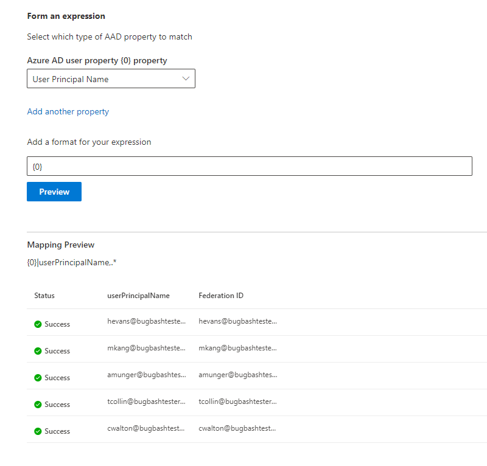

# 對應 Azure AD 身分識別Map your Azure AD Identities  

本文將引導您完成將 Azure AD 身分識別對應至資料來源的唯一識別碼的步驟 (非 Azure AD 身分識別) ，這樣，您的存取控制清單中的人員) 與非 Azure AD 身分識別的存取控制 (清單中的人員，便可查看限制範圍的連接器搜尋結果。This article walks you through the steps of mapping your Azure AD identities to a unique identifier for your data source (non-Azure AD identity) so that people in your Access Control List (ACL) with non-Azure AD identities can see connector search results scoped to them.

這些步驟只會與使用「存取此資料來源的人」和「AAD」的「搜尋」許可權的「搜尋」許可權設定為 Microsoft 的 [Salesforce](salesforce-connector.md) 連接器有關的搜尋系統管理員相關。These steps are only relevant to search administrators who are setting up a [Salesforce](salesforce-connector.md) connector by Microsoft with search permissions for "Only people with access to this data source" and identity type "AAD." 下列步驟會引導您如何將 Azure AD 使用者屬性對應至使用者的 **同盟 IDs** 。The following steps walk you through how to map your Azure AD user properties to your users' **Federation IDs**.

>[!NOTE]
>如果您是在 [搜尋許可權] 畫面上設定 [Salesforce 連接器](salesforce-connector.md) 並 **只選取存取此資料來源的人員** 和身分識別類型 **非 AAD** ，請參閱 [對應您的非 azure ad](map-non-aad.md) 身分識別文章，以取得如何對應非 azure ad 身分識別的步驟。If you are setting up a [Salesforce connector](salesforce-connector.md) and select **Only people with access to this data source** and identity type **non-AAD** on the search permissions screen, refer to the [Map your non-Azure AD Identities](map-non-aad.md) article for steps on how to map non-Azure AD identities.  

## 對應 Azure AD 屬性的步驟Steps for mapping your Azure AD properties

### 1. 選取要對應的 Azure AD 使用者屬性1. Select Azure AD user properties to map

您可以選取您要對應至同盟識別碼的 Azure AD 屬性。You can select the Azure AD properties you need to map to the Federation ID.

您可以從下拉式清單中選取 Azure AD 使用者屬性。You can select an Azure AD user property from the dropdown. 您也可以新增您想要的 Azure AD 使用者屬性。若要建立組織的同盟識別碼對應，您也可以像您所需的那樣新增這些屬性。You can also add as many Azure AD user properties as you would like if these properties are necessary to create the Federation ID mapping for your organization.

### 2. 建立完成對應的公式2. Create formula to complete mapping

您可以組合 Azure AD 使用者屬性的值，以形成唯一的同盟識別碼。You can combine the values of the Azure AD user properties to form the unique Federation ID.

在 [公式] 方塊中，" {0} " 會對應至您所選取的 *第一個* Azure AD 屬性。In the formula box, "{0}" corresponds to the *first* Azure AD property you selected. " {1} " 對應于您選取的 *第二個* Azure AD 屬性。"{1}" corresponds to the *second* Azure AD property you selected. " {2} " 會對應至 *協力廠商* Azure AD 屬性等等。"{2}" corresponds to the *third* Azure AD property, and so on.  

以下是一些具有範例正則運算式輸出和公式輸出的公式範例：Below are some examples of formulas with sample regular expression outputs and formula outputs:

| 範例公式Sample formula                  | 範例使用者的屬性值 {0}Value of property {0} for a sample user                 | 範例使用者的屬性值 {1}Value of property {1} for a sample user           | 公式的輸出Output of formula                  |
| :------------------- | :------------------- |:---------------|:---------------|
| {0}.{1}@contoso .com{0}.{1}@contoso.com  | firstnamefirstname | 姓氏lastname |firstname.lastname@contoso.comfirstname.lastname@contoso.com
| {0}@domain .com{0}@domain.com                 | useriduserid                 |             |userid@domain.comuserid@domain.com

在您提供公式後，您可以選擇性地按一下 [ **預覽** ]，以查看資料來源中5個隨機使用者的預覽，並套用各自的使用者對應。After you provide your formula, you can optionally click **Preview** to see a preview of 5 random users from your data source with their respective user mappings applied. 預覽的輸出會包含步驟1中為該使用者選取的 Azure AD 使用者屬性值，以及在步驟2中為該使用者提供之最後一個公式的輸出。The output of the preview includes the value of the Azure AD user properties selected in step 1 for those users and the output of the final formula provided in step 2 for that user. 此外，它也會指出是否可以透過 "Success" 或 "Failed" 圖示，將公式的輸出解析為您租使用者中的 Azure AD 使用者。It also indicates whether the output of the formula could be resolved to an Azure AD user in your tenant via a "Success" or "Failed" icon.  

>[!NOTE]
>按一下 [ **預覽** ] 之後，如果有一或多個使用者對應的「失敗」狀態，您仍然可以繼續建立連接。You can still proceed with creating your connection if one or more user mappings have a "Failed" status after you click **Preview**. 預覽會顯示5個隨機使用者，以及其從您的資料來源對應的映射。The preview shows 5 random users and their mappings from your data source. 如果您提供的對應未對應所有使用者，您可能會遇到此案例。If the mapping you provide does not map all users, you may experience this case.

## Azure AD 對應範例Sample Azure AD mapping

如需 Azure AD 對應範例，請參閱下列快照。See the snapshot below for a sample Azure AD mapping.

## 限制Limitations  

- 所有使用者只支援一個對應。Only one mapping is supported for all users. 不支援條件式對應。Conditional mappings are not supported.  

- 發佈連線後，就無法變更對應。You cannot change your mapping once the connection is published.  

- Azure ad 使用者屬性不支援以 Regex 為基礎的運算式，Azure AD to Federation ID 轉換。Regex-based expressions against the Azure AD user properties are not supported for the Azure AD to Federation ID transformation.