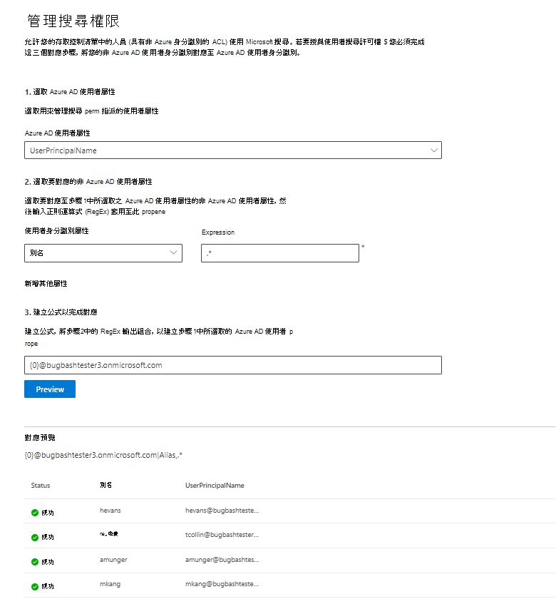

# 對應您的非 Azure AD 身分識別  

本文將引導您完成將您的非 Azure AD 身分識別對應至 Azure AD 身分識別的步驟，讓您的存取控制清單中的人員 (具有非 Azure AD 身分識別的 ACL) 可以查看其範圍內的連接器搜尋結果。

這些步驟只與使用「存取此資料來源的人」和「非 AAD」的「搜尋」許可權設定 [Confluence 雲端](confluence-cloud-connector.md)、 [ServiceNow 知識](servicenow-knowledge-connector.md) [ServiceNow 目錄](servicenow-catalog-connector.md) 或 [Salesforce](salesforce-connector.md) 連接器的搜尋系統管理員相關。

>[!NOTE]
>如果您是在 [搜尋許可權] 畫面上設定 Salesforce 連接器並 **只選取可存取此資料來源** 和身分 **識別類型的** 人員，請參閱 [對應 azure ad](map-aad.md) 身分識別文章，以取得如何對應 azure ad 身分識別的步驟。  

## 用於對應非 Azure AD 屬性的步驟

### 1. 選取 Azure AD 使用者屬性  

您可以選取您要建立對應的 Azure AD 使用者屬性。 這是您想要將非 Azure AD 身分識別對應到的目標屬性。  

您可以選取下列 Azure AD 屬性之一：

| Azure AD 屬性    | 定義           | 範例         |
| :------------------- | :------------------- |:--------------- |
| 使用者主體名稱 (UPN)  | UPN 是由 UPN 首碼所組成 (使用者帳戶名稱) 和 UPN 尾碼 (DNS 功能變數名稱) 。 首碼是使用 "@" 符號加入尾碼。 | us1@contoso.onmicrosoft.com |
| Azure AD 識別碼                 | 指定使用者的 Azure AD 識別碼是使用者的唯一 GUID。                 | 58006c96-9e6e-45ea-8c88-4a56851eefad            |
| Active Directory 安全性識別碼 (SID)                   | SID (的安全性識別碼) 是 Active Directory 用來將物件識別為安全性主體的唯一識別碼。                  | S-1-5-21-453406510-812318184-4183662089             |

### 2. 選取非 Azure AD 使用者屬性以進行對應

您可以從您的資料來源中選取要套用正則運算式的非 Azure AD 屬性。 若要深入瞭解在資料來源中找到這些屬性的詳細資訊，請參閱 [Confluence Cloud](confluence-cloud-connector.md)、 [ServiceNow 知識](servicenow-knowledge-connector.md) [ServiceNow 目錄](servicenow-catalog-connector.md) 及 [Salesforce](salesforce-connector.md) 頁面。  

您可以從下拉式清單中選取非 Azure AD 使用者屬性，並提供在這些使用者屬性值上套用正則運算式。

以下是一些正則運算式範例及其輸出套用至範例字串的範例： 

| 範例字串                  | 規則運算式                 | 範例字串上正則運算式的輸出           |
| :------------------- | :------------------- |:---------------|
| Alexis Vasquez  | .* | Alexis Vasquez |
| Alexis Vasquez                 | ..$                 | Ez            |
| Alexis Vasquez                  |  ( \w +) $                  | Vasquez             |

您可以新增任意數目的非 Azure AD 使用者屬性（如您想要的運算式）。 您可以將不同的正則運算式套用至相同的使用者屬性（如果您的最後一個公式保證這樣做）。  

### 3. 建立完成對應的公式

您可以將套用至每個非 Azure AD 使用者屬性之正則運算式的輸出組合在一起，以形成步驟1中所選取的 Azure AD 屬性。

在 [公式] 方塊中，" {0} " 對應于正則運算式的輸出，該正則運算式套用到您選取的 *第一個* 非 Azure AD 屬性。 " {1} " 對應于正則運算式的輸出，此正則運算式套用到您選取的 *第二個* 非 Azure AD 屬性。 " {2} " 對應于套用至 *第三個* 非 Azure AD 屬性等正則運算式的輸出。  

以下是一些具有範例正則運算式輸出和公式輸出的公式範例： 

| 範例公式                  | {0}範例使用者的值                 | {1}範例使用者的值           | 公式的輸出                  |
| :------------------- | :------------------- |:---------------|:---------------|
| {0}.{1}@contoso .com  | firstname | 姓氏 |firstname.lastname@contoso.com
| {0}@domain .com                 | userid                 |             |userid@domain.com

在您提供公式後，您可以選擇性地按一下 [ **預覽** ]，以查看資料來源中5個隨機使用者的預覽，並套用各自的使用者對應。 預覽的輸出包含在步驟2中為該使用者所選取的非 Azure AD 使用者屬性值，以及在步驟3中為該使用者提供的最後一個公式的輸出。 此外，它也會指出是否可以透過 "Success" 或 "Failed" 圖示，將公式的輸出解析為您租使用者中的 Azure AD 使用者。  

>[!NOTE]
>按一下 [ **預覽**] 之後，如果有一或多個使用者對應的「失敗」狀態，您仍然可以繼續建立連接。 預覽會顯示5個隨機使用者，以及其從您的資料來源對應的映射。 如果您提供的對應未對應所有使用者，您可能會遇到此案例。

## 非 Azure AD 對應範例

請參閱下方的快照，以取得非 Azure AD 的範例對應。

## 限制  

- 所有使用者只支援一個對應。 不支援條件式對應。  

- 發佈連線後，就無法變更對應。  

- 目前只有對非 AAD 使用者屬性的 RegEx 型運算式支援轉換。

- 只有3個 Azure AD 身分識別您可以選擇對應 (UPN、Azure AD ID 及 AD SID) 。