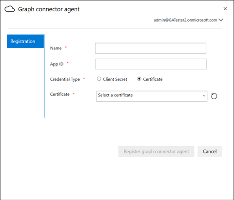

# 部署代理程式

## 圖形連接器代理程式

部署圖形連接器需要安裝 *Graph 連接器代理程式* 軟體。 它允許在內部部署資料和雲端服務之間進行快速且安全的資料傳輸。 本文將引導您完成安裝及設定軟體的步驟。 設定之後，就可以從 [Microsoft 365 系統管理中心](https://admin.microsoft.com)建立部署資料來源的連線。

## 安裝

使用 [此連結](https://download.microsoft.com/download/d/d/e/dde18236-9c67-437d-a864-894a0a888ef2/AgentPackage.msi) 下載最新版的 Graph connector agent，並使用安裝精靈安裝軟體。 使用下列所述機器的建議設定，軟體可順利處理最多三個連接。 超過此數目的任何連線可能會降低效能。

建議的設定：

* Windows 10、Windows Server 2012 R2 及更新版本
* 8核心，3GHz
* 16GB RAM，1GB 磁碟空間
* 透過443對資料來源和網際網路的網路存取

## 建立代理程式的應用程式  

在建立連線之前，必須將代理實例送入少數幾個重要參數。 這些參數包含使用圖形攝取 APIs 所需的驗證詳細資料。  

建立代理程式之應用程式的步驟。

1. 移至 [Azure 入口網站](https://portal.azure.com) ，並使用系統管理員認證登入以供租使用者使用。
2. 從功能窗格流覽至 [ **Azure Active Directory**  ->  **應用程式註冊**]，然後選取 [**新增註冊**]。
3. 提供應用程式的名稱，然後選取 [ **註冊**]。
4. 記下應用程式 (用戶端) 識別碼。
5. 從功能窗格開啟 **API 許可權** ，然後選取 [ **新增許可權**]。
6. 選取 [ **Microsoft Graph]** ，然後選取 [ **應用程式許可權**]。
7. 從許可權搜尋 "ReadWrite ExternalItem" 和「Directory. all」，然後選取 [ **新增許可權**]。
8. 選取 **[授與「TenantName] 的系統管理員同意** ，並選取 [ **是**]。
9. 檢查許可權是否處於授與的狀態。
     

## 設定圖表連接器代理程式

建立代理程式之後，您必須設定代理程式的適當驗證詳細資料。

您可以在下列其中一個表單中提供驗證詳細資料。

### 設定用戶端密碼進行驗證

1. 移至 [Azure 入口網站](https://portal.azure.com) ，並使用系統管理員認證登入以供租使用者使用。
2. 從功能窗格開啟 **應用程式註冊** ，然後移至適當的應用程式。 在 [ **管理**] 下，選取 [ **憑證和機密**]。
3. 選取 [ **新增用戶端密碼** ]，然後選取密碼到期期限。 複製產生的密碼並加以儲存，因為它不會再次顯示。
4. 使用此用戶端密碼和應用程式識別碼來設定代理程式。 請勿在代理程式的 [ **名稱** ] 欄位中使用任何空格。 會接受字母數位字元。

## 使用指紋憑證進行驗證

如果您已在設定 [用戶端密碼進行驗證](#configuring-the-client-secret-for-authentication) 之後設定驗證詳細資料，則可以直接跳至 [安裝程式概述](configure-connector.md)。

1. 開啟 **應用程式註冊** ，然後從功能窗格中選取 **憑證和密碼** 。 複製憑證指紋。

2. 使用用戶端密碼或指紋來註冊圖形連接器代理程式。

