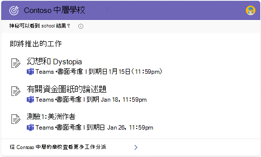

# Bing 中的 Microsoft 搜尋綜述

Bing 中的 Microsoft 搜尋會將 Microsoft 搜尋和 Bing 網頁搜尋的功能彙集在一起。 它會提供熟悉的搜尋體驗，以協助使用者從您的組織和網頁找到相關的結果。 為了協助保護您的使用者和您的資料，使用者必須先登入其工作或學校帳戶的 Bing，才能找到內部結果。

## 使用者看到的內容

當貴組織中的人員使用 Bing 中的 Microsoft 搜尋時，有兩個地方可以看到工作或學校結果：

- 所有結果頁面：如果有相關的工作或學校結果，它會顯示在搜尋結果頁面的頂端，然後是公用 web 結果。
- [工作或學校結果] 頁面：只有您組織的結果會出現在此頁面上。 它永遠不包含公用 web 結果。

:::image type="content" alt-text="Contoso 和 school results 的所有和工作結果頁面，適用于 Contoso 中層學校。" source="media/msb-overview/all-work-school-serps.gif" lightbox="media/msb-overview/all-work-school-serps.gif":::

使用者可以尋找組織的標誌、名稱或其設定檔影像，輕鬆識別工作或學校結果。

## Bing 中 Microsoft 搜尋入門

預設會為組織中的所有人啟用 Bing 中的 Microsoft 搜尋。 如果使用者已登入其他服務上的公司或學校帳戶，例如 Outlook、Microsoft Teams 或 SharePoint--當他們前往 Bing 時，會自動登入相同的帳戶。 如需詳細資訊，請參閱[Bing 專用 Microsoft 搜尋的安全性和隱私權](security-for-search.md)。

如果您不熟悉 Bing 中的 Microsoft 搜尋，建議您複習 Bing 系統[管理重點指南](https://aka.ms/SearchAdminEssentials)中的 Microsoft 搜尋，以取得設定及部署資訊。 為了協助提高使用者對 Microsoft 搜尋的認知，我們[採用套件](https://aka.ms/SearchAdoptionKit)包含訓練和通訊資源。

## 工作和學校搜尋體驗

Bing 中的 Microsoft 搜尋提供的搜尋經驗是針對工作和學校使用者的需求而量身定制。 在具有企業服務方案的組織中，使用者將獲得專為工作而設計的搜尋經驗，包括組織圖表和 Power BI 的答案。

具有教育服務方案之組織中的使用者將會取得設計供搜尋學校使用的經驗，包括有關類別和即將推出之工作分派的答案。

如果您的組織有教育和企業服務方案，您可以為使用者（學校或公司）的 Bing 體驗選擇 Microsoft 搜尋。 如需詳細資訊，請參閱 [選取學校或工作搜尋經驗](/microsoftsearch/select-work-school-search-experience)。

## 將 Bing 中的 Microsoft 搜尋新增至您的內部網路

Microsoft 搜尋的設計目的是讓內部資訊在您的使用者搜尋的任何地方都易於存取。 如果您組織中的人員使用內部網路網站來開始工作或學校搜尋，請考慮將內嵌的搜尋方塊新增至您的網站。

使用簡單的腳本，您可以新增自訂的搜尋方塊，甚至將其指引至自訂的垂直。 若要深入瞭解，請參閱 [將搜尋方塊新增至您的內部網路網站](add-a-search-box-to-your-intranet-site.md)。

## 將預設值設為便於搜尋工作或學校

為了協助提高採用 Bing 的 Microsoft 搜尋，請考慮設定預設值，讓它成為使用者一天中無縫的部分。

**預設瀏覽器**：當您 Microsoft Edge 預設瀏覽器時，您的使用者就可以搜尋您的組織，並取得相關的搜尋建議，直接從網址列。 從位址列進行搜尋的速度很快，易於找到資訊，而且不需要移至 Bing 開始搜尋。 如需詳細資訊，請參閱[Set Microsoft Edge as default browser](/deployedge/edge-default-browser)。

**預設搜尋引擎**：如果變更您的預設瀏覽器不是選項，您可以將 Bing 設定為預設搜尋引擎，以從位址列啟用 [工作] 或 [學校] 搜尋。 如需詳細資訊，請參閱[Bing 預設搜尋引擎](set-default-search-engine.md)。 如果您的組織有 Microsoft 365 Apps 企業版 (先前 Office 365 專業增強版) 服務方案，您可以在 Bing 副檔名中部署 Microsoft 搜尋，將 Bing 設定為 Google Chrome 的預設搜尋引擎。 如需詳細資訊，請參閱[Bing 和 Microsoft 365 Apps 企業版中的 Microsoft 搜尋](/deployoffice/microsoft-search-bing)。

**預設首頁**：設定 Bing 為組織的預設首頁，不會從位址列中搜尋工作或學校，但提供任何簡易的方式可以存取 bing.com。 如需詳細資訊，請參閱[將 Bing .com 設定為預設的首頁](set-default-homepage.md)。

## 安全性與隱私權

Bing 中 Microsoft 搜尋會使用增強的安全性和隱私權措施，協助保護貴組織的資料和使用者。 如需詳細資訊，請參閱[Bing 中 Microsoft 搜尋的安全性和隱私權](security-for-search.md)，以及[Bing 中 Microsoft 搜尋如何保證資訊安全](https://support.microsoft.com/office/how-microsoft-search-in-bing-helps-keep-your-info-secure-cbce46ae-bb1f-4d0e-86f1-5984f4589113)。

## 請參閱

- [Microsoft Search 概觀](overview-microsoft-search.md)
- [規劃您的內容](plan-your-content.md)
