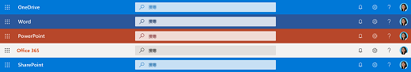
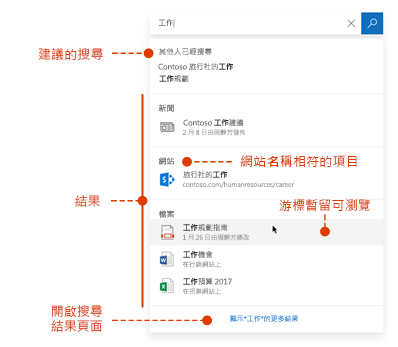
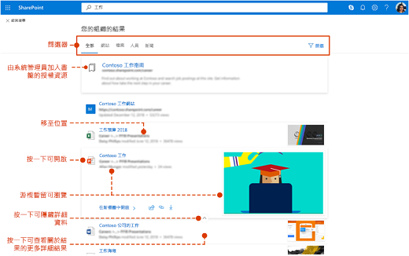

# Microsoft Search 概觀Overview of Microsoft Graph

Microsoft Search 為 Microsoft 365 生產力應用程式和更廣泛 Microsoft 生態系統中的整合式搜尋功能。Microsoft Search is the unified search capability in the Microsoft 365 productivity apps and the broader Microsoft ecosystem. 隨著時間推移，Microsoft Search 將在 Microsoft 365 越來越多的應用程式中提供。Over time Microsoft Search will be available in more and more apps across Microsoft 365.

Microsoft Search 可協助使用者找到正確的答案、人員和內容，以在他們已在使用的應用程式中完成其工作。Microsoft Search helps users find the right answers, people, and content to complete their tasks in the app they’re already working in.

- 使用者會收到他們從中搜尋的應用程式**上下文**中的相關結果。Users get results that are relevant in the **context** of the app they search from. 例如，當使用者在 Outlook 中搜尋時，他們會尋找電子郵件，而不會尋找 SharePoint 中的網站。For example, when they search in Outlook, they find emails, not sites in SharePoint. 在 SharePoint 中搜尋時，他們會尋找網站、頁面和檔案，而不會尋找電子郵件。When they search in SharePoint, they find sites, pages, and files, not emails.
- 無論使用者使用哪個應用程式，Microsoft Search 都是**個人**的。Whichever app users are working in; Microsoft Search is **personal**.  Microsoft Search 會使用來自 Microsoft Graph 的深入資訊來顯示與每個使用者相關的結果。Microsoft Search uses insights from the Microsoft Graph to show results that are relevant to each user. 每個使用者可能會看到不同的結果，即使他們搜尋相同文字亦然。Each user might see different results, even if they search for the same words. 他們只會看到他們有權存取的結果，Microsoft Search 不會變更權限。They only see results that they already have access to, Microsoft Search doesn’t change permissions.
- 使用者不需要記住資訊所在的地方。Users don’t need to remember where the information is located. 例如，使用者在 Word 中作業，但想要重複使用同事從其 OneDrive 共用的簡報資訊。For example, a user is working in Word and wants to reuse information from a presentation that a colleague shared from their OneDrive. 不需要切換到 OneDrive 並搜尋該簡報，而是可以直接從 Word 搜尋。There’s no need to switch to OneDrive and search for that presentation, they can simply search from Word.  
- 在 Bing 中時，使用者可以取得來自公用網站與來自其組織內的結果。When in Bing, users get results from within their organization in addition to the public web results .

## 使用者看到的內容What users see

在 Bing 中，使用者使用的搜尋方塊與網頁搜尋的相同。In Bing, users use the same search box as for web searches. 在 Microsoft 365 應用程式中，使用者在標題列找到 Microsoft Search 方塊，In the Microsoft 365 apps, users find the Microsoft Search box in the header bar. 它看起來像這樣：It looks like this in OneDrive for Business.

當使用者在搜尋方塊按一下，搜尋會根據其在 Office 365 中先前的活動，並根據組織中內容的趨勢來建議結果。When users click in the search box, search suggests results based on their previous activity in Office 365 and based on content that’s trending in your organization. 他們最近處理的檔案，他們最近使用的命令，以及與他們共同作業的人員，這些是搜尋會考慮的活動範例。Files they were working on recently, commands they’ve used recently as well as people they collaborate with are examples of activity that search considers. 當使用者在搜尋方塊中開始輸入時，建議的結果會更新。As users start typing in the search box, the suggested results update. 使用者可以直接從搜尋方塊開啟搜尋結果。Users can open search results right from the search box. 以下是在 SharePoint 中搜尋的範例。Here's an example of a search in SharePoint.

如果搜尋方塊中的建議並非他們所要尋找的內容，按一下 **Enter** 可開啟結果的完整清單。If the suggestions in the search box aren’t what they’re looking for, **Enter** opens the full list of results. 他們可以使用中繼資料，例如上次修改項目的使用者和時間、項目所在位置，以及預覽它來判斷是否為要尋找的內容。They can use metadata such as who last modified the item and when, where the items is located, as well as preview it to determine if it’s what they’re looking for.

## Microsoft Search 的優點Benefits of Microsoft Search

**從任何 Microsoft Search 方塊跨 Microsoft 365 搜尋** - 使用者可以從任何 Microsoft Search 方塊搜尋，並快速回到他們執行的動作。**Search across Microsoft 365 from any Microsoft Search box** – Users can search from any Microsoft Search box and get quickly back to what they were doing. Microsoft Search 會將來自 Office 365 (包括 SharePoint、商務用 OneDrive 和 Exchange) 中資料來源的結果整合在一起。Microsoft Search brings together results from data sources in Office 365, including SharePoint, OneDrive for Business, and Exchange.

**輕鬆搜尋** - Microsoft Search 會根據使用者先前在 Office 365 中的活動，直接在搜尋方塊中建議結果。**Easy to search** - Microsoft Search suggests results based on users’ previous activity in Office 365, right in the search box.

**尋找共用的檔案** - Microsoft Search 使用進階查詢理解讓尋找共用檔案更容易。**Find shared files** - Microsoft Search uses advanced query understanding to make finding shared files simple. 使用者可以輕鬆地找到他們正在共同作業的檔案。Users can easily find files they’re collaborating on.

**顯示相關內容** - 提升您的使用者完成工作所需的資訊和解答，例如政策、福利、資源、工具等。**Show relevant content** - Promote the information and answers your users need to complete tasks, for example policies, benefits, resources, tools, and more. 您也能以特定群組為目標，例如新進人員或遠端工作者。You can also target specific groups, like new hires or remote workers.

**Microsoft Search 發展** - 使用者可以搜尋的這組內容類型，及搜尋方塊的智慧隨著時間增加。**Microsoft Search evolves** – The set of content types users can search for and the intelligence of the search box will grow over time.

**跨所有應用程式管理** - Microsoft Search 預設為開啟，並且您所做的任何系統管理會套用至所有應用程式中的 Microsoft Search。**Administer across all apps** - Microsoft Search is on by default and any administration you do applies to Microsoft Search in all the apps.

## 目前有 Microsoft Search 的應用程式Apps that currently have Microsoft Search

隨著時間推移，Microsoft Search 將在 Microsoft 365 越來越多的應用程式中提供。Over time Microsoft Search will be available in more and more apps across Microsoft 365. 下列 Office 365 應用程式目前提供 Microsoft Search：The following Office 365 apps currently offer Microsoft Search:

- SharePoint OnlineSharePoint Online
- 商務用 OneDriveOneDrive for Business
- Outlook 網頁版Outlook on the web
- Windows 上的 Office 應用程式Office apps on Windows

此外，使用者會在下列位置找到 Microsoft Search：In addition, users find Microsoft Search in:

- BingBing Maps
- Office.comOffice.com: SharePoint
- Word、Excel 及 PowerPoint Online 的起始頁面The starting pages for Word, Excel, and PowerPoint Online

使用者也可以從 Edge 網址列在 Bing 中起始搜尋。Users can also initiate a search in Bing from the Edge address bar.

## 需求Requirements

您的組織必須有具備下列其中一個訂閱的 Office 365 租用戶：Your organization must have an Office 365 tenant with one of the following subscriptions:

- Office 365 商務基本版和商務進階版Office 365 Business Essentials or Office 365 Business Premium
- Office 365 A1/A3/A5Office 365 A1/A3/A5
- Office 365 教育版 E1/E3Office 365 Education E3
- Office 365 企業版 E1/E3/E3 開發人員/E5Office 365 Enterprise E1/E3/E3 developer/E5
- Office 365 F1Office 365 Enterprise F1
- Microsoft 365 商務版Microsoft 365 Business
- Microsoft 365 A3/A5Microsoft 365 A3/A5
- Microsoft 365 F1/E3/E5Microsoft 365 F1/E3/E5

使用者和搜尋系統管理員兩者都必須獲得其中一個訂閱的授權。Both users and search administrators must be licensed with one of these subscriptions. 只有具有有效帳戶的使用者可以使用 Microsoft Search，而且必須**登入**。Only users with active accounts can use Microsoft Search, and they must be **signed in**.

## 為您的組織打造 Microsoft SearchTailoring Microsoft Search to your organization

身為系統管理員，您可以讓使用者在從 SharePoint 起始頁面、Office.com 或 Bing 搜尋時，取得良好的組織特定結果。As an admin you can make it easy for your users to get good organization-specific results when they search from their SharePoint start page, Office.com, or Bing. 您要透過 Microsoft 365 系統管理中心管理 Microsoft Search。You administer Microsoft Search in the Microsoft 365 admin center.

**顯示實用內容** - 幫助使用者找到組織內的重要工具和資源，方法是將其加入書籤。**Show useful content** - Help users find important tools and resources within your organization by bookmarking them. 如同您可以為公用網頁建立書籤，您可以為任何內部網頁建立書籤，供使用者搜尋。Just as you can create a bookmark to a public webpage, you can create a bookmark for any internal webpage, which your users can search for. 您也可以在書籤中整合 PowerApp，讓使用者可以直接從書籤完成工作。You can also integrate a Power App in the bookmark so users can complete their task directly from the bookmark.

**提供常見問題的解答** - 為您的組織最常詢問的問題提供最佳的解答。**Offer answers to common questions** – Give the best answer for the most frequently asked questions in your organization. 當使用者在搜尋方塊中輸入常見的問題時，Microsoft Search 會在結果中顯示這個問題的解答，而非只是提供網頁的連結。When users enter a common question in the search box, Microsoft Search shows the answer as a result instead of just providing a link to the web page.

**顯示實用的位置** - 在地圖上顯示組織的大樓、辦公室和其他工作區的地圖結果和地址資訊。**Show useful locations** - Show map results and address information for your organization's buildings, offices, and other workspaces on a map. 使用者可以使用地圖來取得方向、查看附近有什麼，還有更多功能。Users can use the maps to get directions, see what's nearby, and more.

## 搜尋什麼內容？What content is searched?

Microsoft Search 可以搜尋儲存在 SharePoint Online、商務用 OneDrive 和 Exchange 中的內容，包括來自全域通訊清單與 Office 365 群組的人員。Microsoft Search can search in content that’s stored in SharePoint Online, OneDrive for Business, and Exchange, including people from the global address list and Office 365 groups. 如果您的組織使用雲端混合式搜尋來設定混合式 SharePoint 環境，Microsoft Search 的使用者也可以從內部部署 SharePoint 內容取得結果，包括您已連線至您的 SharePoint Server 環境的任何外部內容。If your organization has set up a hybrid SharePoint environment using cloud hybrid search, users of Microsoft Search can also get results from on-premises SharePoint content, including any external content you’ve connected to your SharePoint Server environment. [深入了解混合式搜尋環境](https://docs.microsoft.com/sharepoint/hybrid/learn-about-cloud-hybrid-search-for-sharepoint)。[Learn more about hybrid search environments](https://docs.microsoft.com/sharepoint/hybrid/learn-about-cloud-hybrid-search-for-sharepoint).

當使用者從 SharePoint 起始頁面或 Office.com 搜尋時，Microsoft Search 會搜尋整個組織中的所有內容，並顯示找到的所有結果。When users search from the SharePoint start page or Office.com, Microsoft Search searches across all the content in their organization and presents all the results it finds. 這是所謂的**全域搜尋範圍**。This is known as the **global search scope**.

當使用者從 Bing 搜尋時，使用者會從組織中的所有內容取得最相關的結果，這些結果會內嵌在來自**網路**的結果清單中。When users search from Bing, users get the most relevant results from all the content in their organization embedded in the list of results from the **web**. 如果他們需要查看**所有**組織結果，只要按一下即可取得全域搜尋範圍。If they need to see **all** organizational results, the global search scope is only a click away.

## 使用者可以找到哪些類型的結果？What types of results can users find?
使用者在搜尋時會從下列來源尋找下列類型的結果：Users find the following types of results when they search from:

**SharePoint**：檔案、資料夾、組織中的人員、組織圖、網站、網頁、最新消息、清單和清單項目。**SharePoint**: Files, folders, people in your organization, organization charts, sites, site pages, news, lists and list items. 如果有定義，則為常見問題的解答、導向官方資訊的書籤、位置和工具。If defined, answers to common questions, bookmarks that lead to authoritative information, locations, and tools. 
  [了解您可以尋找的檔案類型](https://docs.microsoft.com/zh-TW/SharePoint/technical-reference/default-crawled-file-name-extensions-and-parsed-file-types)。[Learn which types of files you can find](https://docs.microsoft.com/en-us/SharePoint/technical-reference/default-crawled-file-name-extensions-and-parsed-file-types).

**Office.com 和 Word、Excel 及 PowerPoint Online 起始頁面**：應用程式、檔案、資料夾、人員、組織圖、SharePoint 網站、網站頁面、清單和清單項目。**Office.com and Word, Excel, and PowerPoint Online start pages**: Apps, files, folders, people, organization charts, SharePoint sites, site pages, lists and list items. 如果有定義，則為常見問題的解答、導向官方資訊的書籤、位置和工具。If defined, answers to common questions, bookmarks that lead to authoritative information, locations, and tools. 可以找到與 SharePoint 中相同類型的檔案。Files of the same type as in SharePoint can be found.

**Bing**：公用網站上的內容、檔案、Office 365 群組、人員、Yammer 和 Teams 交談、組織圖、SharePoint 網站。**Bing**: Content on the public web, files, Office 365 groups, people, Yammer and Teams conversations, organization charts, SharePoint sites. 如果有定義，則為常見問題的解答、導向官方資訊的書籤、位置和工具。If defined, answers to common questions, bookmarks that lead to authoritative information, locations, and tools.  可以找到 Word、Excel、PowerPoint、Visio、OneNote 和 PDF 檔案。Word, Excel, PowerPoint, Visio, OneNote, and PDF files can be found.

**Outlook**：電子郵件、附件和組織中的人員。**Outlook**: Emails, attachments, and people in your organization.

**Windows 上的 Office 應用程式**：應用程式中的動作、組織中和網路上的人員、檔案、文字說明、檔案內或說明內容中查詢的相符項目、網路上的內容。**Office apps on Windows**: Actions in the app, people in your organization and on the web, files, word explanations, matches for the query inside the file or in help content, content on the web. 可以找到 Word、Excel、PowerPoint、Visio 和 OneNote 檔案。Word, Excel, PowerPoint, Visio, and OneNote files can be found.

**OneDrive**：可以找到與 SharePoint 中相同類型的檔案。**OneDrive**: Files of the same type as in SharePoint can be found.

## Microsoft Search 如何運作？How does Microsoft Search work?

當使用者搜尋時，Microsoft Search 會處理查詢，並從較大的片語剖析搜尋意圖，以使用人工智慧 (AI) 學習使用者新增到查詢，但不影響其搜尋意圖的常用多餘片語。When a user searches, Microsoft Search processes the query and parses search intent from larger phrases, using Artificial Intelligence (AI) to learn common superfluous phrases users add to their queries that don't impact their search intent. 舉例來說，當使用者搜尋「如何變更我的密碼」，我們會截掉查詢中較不重要的字詞，並依據較相關的項目 (例如「變更密碼」) 來進行觸發。For example, when a user searches for "how to change my password" we extract the less important words from the query and trigger based on the relevant ones like "change password".  

使用者有**權限**查看的搜尋結果會顯示在搜尋結果頁面上。The search results that the user has **permission** to see are presented on the search results page. Microsoft Search 會依據相關性，使用智慧型排序演算法以排序結果。Microsoft Search uses intelligent ranking algorithms to order results based on relevance.

## SharePoint 中的 Microsoft SearchSearch in Microsoft SharePoint 2013

SharePoint 中的 Microsoft Search 是 SharePoint Online 中的新式搜尋體驗。Microsoft Search in SharePoint is the modern search experience in SharePoint Online. SharePoint Online 也提供傳統搜尋體驗。SharePoint Online also offers a classic search experience. 兩個體驗預設為開啟，也會搜尋相同的內容。Both experiences are on by default and both search the same content. 搜尋系統管理員無法在 SharePoint Online 中開啟任一種體驗。As a search administrator you can’t turn on either experience in SharePoint Online. 您的使用者可獲得的搜尋體驗取決於他們從何處搜尋：Which search experience your users get depends on where they search from:

- 使用者可以在 SharePoint 起始頁面、中樞網站、通訊網站和新式小組網站上，找到 Microsoft Search 搜尋方塊。Users get the modern search experience on the SharePoint home page, hub sites, communication sites, and modern team sites.
- 發佈網站、傳統小組網站和在搜尋中心時，使用者會使用傳統搜尋方塊。Users get the classic search experience on publishing sites, classic team sites, and in the Search Center.

您可以自訂傳統搜尋體驗，例如將自訂精簡器新增至搜尋結果頁面或以不同方式顯示特定類型的結果。You can customize the classic search experience, for example by adding custom refiners to the search results page or displaying a certain type of result differently. 您無法像在 SharePoint 中那樣自訂 Microsoft Search 體驗。You can’t customize the Microsoft Search experience in SharePoint like that. 為傳統搜尋所做的一些自訂可能會影響 SharePoint 中的 Microsoft Search。Some of the customizations you make for classic search might impact Microsoft Search in SharePoint. 如果您的組織將在 SharePoint 中使用兩種搜尋體驗，請[了解差異，以及如何避免影響 SharePoint 中的 Microsoft Search](https://docs.microsoft.com/zh-TW/sharepoint/differences-classic-modern-search) (部分機器翻譯)。If your organization will use both search experiences in SharePoint, [learn about the differences and how to avoid impacting Microsoft Search in SharePoint](https://docs.microsoft.com/en-us/sharepoint/differences-classic-modern-search).

## Bing 中的 Microsoft SearchMicrosoft Search in Bing

由於工作相關的搜尋可能具敏感性質，因此 Microsoft Search 使用一套信任措施來決定 Bing 的公開網頁結果如何處理這些搜尋。Because work-related searches may be sensitive, Microsoft Search uses a set of trust measures for how these searches are handled by the public web results part of Bing.

不論使用者查詢傳回的回應中是否包含一或多個工作相關結果，系統都會採取下列措施：Regardless of whether a user query contains one or more work-related results in the returned response, the following measures are taken:

**記錄** - 所有與 Microsoft Search 流量相關的搜尋記錄都會在去除身分識別後，與公開的非 Microsoft Search 流量分開儲存。**Logging** - All search logs pertaining to Microsoft Search traffic are de-identified and stored separately from public, non-Microsoft Search traffic. 這些記錄會保留 18 個月，且限制為僅供偵錯之用。They're retained for 18 months, and access is restricted for debugging purposes only. 這些記錄中的查詢不會用來建立公開功能模型或進行訓練，例如自動建議或公開網頁的相關搜尋。The queries in these logs are not used to model or train public features such as autosuggest or related searches for the public web. 限制存取會透過各種安全機制來管理，包括安全性群組與工程系統中的其他層級。Restricted access is managed via various secure mechanisms, including security groups and other layers within the engineering system.

**搜尋記錄** - 使用公司或學校帳戶登入時，其他電腦或裝置無法取得該使用者的搜尋記錄。**Search history** - When signed in with a work or school account, a user's search history won't be available on other computers or devices.

**廣告** - 絕不會將企業搜尋查詢與廣告客戶分享或建議給廣告客戶。**Advertising** - Enterprise search queries are never shared with or suggested to advertisers.
與 Microsoft Search 有關的搜尋廣告記錄會與公開流量分開儲存。Search Ads logs pertaining to Microsoft Search are stored separately from public traffic.
廣告永遠不會依據使用者的公司身分識別或組織進行投放。Ads are never targeted to a user based on their work identity or organization.

## 請參閱See also

[設定 Microsoft SearchSet up Microsoft Search](setup-microsoft-search.md)

[讓內容易於尋找Make your documents easy to find](make-content-easy-to-find.md)