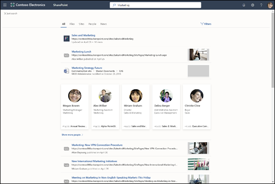

# Microsoft 搜尋概觀Overview of Microsoft Search

Microsoft Search 幫助您尋找您需要完成您正在進行的工作。Microsoft Search helps you find what you need to complete what you’re working on. 是否要搜尋人員、 檔案、 組織圖，網站，或常見問題的答案，您可以使用 Microsoft Search 整個工作日來取得解答。Whether you're searching for people, files, org charts, sites, or answers to common questions, you can use Microsoft Search throughout your workday to get answers.

Microsoft Search 可協助使用者找到正確的答案、人員和內容，以在他們已在使用的應用程式中完成其工作。Microsoft Search helps users find the right answers, people, and content to complete their tasks in the app they’re already working in.

- 使用者會收到他們從中搜尋的應用程式**上下文**中的相關結果。Users get results that are relevant in the **context** of the app they search from. 例如，當他們在[Microsoft Outlook](https://www.microsoft.com/outlook)中搜尋時，他們找出電子郵件，並不是[SharePoint](http://sharepoint.com/)網站。For example, when they search in [Microsoft Outlook](https://www.microsoft.com/outlook), they find emails, and not [SharePoint](http://sharepoint.com/) sites. 在 SharePoint 中搜尋時，他們會尋找網站、頁面和檔案時。When they search in SharePoint, they find sites, pages, and files.
- 無論使用者使用哪個應用程式，Microsoft Search 都是**個人**的。Whichever app users are working in; Microsoft Search is **personal**. Microsoft 搜尋會使用[Microsoft Graph](https://developer.microsoft.com/graph/)的觀點，以顯示與每個使用者相關的結果。Microsoft Search uses insights from the [Microsoft Graph](https://developer.microsoft.com/graph/) to show results that are relevant to each user. 每個使用者可能會看到不同的結果，即使他們搜尋相同文字亦然。Each user might see different results, even if they search for the same words. 他們只會看到他們有權存取的結果，Microsoft Search 不會變更權限。They only see results that they already have access to, Microsoft Search doesn’t change permissions.
- 使用者不需要記住資訊所在的地方。Users don’t need to remember where the information is located. 例如，使用者在[Microsoft Word](https://products.office.com/word)中工作，並想要重複使用從其[OneDrive](https://onedrive.live.com/about/)同事共用簡報中的資訊。For example, a user is working in [Microsoft Word](https://products.office.com/word) and wants to reuse information from a presentation that a colleague shared from their [OneDrive](https://onedrive.live.com/about/). 不需要切換到 OneDrive 並搜尋該簡報，而是可以直接從 Word 搜尋。There’s no need to switch to OneDrive and search for that presentation, they can simply search from Word.
- 在 [Bing](https://bing.com) 中時，使用者可以取得來自公用網站與來自其組織內的結果。When in [Bing](https://bing.com), users get results from within their organization in addition to the public web results.

## 使用者看到的內容What users see

在[Bing](https://bing.com)，使用者會使用 web 搜尋與相同的 [搜尋] 方塊。In [Bing](https://bing.com), users use the same search box as for web searches. Office 應用程式，使用者會在標頭列中尋找 Microsoft 搜尋方塊中。In the Office apps, users find the Microsoft Search box in the header bar. 它看起來像這樣：It looks like this:

當使用者按一下 [**搜尋**] 方塊中時，搜尋會建議結果根據他們在 Office 365 中的前一個活動，並根據趨勢貴組織中的內容。When users click in the **Search** box, search suggests results based on their previous activity in Office 365 and based on content that’s trending in your organization. 他們最近處理的檔案，他們最近使用的命令，以及與他們共同作業的人員，這些是搜尋會考慮的活動範例。Files they were working on recently, commands they’ve used recently as well as people they collaborate with are examples of activity that search considers. 當使用者開始在**搜尋**方塊中輸入，建議的結果就會更新。As users start typing in the **Search** box, the suggested results update. 使用者可以直接從 [**搜尋**方塊開啟搜尋結果。Users can open search results right from the **Search** box. 以下是在[SharePoint](http://sharepoint.com/)中搜尋的範例。Here's an example of a search in [SharePoint](http://sharepoint.com/).

如果在搜尋方塊中的建議不使用者正在尋找，**輸入**會開啟結果的完整清單。If the suggestions in the search box aren’t what users are looking for, **Enter** opens the full list of results. 他們可以使用中繼資料，例如上次修改項目的使用者和時間、項目所在位置，以及預覽它來判斷是否為要尋找的內容。They can use metadata such as who last modified the item and when, where the items is located, as well as preview it to determine if it’s what they’re looking for.

## Microsoft Search 的優點Benefits of Microsoft Search

**從任何 Microsoft Search 方塊跨 Microsoft 365 搜尋** - 使用者可以從任何 Microsoft Search 方塊搜尋，並快速回到他們執行的動作。**Search across Microsoft 365 from any Microsoft Search box** – Users can search from any Microsoft Search box and get quickly back to what they were doing. Microsoft Search 聚集所有同等級結果從 Office 365，包括[SharePoint](http://sharepoint.com/)、[商務用 Microsoft OneDrive](https://onedrive.live.com/about/en-us/business/)及[Microsoft Exchange Server](https://products.office.com/en-us/exchange/microsoft-exchange-server)中的資料來源。Microsoft Search brings together results from data sources in Office 365, including [SharePoint](http://sharepoint.com/), [Microsoft OneDrive for Business](https://onedrive.live.com/about/en-us/business/), and [Microsoft Exchange Server](https://products.office.com/en-us/exchange/microsoft-exchange-server).

**若要搜尋的容易**– Microsoft Search 建議根據使用者的 Office 365 中的前一個活動、 在 [**搜尋**] 方塊中的權限的結果。**Easy to search** – Microsoft Search suggests results based on users’ previous activity in Office 365, right in the **Search** box.

**尋找共用的檔案** - Microsoft 搜尋使用進階查詢理解讓尋找共用檔案更容易。**Find shared files** – Microsoft Search uses advanced query understanding to make finding shared files simple. 使用者可以輕鬆地找到他們正在共同作業的檔案。Users can easily find files they’re collaborating on.

**顯示相關內容** - 提升您的使用者完成工作所需的資訊和解答，例如政策、福利、資源、工具等。**Show relevant content** – Promote the information and answers your users need to complete tasks, for example policies, benefits, resources, tools, and more. 您也可以針對特定群組，例如新主講、 遠端員工或不同地理位置。You can also target specific groups, like new hires, remote workers, or different geographies.

**跨所有應用程式管理** - Microsoft 搜尋預設為**開啟**，並且您所做的任何系統管理會套用至所有應用程式中的 Microsoft 搜尋。**Administer across all apps** – Microsoft Search is **on** by default and any administration you do applies to Microsoft Search in all the apps.

## 為您的組織打造 Microsoft SearchTailoring Microsoft Search to your organization

當您可以建立的系統管理員和令人 Microsoft 搜尋經驗為您的使用者。As an administrator you can create and amazing Microsoft Search experience for your users. 

**顯示實用的內容**– 解答提供快速的代表性結果] 來搜尋關鍵字為基礎的查詢。**Show useful content** – Answers provide fast, authoritative results to search queries based on keywords. [進行內容容易尋找](make-content-easy-to-find.md)。[Make content easy to find](make-content-easy-to-find.md).

**新增外部內容**-Microsoft Graph 連接器可讓您將外部內容移入索引。**Add external content** - Microsoft Graph Connectors allow you to bring external content into the index. 使用連接器來豐富搜尋經驗的資料與外部 Microsoft 365 的檔案。Use connectors to enrich the search experience with data and files from outside of the Microsoft 365. [Microsoft Graph 連接器的概觀Overview of Microsoft Graph connectors](connectors-overview.md)

**自訂使用者經驗**-您可以自訂透過類別和其他組態的使用者經驗。**Customize the user experience** - You can customize the user experience through the use of verticals and other configurations. [自訂 Microsoft 搜尋] 頁面](customize-search-page.md)[Customize the Microsoft Search page](customize-search-page.md)

## 搜尋什麼內容？What content is searched?

Microsoft Search 顯示的內容，您的組織已儲存在 Microsoft 365 或透過連接器已編製索引。Microsoft Search shows the content that your organization has stored in Microsoft 365 or indexed through connectors. Microsoft 搜尋不會搜尋整個租用戶或顯示結果由其他組織共用的內容。Microsoft Search does not search across tenants or show results from content that's shared by other organizations. 如果您的組織使用雲端混合式搜尋來設定混合式 SharePoint 環境，Microsoft Search 會同時傳回線上和內部部署 SharePoint 內容的搜尋結果，包括您已連線至您的 SharePoint Server 環境的任何外部內容。If your organization has set up a hybrid SharePoint environment using cloud hybrid search, Microsoft Search returns search results from both online and on-premises SharePoint content, including any external content you’ve connected to your SharePoint Server environment. [深入了解混合式搜尋環境](https://docs.microsoft.com/sharepoint/hybrid/learn-about-cloud-hybrid-search-for-sharepoint)。[Learn more about hybrid search environments](https://docs.microsoft.com/sharepoint/hybrid/learn-about-cloud-hybrid-search-for-sharepoint).

使用者會得到同一個企業搜尋結果他們取得來自其他位置，也會從網際網路取得結果。Users will get the same enterprise search results they get from other locations and will also get results from the internet.

## Microsoft Search 如何運作？How does Microsoft Search work?

當使用者搜尋時，Microsoft Search 會處理查詢，並從較大的片語剖析搜尋意圖，以使用人工智慧 (AI) 學習使用者新增到查詢，但不影響其搜尋意圖的常用多餘片語。When a user searches, Microsoft Search processes the query and parses search intent from larger phrases, using Artificial Intelligence (AI) to learn common superfluous phrases users add to their queries that don't impact their search intent. 舉例來說，當使用者搜尋「如何變更我的密碼」，我們會截掉查詢中較不重要的字詞，並依據較相關的項目 (例如「變更密碼」) 來進行觸發。For example, when a user searches for "how to change my password" we extract the less important words from the query and trigger based on the relevant ones like "change password".  
使用者有**權限**查看的搜尋結果會顯示在搜尋結果頁面上。The search results that the user has **permission** to see are presented on the search results page. Microsoft Search 會依據相關性，使用智慧型排序演算法以排序結果。Microsoft Search uses intelligent ranking algorithms to order results based on relevance.

## Bing 中的 Microsoft Search 可保護企業搜尋Microsoft Search in Bing protects enterprise searches

當使用者在 Microsoft Bing 搜尋中，輸入搜尋查詢時，會發生兩個同時搜尋要求：When a user enters a search query in Microsoft Search in Bing, two simultaneous search requests occur:

- 您的組織內部資源搜尋。A search of your organization’s internal resources.
- 從 Bing.com 公開的個別搜尋結果。A separate search of public results from Bing.com. 

企業搜尋可能是機密的因為 Microsoft Search 已實作信任措施，說明如何公開的個別搜尋結果從一組`Bing.com`處理。Because enterprise searches might be sensitive, Microsoft Search has implemented a set of trust measures that describe how the separate search of public results from `Bing.com` is handled.

### 記錄Logging
 - 所有`Bing.com`Bing 流量中適用於 Microsoft Search 的搜尋記錄檔會從工作場所識別分離。All `Bing.com` search logs that pertain to Microsoft Search in Bing traffic are disassociated from your workplace identity.
- 如果符合一組限制或頻率閾值，讓我們對於該查詢不是特定組織所特有有信心，則會按照[隱私權聲明](https://privacy.microsoft.com/privacystatement)的 Bing Services 一節中所述的方式來處理該查詢。If a set of restrictions or frequency thresholds are met which give us confidence that the query is not specific to a particular organization, the query will be treated as described in the Bing services section of the [Privacy Statement](https://privacy.microsoft.com/privacystatement). 例如，這類查詢將用來建立模型和訓練公用功能，例如 [自動建議或相關的搜尋。For example, such queries will be used to model and train public features, such as autosuggest or related searches.
- 不符合這組限制或頻率閾值的查詢，將會與公開的非 Microsoft Search 流量分開儲存。Queries that do not meet the set of restrictions or frequency thresholds will be stored separately from public, non-Microsoft Search traffic.
### 廣告Advertising 
在顯示廣告`Bing.com`與企業搜尋察覺相關的搜尋查詢的內容。Advertising shown on `Bing.com` in connection with enterprise searches is solely related to the content of the search queries. 廣告永遠不會根據使用者的工作場所身分識別來鎖定使用者。Ads are never targeted to users based on their workplace identity.

## 請參閱See also

[設定 Microsoft SearchSet up Microsoft Search](setup-microsoft-search.md)

[讓內容易於尋找Make content easy to find](make-content-easy-to-find.md)
