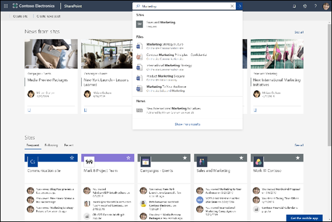

# Microsoft 搜尋概觀

Microsoft Search 幫助您尋找您需要完成您正在進行的工作。 是否要搜尋人員、 檔案、 組織圖，網站，或常見問題的答案，您可以使用 Microsoft Search 整個工作日來取得解答。

Microsoft Search 可協助使用者找到正確的答案、人員和內容，以在他們已在使用的應用程式中完成其工作。

- 使用者會收到他們從中搜尋的應用程式**上下文**中的相關結果。 例如，當他們在[Microsoft Outlook](https://www.microsoft.com/outlook)中搜尋時，他們找出電子郵件，並不是[SharePoint](http://sharepoint.com/)網站。 在 SharePoint 中搜尋時，他們會尋找網站、頁面和檔案時。
- 無論使用者使用哪個應用程式，Microsoft Search 都是**個人**的。 Microsoft 搜尋會使用[Microsoft Graph](https://developer.microsoft.com/graph/)的觀點，以顯示與每個使用者相關的結果。 每個使用者可能會看到不同的結果，即使他們搜尋相同文字亦然。 他們只會看到他們有權存取的結果，Microsoft Search 不會變更權限。
- 使用者不需要記住資訊所在的地方。 例如，使用者在[Microsoft Word](https://products.office.com/word)中工作，並想要重複使用從其[OneDrive](https://onedrive.live.com/about/)同事共用簡報中的資訊。 不需要切換到 OneDrive 並搜尋該簡報，而是可以直接從 Word 搜尋。
- 在 [Bing](https://bing.com) 中時，使用者可以取得來自公用網站與來自其組織內的結果。

## 使用者看到的內容

在[Bing](https://bing.com)，使用者會使用 web 搜尋與相同的 [搜尋] 方塊。 Office 應用程式，使用者會在標頭列中尋找 Microsoft 搜尋方塊中。 它看起來像這樣：

當使用者按一下 [**搜尋**] 方塊中時，搜尋會建議結果根據他們在 Office 365 中的前一個活動，並根據趨勢貴組織中的內容。 他們最近處理的檔案，他們最近使用的命令，以及與他們共同作業的人員，這些是搜尋會考慮的活動範例。 當使用者開始在**搜尋**方塊中輸入，建議的結果就會更新。 使用者可以直接從 [**搜尋**方塊開啟搜尋結果。 以下是在[SharePoint](http://sharepoint.com/)中搜尋的範例。

如果在搜尋方塊中的建議不使用者正在尋找，**輸入**會開啟結果的完整清單。 他們可以使用中繼資料，例如上次修改項目的使用者和時間、項目所在位置，以及預覽它來判斷是否為要尋找的內容。

## Microsoft Search 的優點

**從任何 Microsoft Search 方塊跨 Microsoft 365 搜尋** - 使用者可以從任何 Microsoft Search 方塊搜尋，並快速回到他們執行的動作。 Microsoft Search 聚集所有同等級結果從 Office 365，包括[SharePoint](http://sharepoint.com/)、[商務用 Microsoft OneDrive](https://onedrive.live.com/about/business/)及[Microsoft Exchange Server](https://products.office.com/exchange/microsoft-exchange-server)中的資料來源。

**若要搜尋的容易**– Microsoft Search 建議根據使用者的 Office 365 中的前一個活動、 在 [**搜尋**] 方塊中的權限的結果。

**尋找共用的檔案** - Microsoft 搜尋使用進階查詢理解讓尋找共用檔案更容易。 使用者可以輕鬆地找到他們正在共同作業的檔案。

**顯示相關內容** - 提升您的使用者完成工作所需的資訊和解答，例如政策、福利、資源、工具等。 您也可以針對特定群組，例如新主講、 遠端員工或不同地理位置。

**跨所有應用程式管理** - Microsoft 搜尋預設為**開啟**，並且您所做的任何系統管理會套用至所有應用程式中的 Microsoft 搜尋。

## 為您的組織打造 Microsoft Search

身為系統管理員您可以為您的使用者建立令人 Microsoft 搜尋體驗。 

**顯示實用的內容**– 解答提供快速的代表性結果] 來搜尋關鍵字為基礎的查詢。 [進行內容容易尋找](make-content-easy-to-find.md)。

**新增外部內容**– Microsoft Graph 連接器可讓您將外部內容移入索引。 使用連接器來豐富搜尋經驗的資料與外部 Microsoft 365 的檔案。 [Microsoft Graph 連接器的概觀](connectors-overview.md)

**自訂使用者經驗**– 您可以自訂透過類別和其他組態的使用者經驗。 [自訂 Microsoft 搜尋] 頁面](customize-search-page.md)

## 搜尋什麼內容？

Microsoft Search 顯示的內容，您的組織已儲存在 Microsoft 365 或透過連接器已編製索引。 Microsoft 搜尋不會搜尋整個租用戶或顯示結果由其他組織共用的內容。 如果您的組織使用雲端混合式搜尋來設定混合式 SharePoint 環境，Microsoft Search 會同時傳回線上和內部部署 SharePoint 內容的搜尋結果，包括您已連線至您的 SharePoint Server 環境的任何外部內容。 [深入了解混合式搜尋環境](https://docs.microsoft.com/sharepoint/hybrid/learn-about-cloud-hybrid-search-for-sharepoint)。

使用者會得到相同的搜尋結果他們取得來自其他位置，也會從網際網路取得結果。

## Microsoft Search 如何運作？

當使用者搜尋時，Microsoft Search 會處理查詢，並從較大的片語剖析搜尋意圖，以使用人工智慧 (AI) 學習使用者新增到查詢，但不影響其搜尋意圖的常用多餘片語。 舉例來說，當使用者搜尋「如何變更我的密碼」，我們會截掉查詢中較不重要的字詞，並依據較相關的項目 (例如「變更密碼」) 來進行觸發。  
使用者有**權限**查看的搜尋結果會顯示在搜尋結果頁面上。 Microsoft Search 會依據相關性，使用智慧型排序演算法以排序結果。

## Microsoft Bing 搜尋如何協助保護我的公司資料？

[安全性和 Microsoft 中的搜尋 Bing 的隱私權](security-for-search.md)

## 請參閱

[設定 Microsoft Search](setup-microsoft-search.md)

[讓內容易於尋找](make-content-easy-to-find.md)
