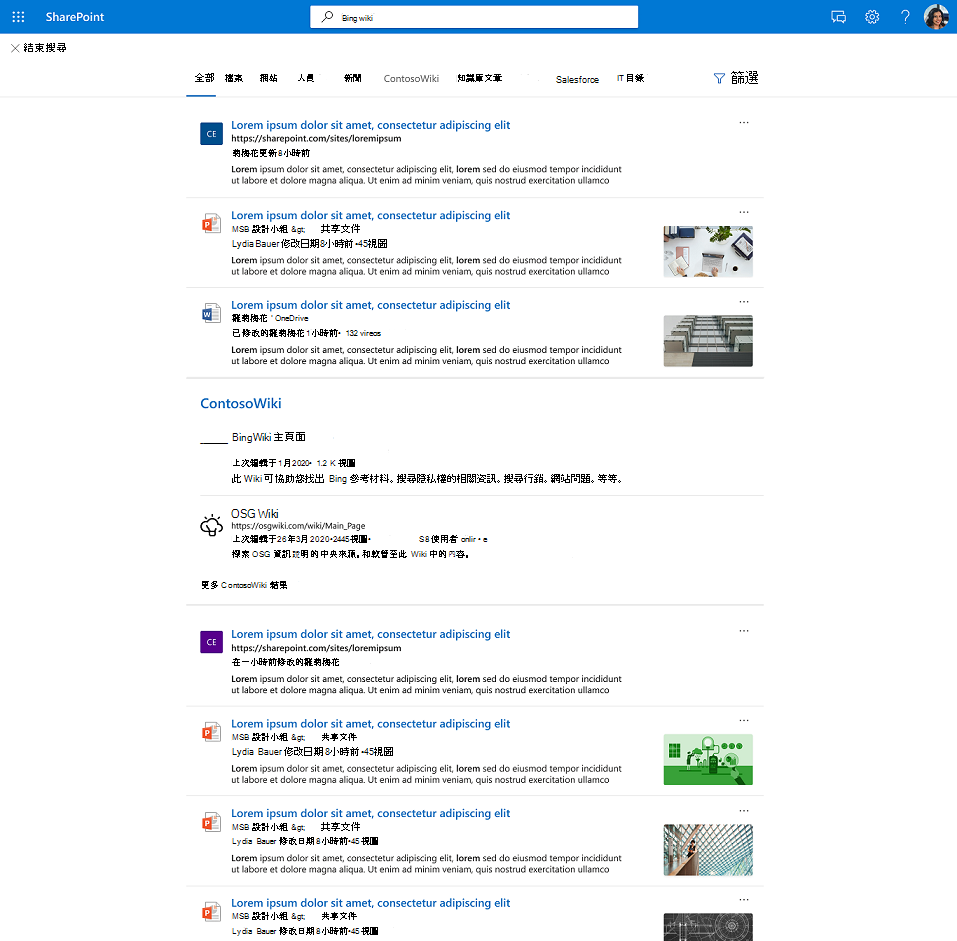

# Graph 連接器結果叢集

## Graph 連接器結果叢集的概覽  

透過 Graph 連接器的結果聚簇，企業可以在其預設視圖、[**全部**] 索引標籤、SharePoint、Office .com 及 Microsoft 搜尋的 Bing 中搜尋協力廠商資料來源的內容。

結果聚簇可協助使用者在一個位置探索所有協力廠商內容。 結果叢集中顯示的結果會根據搜尋類別設定分組在一起。

## 選取及顯示連接器結果的方式

結果叢集中所提供的連接器結果是衍生自個別的搜尋行業及連接器內容。 每個搜尋類別都會提供一組相關的結果，這些結果會變成候選結果叢集。 根據每個專案的「title」屬性和「content」屬性，選取相關的結果。 Content 屬性標示為 *isContent = true* 在架構上。

為了確保從搜尋縱向探索內容，我們建議您為專案提供有意義的標題。 這會影響結果叢集候選項的仲裁，以及您在結果叢集中顯示內容的可能性。 例如，除非您的使用者使用 IDs 尋找內容，否則請避免使用 IDs 做為屬性 "title" 的值。

結果叢集顯示的頻率會因因素而異，例如您設定的搜尋縱向的數目和內容類型。 透過互動或忽略結果叢集，使用者將會以隱含方式提供提示，以調整它隨時間的觸發。

結果叢集中所顯示之連接器專案的搜尋結果體驗使用您所定義的 [結果類型](./customize-search-page.md#create-your-own-result-type) 。 如果未設定任何結果類型，則會使用 [系統產生的版面](./customize-search-page.md#default-search-result-layout) 配置。

建議使用 "title" 屬性做為搜尋結果標題，並使用 "content" 屬性做為搜尋描述。 這可透過準確觸發結果叢集和最相關的結果，為您的使用者提供最佳的體驗。

結果叢集會顯示在頁面中間的 [全部] 垂直位置。 例如，從 ' MediaWiki ' 垂直的結果叢集如下所示。

## 結果聚簇預設設定
  
預設會開啟結果叢集體驗。  

如果您想要停用它，請遵循下列步驟，關閉組織層級的體驗：

1. 在 [Microsoft 365 系統管理中心](https://admin.microsoft.com)中，移至 [[**縱向**](https://admin.microsoft.com/Adminportal/Home#/MicrosoftSearch/verticals)]。
1. 選取 [ **所有** 垂直]，然後啟用 [ **隱藏連接器結果**]。

請遵循下列步驟，關閉 SharePoint 網站層級的體驗：

1. 移至 SharePoint 網站中的 **設定**
2. 移至 **網站資訊** > **查看所有網站設定**。
3. 移至 [Microsoft 搜尋] 區段，然後 **為此網站集合選取 [設定 Microsoft 搜尋**]。
4. 在功能窗格中，移至 [ **自訂經驗**]，然後選取 [ **縱向**]。
5. 選取 [ **所有** 垂直]，然後啟用 [ **隱藏連接器結果**]。
