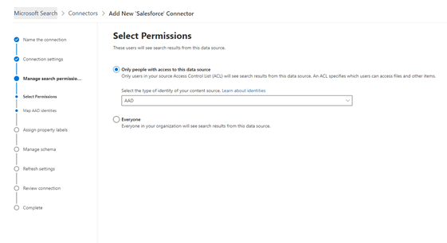

<!---Previous ms.author: rusamai --->

# Salesforce Graph connector (preview) Salesforce Graph connector (preview)

salesforce Graph connector 可讓您的組織為您的 Salesforce 實例中的連絡人、商機、潛在客戶和帳戶物件編制索引。The Salesforce Graph connector, allows your organization to index Contacts, Opportunities, Leads, and Accounts objects in your Salesforce instance. 從 Salesforce 設定連接器和索引內容之後，使用者可以從任何 Microsoft 搜尋用戶端搜尋這些專案。After you configure the connector and index content from Salesforce, end users can search for those items from any Microsoft Search client.

> [!NOTE]
> 請閱讀 [**Graph 連接器**](configure-connector.md)文章的設定，以瞭解一般 Graph 連接器設定指示。Read the [**Setup for your Graph connector**](configure-connector.md) article to understand the general Graph connectors setup instructions.

本文適用于任何設定、執行及監視 Salesforce Graph 連接器的人員。This article is for anyone who configures, runs, and monitors a Salesforce Graph connector. 它會補充一般設定程式，並顯示只適用于 Salesforce Graph 連接器的指示。It supplements the general setup process, and shows instructions that apply only for the Salesforce Graph connector. 本文也包含 [限制](#limitations)的相關資訊。This article also includes information about [Limitations](#limitations).

>[!IMPORTANT]
>Salesforce Graph 連接器目前支援暑假 ' 19 或更新版本。The Salesforce Graph connector currently supports Summer '19 or later.

## 開始之前Before you get started

若要連線到您的 Salesforce 實例，您需要您的 Salesforce 實例 URL、用戶端識別碼，以及 OAuth 驗證的用戶端密碼。To connect to your Salesforce instance, you need your Salesforce instance URL, the Client ID, and Client Secret for OAuth authentication. 下列步驟會說明您或您的 Salesforce 管理員如何從您的 Salesforce 帳戶取得此資訊：The following steps explain how you or your Salesforce administrator can get this information from your Salesforce account:

- 登入您的 Salesforce 實例，然後移至 [設定]Log in to your Salesforce instance and go to Setup

- 流覽至應用程式-> 應用程式管理員。Navigate to Apps -> App Manager.

- 選取 [ **新增已連線的應用程式**]。Select **New connected app**.

- 完成 API 區段，如下所示：Complete the API section as follows:

    - 選取 [**啟用 Oauth 設定**] 核取方塊。Select the checkbox for **Enable Oauth Settings**.

    - 指定回撥 URL 做為： [https://gcs.office.com/v1.0/admin/oauth/callback](https://gcs.office.com/v1.0/admin/oauth/callback)Specify the Callback URL as: [https://gcs.office.com/v1.0/admin/oauth/callback](https://gcs.office.com/v1.0/admin/oauth/callback)

    - 選取這些必要的 OAuth 範圍。Select these required OAuth scopes.

        - 存取及管理您的資料 (api) Access and manage your data (api)

        - 隨時以您的名義執行要求 (refresh_token、offline_access) Perform requests on your behalf at any time (refresh_token, offline_access)

    - 選取 [ **需要 web 伺服器流程的機密**] 核取方塊。Select the checkbox for **Require secret for web server flow**.

    - 儲存應用程式。Save the app.
    
      > [!div class="mx-imgBorder"]
      > 

- 複製使用者金鑰和使用者密碼。Copy the consumer key and the consumer secret. 當您在 Microsoft 365 admin 入口網站中設定 Graph 連接器的連線設定時，會使用此資訊做為用戶端識別碼和用戶端密碼。This information will be used as the Client ID and the Client Secret when you configure the Connection Settings for your Graph Connector in the Microsoft 365 admin portal.

  > [!div class="mx-imgBorder"]
  > Consumer Key is at top of left column and Consumer Secret is at top of right column.](media/salesforce-connector/clientsecret.png)
  
- 在關閉您的 Salesforce 實例之前，請遵循下列步驟，以確保重新整理權杖不會到期：Before closing your Salesforce instance, follow these steps to ensure that refresh tokens don't expire:
    - 移至應用程式-> 應用程式管理員Go to Apps -> App Manager
    - 找到您已建立的應用程式，然後選取右邊的下拉式清單。Find the app you created and select the drop-down on the right. 選取 [ **管理**Select **Manage**
    - 選取 **編輯原則**Select **edit policies**
    - 針對重新整理權杖原則，選取重新整理 **權杖有效直到撤銷**For refresh token policy, select **Refresh token is valid until revoked**

  > [!div class="mx-imgBorder"]
  > 

您現在可以使用[M365 系統管理中心](https://admin.microsoft.com/)完成 Graph 連接器的其餘設定程式。You can now use the [M365 Admin Center](https://admin.microsoft.com/) to complete the rest of the setup process for your Graph connector.

## 步驟1：在 Microsoft 365 系統管理中心新增 Graph 連接器Step 1: Add a Graph connector in the Microsoft 365 admin center

遵循一般 [設定指示](./configure-connector.md)。Follow the general [setup instructions](./configure-connector.md).
<!---If the above phrase does not apply, delete it and insert specific details for your data source that are different from general setup instructions.-->

## 步驟2：命名連線Step 2: Name the connection

遵循一般 [設定指示](./configure-connector.md)。Follow the general [setup instructions](./configure-connector.md).
<!---If the above phrase does not apply, delete it and insert specific details for your data source that are different from general setup instructions.-->

## 步驟3：設定連接設定Step 3: Configure the connection settings

若為實例 URL，請使用 HTTPs：//[網域]. my .com，其中網域是您組織的 Salesforce 網域。For the Instance URL, use https://[domain].my.salesforce.com where domain would be the Salesforce domain for your organization.

輸入您從 Salesforce 實例取得的用戶端識別碼和用戶端密碼，然後選取 [登入]。Enter the Client ID and Client Secret you obtained from your Salesforce instance and select Sign in.

您第一次嘗試使用這些設定登入時，您會看到一個快顯視窗，要求您使用您的系統管理員使用者名稱和密碼登入 Salesforce。The first time you've attempted to sign in with these settings, you'll get a pop-up asking you to log in to Salesforce with your admin username and password. 下列螢幕擷取畫面顯示快顯功能表。The screenshot below shows the popup. 輸入您的認證，然後選取 [登入]。Enter your credentials and select "Log In".

  

  >[!NOTE]
  >如果快顯視窗未出現，則可能是您的瀏覽器遭到封鎖，所以您必須允許快顯視窗和重新導向。If the pop up does not appear, it might be getting blocked in your browser, so you must allow pop-ups and redirects.

搜尋綠色橫幅（如下列螢幕擷取畫面所示）中的 [連線成功]，以檢查連線是否成功。Check that the connection was successful by searching for a green banner that says "Connection successful" as show in the screenshot below.

  > [!div class="mx-imgBorder"]
  > ![成功登入的螢幕擷取畫面。![Screenshot of successful login. [連線成功] 的綠色旗標位於您的 Salesforce 實例 URL 的欄位底下。](media/salesforce-connector/sf5.png)The green banner that says "Connection successful" is located under the field for your Salesforce Instance URL](media/salesforce-connector/sf5.png)

## 步驟4：管理搜尋許可權Step 4: Manage search permissions

您必須選擇哪一使用者會看到來自此資料來源的搜尋結果。You'll need to choose which users will see search results from this data source. 如果您只允許特定 Azure Active Directory (Azure ad) 或非 Azure ad 使用者看到搜尋結果，請確定您對應的是識別碼。If you allow only certain Azure Active Directory (Azure AD) or Non-Azure AD users to see the search results, make sure you map the identities.

### 步驟4：選取許可權Step 4.a: Select permissions

您可以選擇從您的 Salesforce 實例中 (ACLs) 來攝取存取控制清單，或允許組織中的每個人都看到來自此資料來源的搜尋結果。You can choose to ingest Access Control Lists (ACLs) from your Salesforce instance, or allow everyone in your organization to see search results from this data source. ACLs 可以包含 Azure Active Directory (AAD) 身分識別， (從 azure ad 同盟到 Salesforce) 的使用者、非 Azure ad 身分識別 (在 Azure AD) 中具有對應身分識別的原生使用者，或兩者皆有。ACLs can include Azure Active Directory (AAD) identities (users who are federated from Azure AD to Salesforce), non-Azure AD identities (native Salesforce users who have corresponding identities in Azure AD), or both.

>[!NOTE]
>如果您使用的協力廠商身分識別提供者（如 Ping 識別碼或 secureAuth），則應該選取「非 AAD」做為身分識別類型。If you use a third-party Identity Provider like Ping ID or secureAuth, you should select "non-AAD" as the identity type.

> [!div class="mx-imgBorder"]
> ![選取由系統管理員已完成的 [許可權] 畫面。管理員已選取 [只有存取此資料來源的人員] 選項，而且已從識別類型的下拉式功能表中選取「AAD」。](media/salesforce-connector/sf6.png)

如果您選擇從您的 Salesforce 實例或為身分識別類型選取 "非 AAD" 的 ACL，請參閱 [Map 您的非 AZURE AD](map-non-aad.md) 身分識別，以取得對應身分識別的指示。If you chose to ingest an ACL from your Salesforce instance and selected "non-AAD" for the identity type, see [Map your non-Azure AD Identities](map-non-aad.md) for instructions on mapping the identities.

### 步驟4： b：對應 AAD 身分識別Step 4.b: Map AAD identities

如果您選擇從您的 Salesforce 實例中攝取 ACL 並為身分識別類型選取「AAD」，請參閱 [對應 AZURE AD](map-aad.md) 身分識別，以取得對應身分識別的指示。If you chose to ingest an ACL from your Salesforce instance and selected "AAD" for the identity type, see [Map your Azure AD Identities](map-aad.md) for instructions on mapping the identities. 若要瞭解如何設定適用于 Salesforce 的 Azure AD SSO，請參閱本 [教學](/azure/active-directory/saas-apps/salesforce-tutorial)課程。To learn how to set up Azure AD SSO for Salesforce, see this [tutorial](/azure/active-directory/saas-apps/salesforce-tutorial).

### 套用使用者對應，將您的 Salesforce 身分識別同步處理至 Azure AD 身分識別Apply user mapping to sync your Salesforce identities to Azure AD identities

在此影片中，您可以看到對您的 salesforce 實例進行驗證的程式、將非 Azure Active Directory 身分同步處理至您的 Azure Active Directory 身分識別，以及套用適當的安全性 trimmings 至您的 salesforce 專案。In this video you can see the process to authenticate to your Salesforce instance, sync your non-Azure Active Directory identities to your Azure Active Directory identities, and apply the proper security trimmings to your Salesforce items.

> [!VIDEO https://www.youtube-nocookie.com/embed/SZYiFxZMKcM]

## 步驟5：指派屬性標籤Step 5: Assign property labels

您可以從選項的功能表中選擇，將 source 屬性指派給每個標籤。You can assign a source property to each label by choosing from a menu of options. 這個步驟不是必要的，具有一些屬性標籤會提升搜尋相關性，並確保使用者的更好搜尋結果。While this step is not mandatory, having some property labels will improve the search relevance and ensure better search results for end users. 根據預設，有些標籤（如 "Title"、"URL"、"CreatedBy"、"LastModifiedBy"）已被指派來源屬性。By default, some of the Labels like "Title," "URL," "CreatedBy," and  "LastModifiedBy" have already been assigned source properties.

## 步驟6：管理架構Step 6: Manage schema

您可以選取應該編制索引的來源屬性，使其顯示在搜尋結果中。You can select what source properties should be indexed so that they show up in search results. 依預設，連接嚮導會根據一組來源屬性選取搜尋架構。The connection wizard by default selects a search schema based on a set of source properties. 您可以在 [搜尋架構] 頁面中選取每個屬性和屬性的核取方塊，以加以修改。You can modify it by selecting the check boxes for each property and attribute in the search schema page. 搜尋架構屬性包括搜尋、查詢、檢索及精煉。Search schema attributes include Search, Query, Retrieve, and Refine.
精煉功能可讓您定義以後可用作自訂精簡器或篩選搜尋體驗的屬性。Refine allows you to define the properties that can be later used as custom refiners or filters in the search experience.  

> [!div class="mx-imgBorder"]
> The options are Query, Search, Retrieve, and Refine](media/salesforce-connector/sf9.png)

## 步驟7：設定重新整理排程Step 7: Set the refresh schedule

Salesforce 連接器只支援目前完全編目的重新整理排程。The Salesforce connector only supports refresh schedules for full crawls currently.

>[!IMPORTANT]
>完整編目會找到先前同步處理至 Microsoft 搜尋索引的已刪除物件和使用者。A full crawl finds deleted objects and users that were previously synced to the Microsoft Search index.

建議的排程為一周完整編目。The recommended schedule is one week for a full crawl.

## 步驟8：檢查連線Step 8: Review connection

遵循一般 [設定指示](./configure-connector.md)。Follow the general [setup instructions](./configure-connector.md).
<!---If the above phrase does not apply, delete it and insert specific details for your data source that are different from general setup instructions.-->

<!---## Troubleshooting-->
<!---Insert troubleshooting recommendations for this data source-->

## 限制Limitations

- Graph 連接器目前不支援 Apex 基礎、區域型共用及從 Salesforce 使用個人群組共用。The Graph connector doesn't currently support Apex based, territory-based sharing and sharing using personal groups from Salesforce.
- Graph 連接器所使用的 Salesforce API 有已知的缺陷，在此情況下，潛在客戶的私人組織範圍預設值目前不會生效。There's a known bug in the Salesforce API the Graph connector uses, where the private org-wide defaults for leads aren't honored currently.  
- 如果欄位具有欄位層級安全性 (FLS) 設定設定檔，Graph 連接器將不會為該 Salesforce 組織中的任何設定檔攝取該欄位。因此，使用者將無法搜尋這些欄位的值，也不會顯示在結果中。If a field has field level security (FLS) set for a profile, the Graph connector won't ingest that field for any profiles in that Salesforce org. As a result, users won't be able to search on values for those fields, nor will it show up in the results.  
- 在 [管理架構] 畫面中，這些通用的標準屬性名稱會列出一次，這些選項為 **查詢**、 **搜尋**、 **檢索** 及 **精煉**，並套用至 all 或 none。In the Manage Schema screen these common standard property names are listed once, the options are **Query**, **Search**, **Retrieve**, and **Refine**, and apply to all or none.
    - 名稱Name
    - URLUrl
    - 描述Description
    - 傳真Fax
    - PhonePhone
    - MobilePhoneMobilePhone
    - 電子郵件Email
    - 類型Type
    - 職稱Title
    - AccountIdAccountId
    - AccountNameAccountName
    - AccountUrlAccountUrl
    - AccountOwnerAccountOwner
    - AccountOwnerUrlAccountOwnerUrl
    - 擁有者Owner
    - OwnerUrlOwnerUrl
    - CreatedByCreatedBy
    - CreatedByUrlCreatedByUrl
    - LastModifiedByLastModifiedBy
    - LastModifiedByUrlLastModifiedByUrl
    - LastModifiedDateLastModifiedDate
    - ObjectNameObjectName
