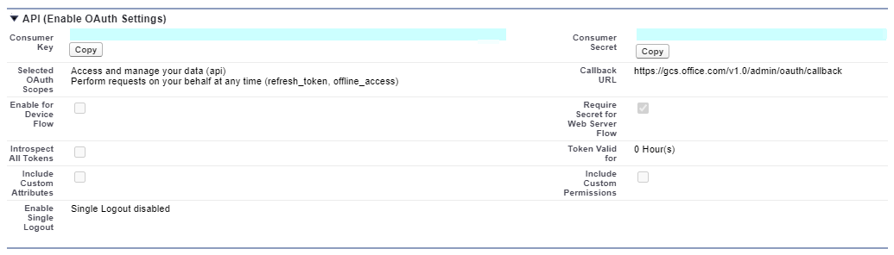
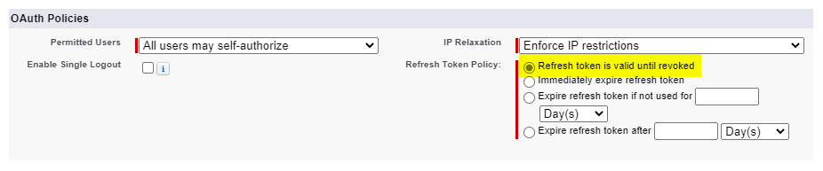
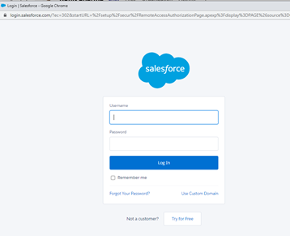

# Salesforce connector (預覽) 

透過 Salesforce 圖形連接器，您的組織可以為您的 Salesforce 實例中的連絡人、商機、潛在客戶和帳戶物件編制索引。 從 Salesforce 設定連接器和索引內容之後，使用者可以從任何 Microsoft 搜尋用戶端搜尋這些專案。

本文適用于 [Microsoft 365](https://www.microsoft.com/microsoft-365) 系統管理員或任何設定、執行及監視 Salesforce 連接器的人員。 它說明如何設定連接器和連接器功能、限制及疑難排解技術。

>[!IMPORTANT]
>Salesforce 圖形連接器目前支援暑假 ' 19 或更新版本。

## 連接設定

若要連線到您的 Salesforce 實例，您需要您的 Salesforce 實例 URL、用戶端識別碼，以及 OAuth 驗證的用戶端密碼。 下列步驟會說明您或您的 Salesforce 管理員如何從您的 Salesforce 帳戶取得此資訊：

- 登入您的 Salesforce 實例，然後移至 [設定]

- 流覽至應用程式-> 應用程式管理員。

- 選取 [ **新增已連線的應用程式**]。

- 完成 API 區段，如下所示：

    - 選取 [ **啟用 Oauth 設定**] 核取方塊。

    - 指定回撥 URL 做為： [https://gcs.office.com/v1.0/admin/oauth/callback](https://gcs.office.com/v1.0/admin/oauth/callback)

    - 選取這些必要的 OAuth 範圍。 

        - 存取及管理您的資料 (api)  

        - 隨時以您的名義執行要求 (refresh_token、offline_access)  

    - 選取 [ **需要 web 伺服器流程的機密**] 核取方塊。

    - 儲存應用程式。
    
      

- 複製使用者金鑰和使用者密碼。 當您在 Microsoft 365 系統管理入口網站中設定圖形連接器的連線設定時，這些值會被當作用戶端識別碼和用戶端密碼使用。

  
- 在關閉您的 Salesforce 實例之前，請先執行下列步驟，以確保重新整理權杖未到期：
    - 移至應用程式-> 應用程式管理員
    - 找到您剛才建立的應用程式，然後選取右邊的下拉式清單。 選取 [ **管理**
    - 選取 **編輯原則**
    - 針對重新整理權杖原則，選取重新整理 **權杖有效直到撤銷**

  

您現在可以使用 [M365 系統管理中心](https://admin.microsoft.com/) 完成圖形連接器的其餘設定程式。  

如下所示，設定圖形連接器的連線設定：

- 若為實例 URL，請使用 HTTPs：//[網域]. my .com，其中網域是您組織的 Salesforce 網域。 
- 輸入您從 Salesforce 實例取得的用戶端識別碼和用戶端密碼，然後選取 [登入]。
- 如果這是您第一次嘗試使用這些設定來登入，您將會看到一個快顯視窗，要求您使用您的系統管理員使用者名稱和密碼登入 Salesforce。 下列螢幕擷取畫面顯示快顯功能表。 輸入您的認證，然後選取 [登入]。

  

  >[!NOTE]
  >如果快顯視窗未出現，則可能是您的瀏覽器遭到封鎖，所以您必須允許快顯視窗和重新導向。

  >[!NOTE]
  >如果您的組織使用單一登入 (SSO) ，您可以在登入介面的右下角選取 [ **使用自訂網域** ]。 輸入網域，然後選取 [ **繼續**]。 它會移至您組織的特定登入頁面，您可以在此頁面上使用 SSO 登入的選項。

- 搜尋綠色橫幅（如下列螢幕擷取畫面所示）中的 [連線成功]，以檢查連線是否成功。

  ![成功登入的螢幕擷取畫面。 [連線成功] 的綠色旗標位於您的 Salesforce 實例 URL 的欄位底下。](media/salesforce-connector/sf5.png)

## 管理搜尋許可權
您將需要選擇哪些使用者將會看到來自此資料來源的搜尋結果。 如果您只允許某些 Azure Active Directory (Azure AD) 或非 Azure AD 使用者看到搜尋結果，您就必須對應身分識別。

### 選取許可權
您可以選擇從您的 Salesforce 實例中 (ACLs) 來攝取存取控制清單，也可以讓組織中的每個人都可以查看此資料來源的搜尋結果。 ACLs 可以包含 Azure Active Directory (AAD) 身分識別， (從 Azure AD 同盟到 Salesforce) 的使用者、非 Azure AD 身分識別 (在 Azure AD) 中具有對應身分識別的原生 Salesforce 使用者，或兩者皆有。

![選取由系統管理員已完成的 [許可權] 畫面。管理員已選取 [只有存取此資料來源的人員] 選項，而且已從識別類型的下拉式功能表中選取「AAD」。](media/salesforce-connector/sf6.png)

### 對應非 AAD 身分識別 
如果您選擇從您的 Salesforce 實例中攝取 ACL 並為身分識別類型選取 "非 AAD"，請參閱 [Map 您的非 AZURE AD](map-non-aad.md) 身分識別，以取得對應身分識別的指示。

### 對應 AAD 身分識別
如果您選擇從您的 Salesforce 實例中攝取 ACL 並為身分識別類型選取「AAD」，請參閱 [對應 AZURE AD](map-aad.md) 身分識別，以取得對應身分識別的指示。 若要瞭解如何設定適用于 Salesforce 的 Azure AD SSO，請參閱本 [教學](https://docs.microsoft.com/en-us/azure/active-directory/saas-apps/salesforce-tutorial)課程。

## 指派屬性標籤 
您可以從選項的功能表中選擇，將 source 屬性指派給每個標籤。 雖然這個步驟不是必要的，但具有一些屬性標籤會提升搜尋相關性，並可確保使用者更準確的搜尋結果。 根據預設，有些標籤（如 "Title"、"URL"、"CreatedBy"、"LastModifiedBy"）已被指派來源屬性。

![[指派屬性標籤] 畫面顯示預設來源屬性。](media/salesforce-connector/sf8.png)

## 管理架構
您可以選取應該編制索引的來源屬性，使其可顯示在搜尋結果中。 依預設，連接嚮導會根據一組來源屬性選取搜尋架構。 您可以在 [搜尋架構] 頁面中選取每個屬性和屬性的核取方塊，以加以修改。 搜尋架構屬性包括搜尋、查詢、檢索及精煉。 精煉功能可讓您定義以後可用作自訂精簡器或篩選搜尋體驗的屬性。  

## 設定重新整理排程

Salesforce 連接器只支援目前完全編目的重新整理排程。

>[!IMPORTANT]
>完整編目會找到先前同步處理至 Microsoft 搜尋索引的已刪除物件和使用者。

建議的排程為一周完整編目。

## 限制

- 圖形連接器目前不支援 Apex 基礎、區域型共用和使用個人群組從 Salesforce 共用。
- 在 Salesforce API 中有一個已知的錯誤，圖形連接器會使用，而潛在客戶的私人組織寬預設值並不是有效的。  
- 如果欄位具有欄位層級安全性 (FLS) 設定設定檔，圖形連接器將不會為該 Salesforce 組織中的任何設定檔攝取該欄位。因此，使用者將無法搜尋這些欄位的值，也不會顯示在結果中。  
- 在 [管理架構] 畫面中，這些通用的標準屬性名稱會列出一次，而且已完成的選取範圍是以可查詢、可搜尋及可檢索的方式套用全部或無。
    - 姓名
    - URL 
    - 描述
    - 傳真
    - Phone
    - MobilePhone
    - 電子郵件
    - 類型
    - 職稱
    - AccountId
    - AccountName
    - AccountUrl
    - AccountOwner
    - AccountOwnerUrl
    - 擁有者
    - OwnerUrl
    - CreatedBy 
    - CreatedByUrl 
    - LastModifiedBy 
    - LastModifiedByUrl 
    - LastModifiedDate
    - ObjectName 
