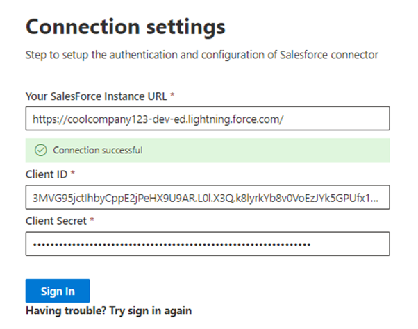

# Salesforce 連接器Salesforce connector

透過 Salesforce 圖形連接器，您的組織可以為您的 Salesforce 實例中的連絡人、商機、潛在客戶和帳戶物件編制索引。With the Salesforce Graph connector, your organization can index Contacts, Opportunities, Leads and Accounts objects in your Salesforce instance. 從 Salesforce 設定連接器和索引內容之後，使用者可以從任何 Microsoft Search 用戶端搜尋這些專案。After you configure the connector and index content from Salesforce, end users can search for those items from any Microsoft Search client

本文適用于 [Microsoft 365](https://www.microsoft.com/microsoft-365) 系統管理員或任何設定、執行及監視 Salesforce 連接器的人員。This article is for [Microsoft 365](https://www.microsoft.com/microsoft-365) administrators or anyone who configures, runs, and monitors a Salesforce connector. 它說明如何設定連接器和連接器功能、限制及疑難排解技術。It explains how to configure your connector and connector capabilities, limitations, and troubleshooting techniques.

>[!IMPORTANT]
>Salesforce 圖形連接器目前支援暑假 ' 20，春季 ' 20，冬季20，和暑假 ' 19 版本。The Salesforce Graph connector currently supports Summer ’20, Spring’20, Winter’20, and Summer ’19 versions.

## 連接設定Connection settings

若要連線到您的 Salesforce 實例，您需要您的 Salesforce 實例 URL、用戶端識別碼，以及 OAuth 驗證的用戶端密碼。To connect to your Salesforce instance, you need your Salesforce instance URL, the Client ID, and Client Secret for OAuth authentication. 下列步驟會說明您或您的 Salesforce 管理員如何從您的 Salesforce 帳戶取得此資訊：The following steps explain how you or your Salesforce administrator can get this information from your Salesforce account:

- 登入您的 Salesforce 實例，然後移至 [設定]Log in to your Salesforce instance and go to Setup

- 流覽至應用程式-> 應用程式管理員。Navigate to Apps -> App Manager.

- 選取 [ **新增已連線的應用程式** ]。Select **New connected app**.

- 完成 API 區段，如下所示：Complete the API section as follows:

    - 選取 [ **啟用 Oauth 設定** ] 核取方塊。Select the checkbox for **Enable Oauth Settings**.

    - 指定回撥 URL 做為： [https://gcs.office.com/v1.0/admin/oauth/callback](https://gcs.office.com/v1.0/admin/oauth/callback)Specify the Callback URL as: [https://gcs.office.com/v1.0/admin/oauth/callback](https://gcs.office.com/v1.0/admin/oauth/callback)

    - 選取這些必要的 OAuth 範圍。Select these required OAuth scopes. 

        - 存取及管理您的資料 (api) Access and manage your data (api) 

        - 隨時以您的名義執行要求 (refresh_token、offline_access) Perform requests on your behalf at any time (refresh_token, offline_access) 

    - 選取 [ **需要 web 伺服器流程的機密** ] 核取方塊。Select the checkbox for **Require secret for web server flow**.

    - 儲存應用程式。Save the app.
    
      

- 複製使用者金鑰和使用者密碼。Copy the consumer key and the consumer secret. 當您在 Microsoft 365 系統管理入口網站中設定圖形連接器的連線設定時，這些值會被當作用戶端識別碼和用戶端密碼使用。These will be used as the Client ID and the Client Secret when you configure the Connection Settings for your Graph Connector in the Microsoft 365 admin portal.

  
- 在關閉您的 Salesforce 實例之前，請先執行下列步驟，以確保重新整理權杖未到期：Before closing your Salesforce instance, perform the following steps to ensure that refresh tokens do not expire: 
    - 移至應用程式-> 應用程式管理員Go to Apps -> App Manager
    - 找到您剛才建立的應用程式，然後選取右邊的下拉式清單。Find the app you just created and select the drop down on the right. 選取 [ **管理**Select **Manage**
    - 選取 **編輯原則**Select **edit policies**
    - 針對重新整理權杖原則，選取重新整理 **權杖有效直到撤銷**For refresh token policy, select **Refresh token is valid until revoked**

  

您現在可以使用 [M365 系統管理中心](https://admin.microsoft.com/) 完成圖形連接器的其餘設定程式。You can now use the [M365 Admin Center](https://admin.microsoft.com/) to complete the rest of the setup process for your Graph connector.  

如下所示，設定圖形連接器的連線設定：Configure the Connection settings for your Graph connector as follows:

- 若為實例 URL，請使用 HTTPs：//[網域]. my .com，其中網域是您組織的 Salesforce 網域。For the Instance URL, use https://[domain].my.salesforce.com where domain would be the Salesforce domain for your organization. 
- 輸入您從 Salesforce 實例取得的用戶端識別碼和用戶端密碼，然後選取 [登入]。Enter the Client ID and Client Secret you obtained from your Salesforce instance and select Sign in.
- 如果這是您第一次嘗試使用這些設定來登入，您將會看到一個快顯視窗，要求您使用您的系統管理員使用者名稱和密碼登入 Salesforce。If this is the first time you have attempted to Sign in with these settings, you will get a pop up asking you to login to Salesforce with your admin username and password. 下列螢幕擷取畫面顯示快顯功能表。The screenshot below shows the popup. 輸入您的認證，然後選取 [登入]。Enter your credentials and select Log in.

  

  >[!NOTE]
  >如果快顯視窗未出現，則可能是您的瀏覽器遭到封鎖，所以您必須允許快顯視窗和重新導向。If the pop up does not appear, it might be getting blocked in your browser, so you must allow pop-ups and redirects.

  >[!NOTE]
  >如果您的組織使用單一登入 (SSO) ，您可以在登入介面的右下角選取 [ **使用自訂網域** ]。If your organization uses single sign-on (SSO), you can select **Use Custom Domain** in the bottom, right-hand corner of the login interface. 輸入網域，然後選取 [ **繼續** ]。Enter the domain and then select **Continue**. 它會移至您組織的特定登入頁面，您可以在此頁面上使用 SSO 登入的選項。It will go to your organization specific login page where you will have an option to login with SSO.

- 搜尋綠色橫幅（如下列螢幕擷取畫面所示）中的 [連線成功]，以檢查連線是否成功。Check that the connection was successful by searching for a green banner that says "Connection successful" as show in the screenshot below.

  

## 管理搜尋許可權Manage search permissions
您將需要選擇哪些使用者將會看到來自此資料來源的搜尋結果。You will need to choose which users will see search results from this data source. 如果您只允許某些 Azure Active Directory (AAD) 或非 AAD 使用者看到搜尋結果，您就必須對應身分識別。If you allow only certain Azure Active Directory (AAD) or Non-AAD users to see the search results, you will then need to map the identities.

### 選取許可權Select Permissions
您可以選擇從您的 Salesforce 實例中 (ACLs) 來攝取存取控制清單，也可以讓組織中的每個人都可以查看此資料來源的搜尋結果。You can choose to ingest Access Control Lists (ACLs) from your Salesforce instance, or you can allow everyone in your organization to see search results from this data source. ACLs 可以包含 Azure Active Directory (AAD) 身分識別和/或非 AAD 身分識別。ACLs can include Azure Active Directory (AAD) identities, Non-AAD identities, or both.

![選取由系統管理員已完成的 [許可權] 畫面。管理員已選取 [只有存取此資料來源的人員] 選項，而且已從識別類型的下拉式功能表中選取「AAD」。](media/salesforce-connector/sf6.png)

### 對應非 AAD 身分識別Map non-AAD identities 
如果您選擇從您的 Salesforce 實例中攝取 ACL 並為身分識別類型選取 "非 AAD"，請參閱 [Map 您的非 AZURE AD ](map-non-aad.md) 身分識別，以取得對應身分識別的指示。If you chose to ingest an ACL from your Salesforce instance and selected "non-AAD" for the identity type see [Map your non-Azure AD Identities ](map-non-aad.md) for instructions on mapping the identities.

### 對應 AAD 身分識別Map AAD identities
如果您選擇從您的 Salesforce 實例中攝取 ACL 並為身分識別類型選取「AAD」，請參閱 [對應 AZURE AD](map-aad.md) 身分識別，以取得對應身分識別的指示。If you chose to ingest an ACL from your Salesforce instance and selected "AAD" for the identity type see [Map your Azure AD Identities](map-aad.md) for instructions on mapping the identities.

## 指派屬性標籤Assign property labels 
您可以從選項的功能表中選擇，將 source 屬性指派給每個標籤。You can assign a source property to each label by choosing from a menu of options. 雖然這個步驟不是必要的，但具有一些屬性標籤會提升搜尋相關性，並可確保使用者更準確的搜尋結果。While this step is not mandatory, having some property labels will improve the search relevance and ensure more accurate search results for end users. 根據預設，有些標籤（如 "Title"、"url" 和 "LastModifiedBy"）已被指派來源屬性。By default, some of the Labels like ”Title”, “url”, and  “LastModifiedBy” have already been assigned source properties.

![[指派屬性標籤] 畫面顯示預設來源屬性。](media/salesforce-connector/sf8.png)

## 管理架構Manage Schema
您可以選取應該編制索引的來源屬性，使其可顯示在搜尋結果中。You can select what source properties should be indexed so that they can show up in search results. 依預設，連接嚮導會根據一組來源屬性選取搜尋架構。The connection wizard by default selects a search schema based on a set of source properties. 您可以在 [搜尋架構] 頁面中選取每個屬性和屬性的核取方塊，以加以修改。You can modify it by selecting the check boxes for each property and attribute in the search schema page. 搜尋架構屬性包括搜尋、查詢、檢索及精煉。Search schema attributes include Search, Query, Retrieve and Refine. 精煉功能可讓您定義以後可用作自訂精簡器或篩選搜尋體驗的屬性。Refine allows you to define the properties which can be later used as custom refiners or filters in the search experience.  

## 設定重新整理排程Set the refresh schedule

Salesforce 連接器只支援目前完全編目的重新整理排程。The Salesforce connector only supports refresh schedules for full crawls currently.

>[!IMPORTANT]
>完整編目會找到先前同步處理至 Microsoft 搜尋索引的已刪除物件和使用者。A full crawl finds deleted objects and users that were previously synced to the Microsoft Search index.

建議的排程為一周完整編目。The recommended schedule is one week for a full crawl.

## 限制Limitations

- 圖形連接器目前不支援 Apex 基礎、區域型共用和使用個人群組從 Salesforce 共用。The Graph connector does not currently support Apex based , territory-based sharing and sharing using personal groups from Salesforce.
- 在 Salesforce API 中有一個已知的錯誤，圖形連接器會使用，而潛在客戶的私人組織寬預設值並不是有效的。There is a known bug in the Salesforce API that the Graph connector uses where the private org wide defaults for leads is not honored currently.  
- 如果欄位具有欄位層級安全性 (FLS) 設定設定檔，圖形連接器將不會為該 Salesforce 組織中的任何設定檔攝取該欄位。因此，使用者將無法搜尋這些欄位的值，也不會顯示在結果中。If a field has field level security (FLS) set for a profile, the Graph connector will not ingest that field for any profiles in that Salesforce org. Users will thus not be able to search on values for those fields, nor will it  show up in the results.  
- 在完整同步處理連接器時，將會進行任何設定的 FLS。Any FLS set up will be honored during the Full syncs of the connector.
- 在 [管理架構] 畫面中，這些通用的標準屬性名稱會列出一次，而且已完成的選取範圍是以可查詢、可搜尋及可檢索的方式套用全部或無。In the Manage Schema screen these common standard property names are listed once and the selection done to make them queryable, searchable and retrievable apply to all or none.
    - NameName
    - URLUrl 
    - 描述Description
    - 傳真Fax
    - PhonePhone
    - MobilePhoneMobilePhone
    - 電子郵件Email
    - 類型Type
    - 職稱Title
    - AccountIdAccountId
    - AccountNameAccountName
    - AccountUrlAccountUrl
    - AccountOwnerAccountOwner
    - AccountOwnerUrlAccountOwnerUrl
    - 擁有者Owner
    - OwnerUrlOwnerUrl
    - CreatedByCreatedBy 
    - CreatedByUrlCreatedByUrl 
    - LastModifiedByLastModifiedBy 
    - LastModifiedByUrlLastModifiedByUrl 
    - LastModifiedDateLastModifiedDate
    - ObjectNameObjectName 
