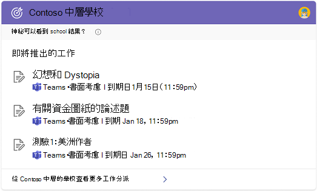

# 選取學校或工作搜尋體驗 (預覽) 

如果您的組織有教育和企業服務方案，您可以為使用者（學校或公司）的 Bing 體驗選擇 Microsoft 搜尋。 因為此設定會套用至所有使用者，所以建議您選取與組織中大部分人員相符的選項。

1. 在[Microsoft 365 系統管理中心](https://admin.microsoft.com)中，移至 [設定[]。](https://admin.microsoft.com/Adminportal/Home#/MicrosoftSearch/configurations)
1. 在 [Microsoft 搜尋 Bing 的工作或學校] 底下，選取 [**變更設定**]。
1. 在面板中，選取搜尋體驗（「學校搜尋」或「工作搜尋」）。 可能需要長達72小時，此變更才會顯示在 Bing 中。

## 學校與工作搜尋之間的差異

在大多數情況下，對 Bing 中 Microsoft 搜尋的學校和工作搜尋體驗是類似的。 使用者可以找到人員、檔案、網站、解答等等。 但有一些重要差異：

### 學校搜尋

學校搜尋經驗包括兩個唯一的答案、類別和工作分派。 在 [類別] 答案中，學生和教師可以查看其類別的完整清單，並使用連結將其類別加入 Microsoft Teams。 在 [工作分派答案] 中，他們可以查看依到期日排序的即將進行的工作分派清單。

學校使用者可以在[Bing](https://Bing.com)上的搜尋方塊中輸入下列查詢，以取得類別和工作分派的答案：

- 我的類別
- 類別
- 我的工作分派
- 我的作業

此外，對於學校搜尋使用者，安全搜尋會設定為嚴格的預設值。 如需有關安全安全的詳細資訊，請參閱 [使用安全性群組封鎖成人內容](https://support.microsoft.com/topic/946059ed-992b-46a0-944a-28e8fb8f1814)。

### 工作搜尋

工作搜尋經驗包括組織圖表和 Power BI 的答案。 在學校搜尋體驗中無法使用這些功能。

如需 Power BI 解答的詳細資訊，請參閱[Manage Power BI 解答](manage-powerbi.md)。
