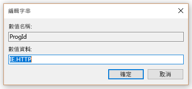
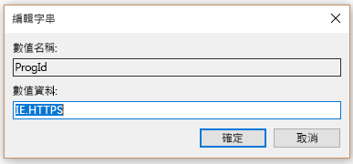

# 設定預設瀏覽器Set default browser

設定預設的瀏覽器、 預設搜尋引擎，以及預設首頁可協助您探索 Microsoft 搜尋功能、 鼓勵更多的使用狀況，並提供更順暢的使用者。Configuring the default browser, default search engine, and default homepage will help your users discover Microsoft Search capabilities, encourage more usage, and provide a smoother experience.
  
若要設定您的組織的預設瀏覽器，請遵循下列步驟。To set the default browser for your organization, follow the steps below.
  
## Windows 8 及以上Windows 8 and above

若要為預設瀏覽器設定 Internet Explorer 或 Microsoft Edge，遵循下列步驟：To set Internet Explorer or Microsoft Edge as the default browser, follow these steps:
  
### 建立關聯的預設檔案Create default associations file

1. 開啟 [系統管理的 PowerShell 主控台]。Open an administrative PowerShell console.
    
2.  `New-Item -Path "\\$env:USERDOMAIN\SYSVOL\$env:USERDNSDOMAIN" -Type Directory -Name "Settings"`
    
3.  `$SettingsPath="\\$env:USERDOMAIN\SYSVOL\$env:USERDNSDOMAIN\Settings"`
    
4.  `Start-Process Dism.exe -PassThru "/Online /Export-DefaultAppAssociations:$SettingsPath\AppAssoc.xml"`
    
這些步驟嘗試與網域控制站的 SYSVOL 資料夾中建立的預設關聯檔案。These steps try and create the default associations file in the SYSVOL folder of the domain controller.
  
### 新增或編輯預設關聯檔案Add or edit the default associations file

1. `Notepad "$SettingsPath\AppAssoc.xml"`
    
2. 編輯下列項目 （.htm、.html、 http、 https） 並不是需要時移除其他項目。Edit the following entries (.htm, .html, http, https), and remove other entries if they're not needed.
    
  - **Microsoft Edge****Microsoft Edge**
    
     `<Association Identifier=".htm" ProgId="AppX4hxtad77fbk3jkkeerkrm0ze94wjf3s9" ApplicationName="Microsoft Edge" />`
  
     `<Association Identifier=".html" ProgId="AppX4hxtad77fbk3jkkeerkrm0ze94wjf3s9" ApplicationName="Microsoft Edge" />`
  
     `<Association Identifier="http" ProgId="AppXq0fevzme2pys62n3e0fbqa7peapykr8v" ApplicationName="Microsoft Edge" />`
    
  - **Internet Explorer****Internet Explorer**
    
     `<Association Identifier=".htm" ProgId="htmlfile" ApplicationName="Internet Explorer" />`
  
     `<Association Identifier=".html" ProgId="htmlfile" ApplicationName="Internet Explorer" />`
  
     `<Association Identifier="http" ProgId="IE.HTTP" ApplicationName="Internet Explorer" />`
  
     `<Association Identifier="https" ProgId="IE.HTTPS" ApplicationName="Internet Explorer" />`
    
3. 若要編輯的任何現有原則或建立一個新參數和開啟群組原則管理主控台 （gpmc.msc 取得）。Open Group Policy Management Console (gpmc.msc) and switch to editing any existing policy or creating a new one.
    
1. 瀏覽至 [**電腦設定系統 Components\File 瀏覽器**Navigate to **Computer Configuration\Administrative Templates\Windows Components\File Explorer**
    
2. 連按兩下 [**設定預設的關聯設定檔**、 將它設為 [**已啟用**] 並輸入 AppAssoc.xml 的路徑 (例如 %USERDOMAIN%\SYSVOL\%USERDNSDOMAIN%\Settings\AppAssoc.xml)Double-click **Set a default associations configuration file**, set it to **Enabled**, and enter the path to AppAssoc.xml (for example %USERDOMAIN%\SYSVOL\%USERDNSDOMAIN%\Settings\AppAssoc.xml)
    
4. 強制產生 GPO 連結至適當的網域。Enforce the resultant GPO by linking it to the appropriate domain.
    
使用者無法變更瀏覽器之後此原則設定。Users will be able to change the browser after this policy is set.
  
## Windows 7Windows 7

1. 設定本機電腦將用來將 GPO 設定。Configure the local machine that will be used to set the GPO.
    
1. 開啟**控制項 Panel\Programs\Default Programs\Set 預設程式**並將 Internet Explorer 設定為預設值。Open **Control Panel\Programs\Default Programs\Set Default Programs** and set Internet Explorer as the default. 
    
2. 若要編輯的任何現有原則或建立一個新參數和開啟群組原則管理主控台 （gpmc.msc 取得）。Open Group Policy Management Console (gpmc.msc) and switch to editing any existing policy or creating a new one.
    
1. 瀏覽至 [**\<電腦/使用者\>Configuration\Policies\Preferences\Windows 設定**。Navigate to **\<Computer/User\> Configuration\Policies\Preferences\Windows Settings**.
    
2. 以滑鼠右鍵按一下**Registry\New**並選取 [**登錄精靈**]。Right-click on **Registry\New** and select **Registry Wizard**.
    
3. 從登錄瀏覽器視窗中，選取 [**本機電腦**，並按一下 [**下一步**。From the Registry Browser window, select **Local Computer** and click **Next**.
    
4. 瀏覽至 [ **HKEY_CURRENT_USER\Software\Microsoft\Windows\Shell\Associations\UrlAssociations\https**並選取 ProgId 的值。請確定值起來下方：Navigate to **HKEY_CURRENT_USER\Software\Microsoft\Windows\Shell\Associations\UrlAssociations\https** and select the ProgId value. Make sure the value looks like the one below: 
    
    
  
5. 瀏覽至 [ **HKEY_CURRENT_USER\Software\Microsoft\Windows\Shell\Associations\UrlAssociations\https**並選取 ProgId 的值。請確定值如下所示的其中一個下：Navigate to **HKEY_CURRENT_USER\Software\Microsoft\Windows\Shell\Associations\UrlAssociations\https** and select the ProgId value. Make sure that the value looks like the one below: 
    
    
  
3. 強制產生 GPO 連結至適當的網域。Enforce the resultant GPO by linking it to the appropriate domain.
    
使用者無法變更瀏覽器之後此原則設定。Users will be able to change the browser after this policy is set.