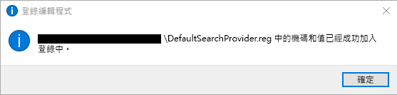
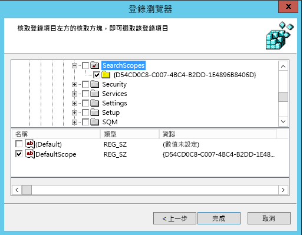
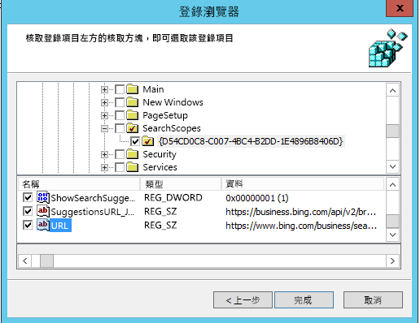

# 讓 Bing 成為預設搜尋引擎
  
本文將說明如何讓 Bing 成為 Microsoft Edge、Google Chrome 和 Internet Explorer 的預設搜尋引擎。 
  
## Windows 10 版本 1703 或更新版本上的 Microsoft Edge

雖然您可以將 Bing 設定為預設的搜尋引擎，Microsoft Edge 可讓使用者變更其設定，以使用不同的搜尋引擎。
  
如需適用於其他版本 Windows 的最新 ADMX 檔案，請參閱[如何在 Windows 中建立和管理群組原則系統管理範本的集中存放區](https://support.microsoft.com/help/3087759/how-to-create-and-manage-the-central-store-for-group-policy-administra)。
  
如果在 GPMC 中找不到本節中描述的設定，請下載適當的 ADMX 並將它們複製到集中存放區。 如需詳細資訊，請參閱使用 [ADMX 檔案編輯網域型 GPO](https://docs.microsoft.com/previous-versions/windows/it-pro/windows-vista/cc748955%28v%3dws.10%29)。 控制器上的集中存放區是使用下列命名慣例的資料夾：
  
 **%systemroot%\sysvol\\<domain\>\policies\PolicyDefinitions**
  
控制站處理的每個網域都應該有個別的資料夾。 可以透過命令提示字元使用下列命令來複製 ADMX 檔案：
  
 `Copy <path_to_ADMX.ADMX> %systemroot%\sysvol\<domain>\policies\PolicyDefinitions`
  
1. 開啟 [群組原則管理主控台] (gpmc.msc)，然後切換以編輯現有原則或建立新原則。
    
2. 瀏覽至 **[電腦/使用者設定]&lt;&gt;\[系統管理範本]\[Windows 元件]\[Microsoft Edge]**。
    
1. 按兩下 [設定預設搜索引擎]****，將它設為 [已啟用]****，然後輸入 `https://www.bing.com/sa/osd/bfb.xml`
    
3. 將結果 GPO 連結到適當網域以強制執行結果 GPO。

## Windows XP SP2 或更新版本上的 Google Chrome

設定此原則之後，使用者將無法變更預設的搜尋引擎。
  
Chrome 隨附自己的一組群組原則設定，您可以從 [Google Chrome Enterprise 說明](https://support.google.com/chrome/a/answer/187202)以 ADMX 檔案的格式下載。 如果使用 Windows Vista/Server 2008 或更新版本的作業系統來管理網域的 GPO，則此套件中提供的 ADMX 檔案將會管理 Windows XP SP2 或更新版本上的 Chrome 設定。
  
針對網域控制站上的 ADMX 檔案，將範本檔案複製到集中存放區。 如需詳細資訊，請參閱使用 [ADMX 檔案編輯網域型 GPO](https://docs.microsoft.com/previous-versions/windows/it-pro/windows-vista/cc748955%28v%3dws.10%29)。 控制器上的集中存放區是使用下列命名慣例的資料夾：
  
 **%systemroot%\sysvol\\<domain\>\policies\PolicyDefinitions**
  
控制站處理的每個網域都應該有個別的資料夾。 可以透過命令提示字元使用下列命令來複製 ADMX 檔案：
  
 `Copy <path_to_Chrome.ADMX> %systemroot%\sysvol\<domain>\policies\PolicyDefinitions`
  
1. 開啟 [群組原則管理主控台] (gpmc.msc)，然後切換以編輯任何現有原則或建立新原則。
    
2. 確定在 [使用者設定]/[電腦設定] 中的 [系統管理範本] 區段中都有下列資料夾：Google Chrome 和 Google Chrome - 預設設定。
    
  - 第一個區段的設定是固定的，而且本機系統管理員無法在瀏覽器中變更它們。
    
  - 使用者可以在瀏覽器設定中變更原則後面區段的設定。
    
3. 瀏覽至 [\<電腦/使用者\>設定]\[系統管理範本]\[Google Chrome]\[預設搜尋引擎]****。
    
4. 按兩下 [啟用預設搜尋引擎]****，然後設為 [已啟用]****。
    
5. 按兩下 [預設搜尋提供者圖示]****，將它設為 [已啟用]****，然後輸入 `https://www.bing.com/sa/simg/bb.ico`
    
6. 按兩下 [預設搜尋提供者立即 URL]****，然後輸入 `https://www.bing.com/business/search?q={searchTerms}&amp;form=BFBSPR`
    
7. 按兩下 [預設搜尋引擎名稱]****，將它設為 [已啟用]，然後輸入「Bing 中的 Microsoft Search」
    
8. 按兩下 [預設搜尋提供者搜尋 URL]****，將它設為 [已啟用]****，然後輸入 `https://www.bing.com/business/search?q={searchTerms}&amp;form=BFBSPR`
    
9. 按兩下 [預設搜尋提供者建議 URL]****，將它設為 [已啟用]****，然後輸入 `https://business.bing.com/api/v2/browser/suggest?q={searchTerms}&amp;form=BFBSPA`
    
10. 將結果 GPO 連結到適當網域以強制執行結果 GPO。
    
設定預設搜尋引擎會在瀏覽器網址列中加入 Microsoft Search 搜尋建議功能。 此功能目前只支援書籤。 當使用者在網址列中輸入時，將會在公用網路建議的上方看到最熱門的兩個書籤建議。

## Internet Explorer 11 或更新版本

設定此原則之後，使用者將能夠變更搜尋提供者。
  
### 步驟 1： 設定將用來設定 GPO 的本機電腦

將下列文字貼上到 reg (\*.reg) 檔案中。
  
Windows 登錄編輯程式 5.00 版
  
<pre>[HKEY_CURRENT_USER\Software\Microsoft\Internet Explorer\SearchScopes]
"DefaultScope"="{D54CD0C8-C007-4BC4-B2DD-1E4896B8406D}"
[HKEY_CURRENT_USER\Software\Microsoft\Internet Explorer\SearchScopes\{D54CD0C8-C007-4BC4-B2DD-1E4896B8406D}]
"Codepage"=dword:0000fde9
"DisplayName"="Microsoft Search in Bing"
"OSDFileURL"="https://www.bing.com/sa/osd/bfb.xml"
"FaviconURL"="https://www.bing.com/sa/simg/bb.ico"
"SuggestionsURL_JSON"="https://business.ing.com/api/v2/browser/suggest?q={searchTerms}&amp;form=BFBSPA"
"ShowSearchSuggestions"=dword:00000001
"URL"="https://www.bing.com/business/search?q={searchTerms}&amp;form=BFBSPR"</pre>
  
按兩下所建立的檔案，然後按照步驟操作以匯入檔案。 成功匯入後應該會出現下列對話方塊：
  

  
### 步驟 2： 開啟 [群組原則管理主控台] (gpmc.msc)，然後切換以編輯現有原則或建立新原則

1. 瀏覽至 [使用者設定]\[原則]\[喜好設定]\[Windows 設定]****。
    
2. 以滑鼠右鍵按一下 [登錄]\[新增]****，然後選取 [登錄精靈]****。 從 [登錄瀏覽器] 視窗中，選取 [本機電腦]****，然後按 [下一步]****。
    
3. 瀏覽至 **HKEY_CURRENT_USER\SOFTWARE\Microsoft\Internet Explorer\SearchScopes**。
    
4. 請務必從此機碼選取 DefaultScope。
    
    
  
5. 選取包含 Bing 中 Microsoft Search 的 GUID 的所有子機碼，以及該機碼下的所有值，但不要選取任何使用者設定檔的路徑。 向下捲動以選取其他項目。
    
    
  
6. 按一下 [完成] 以完成此組態。
    
### 步驟 3： 設定使用者喜好設定以協助減少強制執行 DefaultScope 時使用者會收到的警告

此警告是預設的設計，目的是要警示使用者有某個程式正在嘗試修改他們的設定。
  
1. 在同一個 GPO 內，以滑鼠右鍵按一下 [登錄]\[新增]**** 然後選取 [登錄精靈]****。
    
2. 瀏覽至 **HKEY_CURRENT_USER\SOFTWARE\Microsoft\Internet Explorer\User Preferences**。
    
3. 選取 **User Preferences** 機碼。
    
4. 按一下 [完成]****。
    
5. 按一下新建立的物件。 在右側窗格中，於 User Preferences (使用者喜好設定) 物件上按兩下，將 [動作]**** 變更成 [刪除]****，然後儲存。
1. 將結果 GPO 連結到適當網域以強制執行結果 GPO。