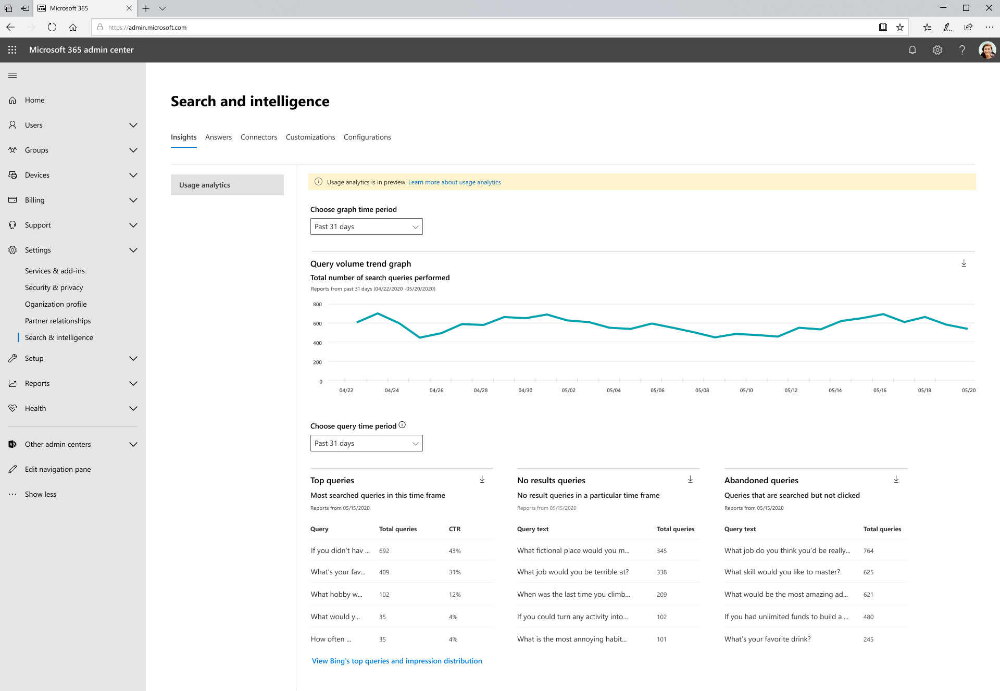

# Microsoft 搜尋使用方式報告

搜尋使用方式報告可讓您深入瞭解搜尋在組織中的運作方式。 從這些報告產生的資訊可協助您 [進行內容的尋找](https://docs.microsoft.com/microsoftsearch/make-content-easy-to-find) ，並採取動作，讓您的使用者能夠更有説明和 delightful 的體驗。

> [!IMPORTANT]
> Microsoft 搜尋使用方式報告目前在預覽中。

[Microsoft 搜尋使用方式報告](https://admin.microsoft.com/Adminportal/Home?#/MicrosoftSearch/insights)包含從搜尋產生的圖形和表格，從 SharePoint Home 和 Office.com 搜尋方塊中執行。 您可以看到過去31天、每天或每月過去一年的資料。 這些報告只會產生，所以需要一些時間才能累算歷史資料。

先前版本的此頁面包含在 Bing.com 中針對 Bing 針對 Microsoft 搜尋執行的搜尋資料。 該資料會立即整合到這些報告中，但現在您仍然可以按一下頁面底部的連結，以 **查看 Bing 的最熱門查詢和印記發佈**，以查看這些報告。

## 搜尋報告概述

|**Report**|**描述**|
|:-----|:-----|
|查詢磁片區|此報告顯示所執行的搜尋查詢數。 使用此報告可識別搜尋查詢量的趨勢，並決定高和低搜尋活動的時段。|
|主要查詢|此報告顯示最常用的搜尋查詢。 使用此報告可瞭解使用者搜尋的資訊類型。|
|放棄的查詢|此報告顯示可接收低點擊式的常用搜尋查詢。 使用此報告可識別出可能造成使用者不滿意的搜尋查詢，以改善內容的可探索性。 然後，您就可以判斷是否建立答案（如書簽），或透過圖形連接器 ingesting 新內容是正確的動作。|
|無結果查詢|此報告顯示傳回查無結果的常用搜尋查詢。 使用此報告可識別出可能造成使用者不滿意的搜尋查詢，以改善內容的可探索性。 然後，您就可以判斷是否建立答案（如書簽），或透過圖形連接器 ingesting 新內容是正確的動作。|

## 查看報告

當您流覽至 [使用狀況報告] 頁面時，所有報告都可供查看。 您可以使用日期篩選器挑選要查看的特定日或月份。

下載報告可讓您查看更多時間範圍內的報告。 按一下 [下載箭號]，然後選取 [ **過去31天** ] 或 [ **最近12個月**]。 報告會下載成 Excel 試算表。 如果您選取過去31天，試算表將會有每日各有一個個別的索引標籤。 過去12個月下載將每月都有一個 tab 鍵。

若要查看 Bing 的最上層查詢和印記散佈報告，請按一下頁面上的連結。

## 常見問題集

**當我選取過去31天或過去12個月時，我為何必須分別選擇特定的一天或特定月份。**

Microsoft search 流量報告中的行事曆 view 是一個兩步驟的處理常式。 先從下拉式清單中選取日期範圍 (過去31天或過去12個月內) ，然後選取 [開始日] 或 [月]。

上、放棄和失敗的查詢表會顯示從一天或一個月份所選擇的結果。

**何時會看到過去7天、過去30天等的匯總資料（如 Bing 的最上層查詢報告）？**

我們正在考慮這種類型的匯總，並簡化未來版本報告的資料範圍篩選。

**為什麼我無法透過不同的應用程式 (來源來查看使用狀況報告的明細) ？**

目前不提供依來源篩選的功能。 報告會將搜尋從 SharePoint Home 和 Office.com 合併。 我們的下一個版本將會包含來源篩選，因此您可以看到每個應用程式特有的計量。

**其他的使用方式報告篩選？**

我們正在處理其他篩選器，可協助您的組織更細微地瞭解搜尋的使用程度。 例如，您將可以查看特定地理位置或部門的查詢磁片區。

**為什麼 Microsoft 搜尋在另一頁的 Bing 報告中？**

現代化在 Office 365 應用程式中進行搜尋時，Microsoft 搜尋需要我們加入先前分散的系統（包括報告產生）。 這需要很長的時間，我們認為，立即完成這些報告，而不是等到我們能夠完成 Bing 資料的整合。 一旦完成整合，所有搜尋端點中的資料都會包含在相同的報告中。
